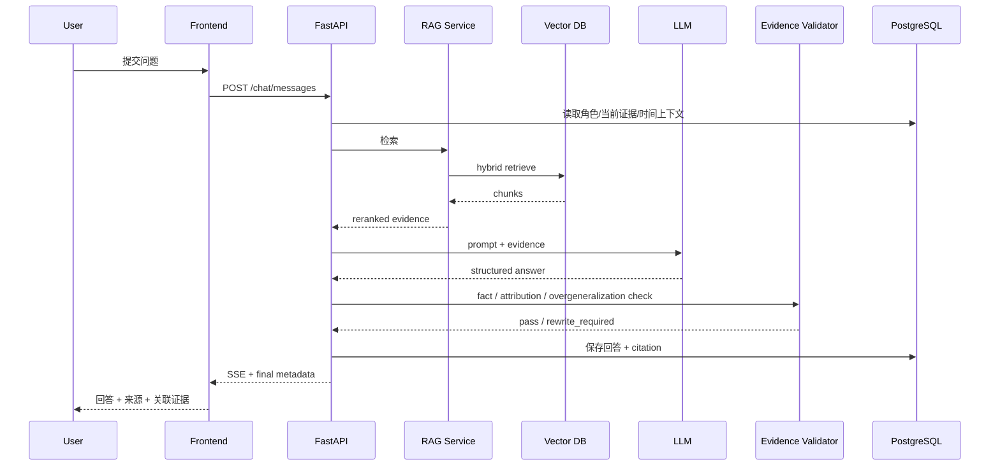

# 《同心千年》北魏章节实施规格
## 平城—洛阳、云冈—龙门：页面级原型 + 交互逻辑 + API + 数据表 + AI Prompt + Neo4j 图谱

**版本：V1.0 / Vertical Slice 开发版**  
**目标：让前端、后端、AI、内容、视觉可以按同一份文档并行开工。**  
**范围：只做“北魏·交融”一个完整闭环，重点实现“都城迁移 + 双石窟证据对照 + 孝文帝AI + 史料来源 + 可解释图谱”。**

---

# 1. 本章节要证明什么

这个章节不是为了做一个“北魏孝文帝改革知识介绍页”，也不是把云冈石窟、龙门石窟简单放在两个卡片里，而是要用一条可以被用户亲自探索的证据链，证明《同心千年》中“文化交融”可以被具体、可视、可核验地表达。

核心体验链：

```text
进入北魏历史场景
→ 从平城进入云冈石窟
→ 观察造像、建筑、服饰等具体文化证据
→ 沿时间轴移动到迁都洛阳前后
→ 切换到龙门石窟
→ 对比两个历史空间中的艺术与社会文化证据
→ 点击“证据透镜”理解：看到了什么 / 能证明什么 / 不能推出什么
→ 与孝文帝数字历史角色对话
→ AI从审核史料中回答并显示来源
→ 从人物继续展开到平城、洛阳、云冈、龙门、服饰、墓志与制度变化
→ 用户点击任意关系查看“为什么有这条关系”
→ 北魏章节探索成果进入总知识图谱
```

本章要让用户形成一个明确认知：

> **“交融”不是一句抽象口号，而是可以从都城、制度、服饰、造像、文字和日常生活等具体历史证据中逐步观察的长期过程。**

与其他章节的差异：

```text
汉代：从人物出发，看道路和物品如何连接不同地区
北魏：从两个历史空间和多类实物证据出发，看文化因素如何互动、吸收、改造与并存
唐代：从一幅画进入画外人物关系
元代：从同一建筑中的多种文字看多文化共存
```

北魏章节的核心交互不是“看两张石窟照片”，而是：

> **云冈—龙门双场景证据对照。**

---

# 2. 本章历史内容基线与表达边界

## 2.1 可作为第一版产品基础事实的数据

第一版内容库围绕以下基础事实建立，正式生产前仍须由内容组逐条拆成 Claim 并审核：

- 北魏存在于公元386—534年；
- 北魏曾以平城（今山西大同）为都；
- 云冈石窟主要开凿于公元5世纪中叶至6世纪初，核心营造阶段属于北魏；
- UNESCO资料指出，云冈石窟艺术受到南亚和中亚佛教石窟艺术影响，同时形成具有中国文化传统和地方特色的表达；
- 北魏孝文帝时期发生迁都洛阳以及一系列制度、服饰、姓名等方面的改革；
- 不同权威公开资料对迁都时间存在“493年”和“494年”的不同表述，第一版数据库必须保留来源差异；
- 龙门石窟的重要早期阶段开始于北魏晚期，洛阳成为北魏后期都城后，龙门出现重要佛教石窟营造；
- UNESCO资料指出，龙门石窟保存大量北魏晚期和唐代佛教石刻艺术；
- 中国国家博物馆“元羽墓志”资料涉及迁都、496年改姓等内容；
- 中国国家博物馆北魏侍从陶俑等资料可以用于观察北魏后期服饰制度和社会生活变化；
- 北魏时期社会文化变化不是“一夜之间完成”，不同传统在不同群体、不同场景和不同时期中存在采用、改造、并存与延续。

内容进入正式库的流程：

```text
来源
→ Claim
→ fact / interpretation
→ time_scope
→ place_scope
→ 历史审核
→ approved
```

## 2.2 一个必须在产品层面处理的学术细节

**不能把北魏历史简单压缩成：**

```text
鲜卑文化
   ↓
孝文帝改革
   ↓
完全变成汉文化
   ↓
民族融合完成
```

这种表达会：

1. 把长期变化全部归因于一个皇帝；
2. 把制度、艺术、服饰、日常生活混成一个概念；
3. 把文化交融误写成单向替代；
4. 忽略不同传统的保留、改造和再流行；
5. 把现代概念直接套成古人的主观目标。

本章产品逻辑改成：

```text
北方草原与鲜卑文化传统
            │
            ├──────────────┐
            ▼              │
北魏国家制度建设           │
            │              │
            ▼              │
中原礼制 / 服饰 / 官制     │
            │              │
            ├──────┐       │
            ▼      ▼       ▼
佛教传播  中原艺术  南亚/中亚佛教艺术因素
            │      │       │
            └──────┴───────┘
                    │
                    ▼
          长期互动、吸收与重构
                    │
            ┌───────┴────────┐
            ▼                ▼
          云冈              龙门
       平城时期证据       洛阳时期证据
```

因此页面应强调：

> **文化变化是多来源、多层次、不同步的。**

## 2.3 第二个必须处理的学术细节：493 / 494

公开资料可能采用不同迁都年份：

```text
中国国家博物馆“元羽墓志”页面：493年
部分洛阳官方资料与传统纪年：太和十八年，即494年
```

产品不能：

```text
看到两个年份
→ 随便选一个
→ 删除另一个
```

建议数据：

```text
Event:
event_capital_move_luoyang

Date Claims:
claim_move_capital_493
claim_move_capital_494
```

第一版 UI 可显示：

> **493—494年前后，北魏完成从平城向洛阳的迁都过程。**

并提供按钮：

```text
[为什么资料中有493和494两种写法？]
```

说明文案：

> 不同资料可能依据迁都决策、迁移过程或传统纪年节点采用不同年份。平台保留原始来源表述，并在内容审核后对具体阶段进一步细分。

## 2.4 云冈—龙门不能做成简单“前后对比”

错误：

```text
云冈 = 鲜卑
龙门 = 汉化
```

更严谨的产品表达：

```text
云冈：
南亚 / 中亚佛教艺术影响
+
北魏皇室营造
+
中国文化传统与地方表达
+
不同阶段自身持续变化

龙门：
北魏迁都洛阳后出现重要营造
+
北魏晚期艺术变化
+
洛阳政治文化环境
+
后续仍经历东魏、西魏、北齐、隋唐等时期
```

因此：

> **不能把整个龙门石窟说成“孝文帝时期”。**

本章只选择龙门中的北魏阶段证据进行对照。

## 2.5 本章中的“孝文帝改革”如何建模

不要只建一个巨大节点：

```text
孝文帝改革
```

然后所有关系都指向它。

建议拆为：

```text
event_capital_move_luoyang
policy_costume_reform
policy_surname_reform
policy_language_court
policy_native_place_registration
concept_official_ritual_change
```

正式上线前，每一项分别绑定 Claim 和 Source。

## 2.6 服饰证据的表达边界

服饰透镜的核心不是：

```text
改革前穿胡服
改革后全穿汉服
```

而是：

```text
服饰制度变化
+
实际出土服饰形象
+
场合与身份差异
+
不同传统之间的采用、改造和持续存在
```

## 2.7 本章明确不做

- 不做摄像头识别石窟；
- 不做AI自动识别佛像风格；
- 不做“拍照判断鲜卑风/汉风”；
- 不做实时图像分类；
- 不做复杂3D石窟自由漫游；
- 不做云冈、龙门全洞窟数据库；
- 不把整个龙门石窟都归入北魏；
- 不把所有艺术变化归因于孝文帝；
- 不把服饰变化表达成“一夜全部换装”；
- 不把“鲜卑文化”和“汉文化”设计成互斥阵营；
- 不将“汉化”作为唯一解释词；
- 不让AI编造孝文帝与臣子的私人对白和心理活动；
- 不把现代“中华民族共同体意识”说成孝文帝本人使用的概念；
- 不做“文化融合度百分比”；
- 不把交融做成“谁取代谁”的游戏。

所有石窟互动热点都采用：

> **内容人员预先标注坐标，不依赖视觉识别。**

---

# 3. 核心用户故事

## US-01：第一次进入

> 作为第一次使用平台的用户，我希望快速知道北魏章节为什么同时看平城、洛阳、云冈和龙门，而不是先读很长的改革介绍。

验收：

- 10秒内看懂“两个都城、两处石窟、一条时间线”；
- 最多点击1次进入核心场景；
- 首屏历史说明不超过180字。

## US-02：比较两个石窟

> 作为普通用户，我希望通过具体证据比较云冈和龙门，而不是只读“风格发生变化”。

验收：

- 左右场景可同步显示；
- 至少3组可比较证据；
- 每个热点有基础信息与来源；
- 不要求用户具备艺术史专业知识。

## US-03：理解什么是“证据”

> 作为用户，我希望知道“看到的石刻”与“研究者的解释”不是一回事。

验收：

每张证据卡固定显示：

```text
看到什么
资料能确认什么
研究者如何解释
不能直接推出什么
```

并区分：

```text
● 实物/文献事实
◐ 研究解释
```

## US-04：理解改革不是单一结果

> 作为用户，我希望知道迁都、服饰、姓氏、礼制等变化之间有联系，但不能把所有变化归结成一个原因。

验收：

- AI不回答“孝文帝一改革，所有人都汉化了”；
- 图谱不创建“导致全部文化变化”的边；
- 不同政策和实物证据分别展示。

## US-05：继续追问

> 作为用户，我希望直接问孝文帝“为什么迁都”“为什么改姓”“云冈和龙门有什么关系”。

验收：

- 推荐问题可直接发送；
- 可自由输入；
- AI回答显示来源；
- 无资料时不编；
- 术语先用普通语言解释。

## US-06：发现关系

> 作为用户，我希望从“云冈的一处造像”继续看到它和北魏、平城、佛教艺术传播、龙门等节点之间的联系。

验收：

- 任意核心实体一键进图谱；
- 默认只显示1-hop；
- 可主动展开；
- 重要边可查看关系证据。

## US-07：获得探索成果

> 作为用户，我希望知道自己究竟看过哪些证据，而不是最后只得到一句“北魏民族融合”。

验收：

```text
访问过的历史空间
看过的证据类型
问过的问题
查看过的来源
展开过的关系
```

都进入本章总结。

---

# 4. 页面地图

```text
N00 章节过场
  │
  ▼
N01 章节首页 / 从平城到洛阳
  │
  ▼
N02 云冈—龙门双场景
  ├── N03 文化证据对照透镜
  ├── N04 实体 / 证据详情抽屉
  ├── N05 孝文帝 AI 数字历史角色
  ├── N06 史料证据页
  └── N07 北魏关系图谱
           │
           ▼
         N08 本章探索成果
```

建议路由：

```text
/era/northern-wei
/era/northern-wei/evidence
/era/northern-wei/chat
/era/northern-wei/graph
/era/northern-wei/summary
```

N03、N04、N06优先做 Overlay / Drawer。

URL保留状态：

```text
/era/northern-wei/evidence?left=yungang&right=longmen&category=costume&entity=artifact_yuanyu_epitaph
```

---

# 5. 全局页面框架

PC / 大屏优先，基准：

```text
1440 × 900
```

```text
┌──────────────────────────────────────────────────────────────┐
│ Logo 同心千年     北魏·交融       图谱    我的探索    返回时间轴 │
├──────────────────────────────────────────────────────────────┤
│                                                              │
│                       页面主内容区                            │
│                                                              │
├──────────────────────────────────────────────────────────────┤
│ 章节进度 38%     已探索 5 个证据                   史料说明 / AI说明 │
└──────────────────────────────────────────────────────────────┘
```

全局复用：

```text
AppHeader
EraBreadcrumb
ExploreProgressBar
AiContentBadge
EvidenceBadge
GlobalToast
SourceDisclaimer
```

北魏专属：

```text
CapitalTimeline
TwinHeritageViewer
EvidenceCompareLens
EvidenceCard
ComparisonBridge
TimeScopeBadge
```

---

# 6. N00：章节过场

## 6.1 目的

用4–6秒建立三个关键词：

```text
平城
洛阳
变化
```

不在过场讲完整改革。

## 6.2 页面原型

```text
┌──────────────────────────────────────────────────┐
│                                                  │
│                      北魏                         │
│                                                  │
│                      交融                         │
│                                                  │
│          “文化相遇以后，                         │
│           会发生怎样的改变？”                   │
│                                                  │
│                 [进入平城]                       │
│                 [跳过导览]                       │
│                                                  │
└──────────────────────────────────────────────────┘
```

视觉：

```text
左：平城 / 云冈轮廓
右：洛阳 / 龙门轮廓
中：缓慢移动的时间线
```

AIGC背景标：

> AI辅助历史场景示意

## 6.3 控件

| ID | 文案 | 点击逻辑 | API | 成功状态 |
|---|---|---|---|---|
| BTN-N00-01 | 进入平城 | 500–800ms过渡到N01 | `POST /exploration/events` | 进入章节首页 |
| BTN-N00-02 | 跳过导览 | 直接N02 | `POST /exploration/events` | 打开双场景 |
| BTN-N00-03 | 返回时间轴 | 返回总首页 | 无强依赖 | 保留进度 |

埋点：

```text
northern_wei_intro_view
northern_wei_intro_enter
northern_wei_intro_skip
northern_wei_intro_back
```

---

# 7. N01：章节首页 / 从平城到洛阳

## 7.1 页面目标

让用户快速理解：

1. 平城与北魏前期都城背景；
2. 云冈与平城时期联系；
3. 孝文帝时期迁都洛阳；
4. 龙门北魏阶段与洛阳时期联系；
5. 本章通过“证据对照”理解变化，而不是一句结论。

## 7.2 页面原型

```text
┌───────────────────────────────────────────────────────────────┐
│ 北魏 · 交融                                          进度 0%  │
├───────────────────────────────────────────────────────────────┤
│                                                               │
│   平城 / 云冈                 493—494前后        洛阳 / 龙门   │
│      ◎ ───────────────────────────────→ ◎                    │
│                                                               │
│  [云冈局部视觉]                              [龙门局部视觉]    │
│                                                               │
│ 探索问题：同一个王朝的两个历史空间中，                        │
│          我们能看到哪些文化变化和延续？                       │
│                                                               │
│ [开始证据对照] [与孝文帝对话] [查看北魏关系图谱]              │
└───────────────────────────────────────────────────────────────┘
```

## 7.3 时间轴

```text
398        460                   493/494        496        534
│           │                       │             │          │
平城时期    云冈重要开凿开始       迁都洛阳      改姓等      北魏结束
```

正式生产前每个具体时间点必须绑定 Claim。

## 7.4 按钮逻辑

| ID | 按钮 | 前端行为 | 后端/API | 异常处理 |
|---|---|---|---|---|
| BTN-N01-01 | 开始证据对照 | 进入N02 | 记录`scene_start` | 不阻断 |
| BTN-N01-02 | 与孝文帝对话 | N05 | 创建chat session | fallback |
| BTN-N01-03 | 查看北魏关系图谱 | N07 | `GET /graph/subgraph` | 错误态 |
| BTN-N01-04 | 为什么是493/494？ | 时间证据卡 | `GET /events/{id}/date-claims` | 空状态 |
| BTN-N01-05 | 查看史料 | N06 | entity sources | 空状态 |
| BTN-N01-06 | 返回时间轴 | 总首页 | 异步记录 | 不阻断 |

### 导览文本设计原则

固定导览：

> 云冈和龙门都保存了北魏时期的重要文化遗存，但它们不是简单的“改革前”和“改革后”。通过具体造像、服饰、墓志、都城与制度证据，我们可以观察不同文化传统如何在北魏长期互动中被吸收、改造、并存和重新组织。

控制在100–140中文字。

---

# 8. N02：云冈—龙门双场景

这是本章最重要的页面。

## 8.1 主场景结构

```text
┌──────────────────────────────────────────────────────────────────────┐
│ 北魏 · 交融        [证据透镜] [时间轴] [AI对话] [关系图谱]            │
├───────────────────────────────┬──────────────────────────────────────┤
│                               │                                      │
│          云冈石窟             │              龙门石窟                │
│                               │                                      │
│       [高清局部 / 示意]       │          [高清局部 / 示意]           │
│                               │                                      │
│   ○造像   ○建筑   ○服饰      │      ○造像   ○题记   ○服饰          │
│                               │                                      │
│           平城时期            │              洛阳时期                │
├───────────────────────────────┴──────────────────────────────────────┤
│ 当前任务：选择一种证据类型，比较两个历史空间                         │
│ [造像艺术] [服饰生活] [文字墓志] [都城制度]       已探索 2/8          │
└──────────────────────────────────────────────────────────────────────┘
```

## 8.2 双场景范围

第一版只选择：

```text
云冈：3–5个核心证据热点
龙门：3–5个北魏阶段证据热点
辅助：2–4个博物馆文物 / 墓志证据
```

不做完整景区导览。

## 8.3 推荐首批证据热点

云冈：

```text
evidence_yungang_tanyao
evidence_yungang_architecture
evidence_yungang_style_exchange
```

龙门：

```text
evidence_longmen_guyang
evidence_longmen_inscriptions
evidence_longmen_costume
```

博物馆：

```text
artifact_yuanyu_epitaph
artifact_attendant_figurine_yuanshao
artifact_xianbei_style_figurine
```

若某件比较材料年代超出北魏，必须明确标：

```text
“北朝比较材料”
```

## 8.4 热点实现

```json
{
  "hotspot_id": "hs_yungang_tanyao_01",
  "scene_id": "scene_yungang_compare",
  "entity_id": "evidence_yungang_tanyao",
  "shape": "polygon",
  "points": [[0.21,0.23],[0.39,0.20],[0.41,0.60],[0.20,0.62]],
  "evidence_category": "art"
}
```

坐标0–1归一化。

## 8.5 热点状态

```text
LOCKED
UNSEEN
SEEN
SELECTED
COMPARE_SELECTED
```

## 8.6 页面按钮完整逻辑

| ID | UI | 行为 |
|---|---|---|
| BTN-N02-01 | 证据透镜 | 打开N03 |
| BTN-N02-02 | 时间轴 | CapitalTimeline |
| BTN-N02-03 | AI对话 | N05，当前证据作为上下文 |
| BTN-N02-04 | 关系图谱 | N07 |
| BTN-N02-05 | 造像艺术 | filter=`art` |
| BTN-N02-06 | 服饰生活 | filter=`costume` |
| BTN-N02-07 | 文字墓志 | filter=`inscription` |
| BTN-N02-08 | 都城制度 | filter=`institution` |
| BTN-N02-09 | 同步对比 | 当前类别双侧高亮 |
| BTN-N02-10 | 只看已审核 | approved only |
| BTN-N02-11 | 我的进度 | progress drawer |
| BTN-N02-12 | 返回章节首页 | N01 |
| BTN-N02-13 | 返回总时间轴 | 保留进度 |

## 8.7 热点点击

```text
onClick
→ setSelectedEvidence(evidence_id)
→ POST exploration event
→ GET evidence item
→ 打开N04
→ status = SEEN
```

加入对照：

```text
[加入对照]
→ setComparisonSlot(left/right)
```

最多：

```text
2个主证据 + 2个辅助证据
```

---

# 9. N03：文化证据对照透镜

N03是本章最有辨识度的功能。

## 9.1 产品目的

用户学习：

```text
观察
↓
事实
↓
解释
↓
边界
```

## 9.2 开启效果

顶部：

```text
[造像] [建筑] [服饰] [文字] [制度] [全部] [仅未探索] [关闭]
```

## 9.3 Evidence Card 固定四层

```text
┌────────────────────────────────────┐
│ 证据：元羽墓志                    │
│ ● 实物 / 文献证据                 │
├────────────────────────────────────┤
│ ① 看到什么                       │
│ 北魏元羽墓志，记录其身份和生平。 │
│                                    │
│ ② 可以确认什么                   │
│ 可与迁都、姓氏变化等资料对照。   │
│                                    │
│ ③ 如何解释                       │
│ 可观察北魏后期身份与制度变化。   │
│                                    │
│ ④ 不能直接推出                   │
│ 一方墓志不能代表整个社会同步变化。│
│                                    │
│ [查看来源] [加入对照] [查看关系] │
└────────────────────────────────────┘
```

## 9.4 对照模式

```text
┌──────────────────────┬──────────────────────┐
│ 云冈证据             │ 龙门 / 洛阳证据     │
├──────────────────────┼──────────────────────┤
│ 时间                 │ 时间                 │
│ 地点                 │ 地点                 │
│ 观察                 │ 观察                 │
│ 可确认               │ 可确认               │
│ 解释                 │ 解释                 │
│ 不可推出             │ 不可推出             │
└──────────────────────┴──────────────────────┘
```

底部：

```text
相同点：审核配置
差异点：审核配置
不能直接得出的结论：审核配置
```

比赛版不让LLM自由生成对照结论。

## 9.5 对照类型

```text
ART
COSTUME
INSCRIPTION
INSTITUTION
```

## 9.6 控件

| ID | 文案 | 逻辑 |
|---|---|---|
| BTN-N03-01 | 关闭透镜 | N02 |
| BTN-N03-02 | 造像艺术 | art |
| BTN-N03-03 | 服饰生活 | costume |
| BTN-N03-04 | 文字墓志 | inscription |
| BTN-N03-05 | 都城制度 | institution |
| BTN-N03-06 | 全部 | all |
| BTN-N03-07 | 仅未探索 | UNSEEN |
| BTN-N03-08 | 清空对照 | clear |
| BTN-N03-09 | 为什么不能简单说“完全汉化”？ | 固定知识卡 |
| EVIDENCE-* | 证据热点 | N04 |
| BTN-N03-10 | 加入对照 | left/right slot |

---

# 10. N04：实体 / 证据详情抽屉

统一 `EntityDrawer` + 北魏专属 `EvidenceDetail`。

## 10.1 云冈实体原型

```text
                               ┌───────────────────────────────┐
                               │ 云冈石窟               [×]    │
                               │ HeritageSite / 文化遗产       │
                               ├───────────────────────────────┤
                               │ [遗产图像]                    │
                               │                               │
                               │ 北魏重要佛教石窟遗存          │
                               │ 核心时期：5—6世纪             │
                               │ 地点：今山西大同              │
                               │                               │
                               │ ● 史料确认                    │
                               │ ◐ 艺术交流解释可查看          │
                               │                               │
                               │ [查看证据]                    │
                               │ [围绕它提问]                  │
                               │ [查看关系]                    │
                               │ [史料来源]                    │
                               └───────────────────────────────┘
```

## 10.2 元羽墓志原型

```text
                               ┌───────────────────────────────┐
                               │ 元羽墓志               [×]    │
                               │ Artifact / 墓志               │
                               ├───────────────────────────────┤
                               │ [墓志图像]                    │
                               │ 北魏                          │
                               │ 元羽卒于501年                 │
                               │                               │
                               │ 本章用途：                    │
                               │ 观察迁都、姓氏变化和身份书写  │
                               │                               │
                               │ 证据边界：                    │
                               │ 一方墓志不能代表所有社会群体  │
                               │                               │
                               │ [加入对照] [查看来源]         │
                               └───────────────────────────────┘
```

## 10.3 字段

```text
entity_id
entity_type
display_name
subtitle
era
date_label
short_summary
body_markdown
image_url
verification_label
review_status
source_count
related_entity_count

evidence_category
observation
supported_claim
interpretation_note
forbidden_inference
time_scope
place_scope
comparison_group_ids
```

## 10.4 每个按钮

| ID | 按钮 | 逻辑 | API |
|---|---|---|---|
| BTN-N04-01 | × | 回N02原状态 | 无 |
| BTN-N04-02 | 围绕它提问 | N05 | chat |
| BTN-N04-03 | 查看它的关系 | N07 | graph |
| BTN-N04-04 | 查看史料来源 | N06 | sources |
| BTN-N04-05 | 加入对照 | comparison store | 前端 |
| BTN-N04-06 | 下一个证据 | 当前类别next | evidence API |
| BTN-N04-07 | 在时间轴定位 | 聚焦时间 | 前端 |
| BTN-N04-08 | 加入我的探索 | 自动/手动 | exploration |

---

# 11. N05：孝文帝 AI 数字历史角色

## 11.1 产品定位

角色不是“真正复活的孝文帝”，而是：

> **基于经过审核的历史资料构建的“北魏孝文帝数字历史角色”。**

页面固定显示：

> AI数字历史角色。第一人称表达属于基于史料的数字叙事重构，并非历史人物真实原话。

## 11.2 页面原型

```text
┌────────────────────────────────────────────────────────────────┐
│ ← 返回证据场景     与“北魏孝文帝”对话   [叙事模式 | 史实模式] │
├────────────────────────────────────────────────────────────────┤
│                                                                │
│ 孝文帝：你可以从迁都洛阳、服饰、姓氏或云冈龙门开始问起。      │
│                                                                │
│ 推荐问题：                                                      │
│ [为什么迁都洛阳？]                                             │
│ [迁都是493年还是494年？]                                       │
│ [为什么要改姓？]                                               │
│ [改革后鲜卑文化是不是完全消失了？]                             │
│                                                                │
│ 用户：改革以后鲜卑文化是不是完全消失了？                       │
│                                                                │
│ 孝文帝：……                                                     │
│                                                                │
│ 依据：[国博资料①] [云冈/龙门资料②]                             │
│                                                                │
│ 继续探索：[迁都] [元羽墓志] [服饰证据]                         │
├────────────────────────────────────────────────────────────────┤
│ 输入你想问的问题……                                  [发送]     │
└────────────────────────────────────────────────────────────────┘
```

## 11.3 两种回答模式

### 叙事模式

允许：

> “在我的统治时期，迁都与多项制度调整相继发生……”

但只能复述有史料支持的事件。

不允许：

> “我从小就梦想让所有文化融合在一起。”

这属于无来源心理活动与现代价值目标投射。

### 史实模式

第三人称直接说明：

> “北魏孝文帝时期发生迁都洛阳以及姓氏、服饰等制度变化……”

适合老师、评委查看准确性。

## 11.4 必须正确处理的典型问题

### 问：北魏是不是“完全汉化”了？

不能简单回答“是”或“不是”。

回答结构：

```text
先列具体制度变化
→ 再列实物 / 文献证据
→ 说明不同传统仍有延续、改造和并存
→ 解释“汉化”是概括词，不能替代具体史实
```

### 问：云冈为什么会出现中亚、南亚艺术影响？

必须：

- 基于UNESCO或审核学术资料；
- 使用“受到……影响”“融合……”等有证据的表述；
- 不能编造某位具体中亚工匠在某窟工作的故事，除非资料明确支持。

### 问：龙门石窟是不是你一个人建的？

必须说明：

```text
龙门石窟长期营造
北魏晚期只是重要阶段之一
不能把整个龙门遗产归到孝文帝个人
```

### 问：你迁都是为了“中华民族共同体意识”吗？

必须：

> 这是现代概念，不能直接作为北魏人物当时使用的政治目标。平台可以从今天的历史研究视角讨论北魏时期不同人群长期交往和文化互动留下的历史基础，但不将现代概念直接写成古人的原始动机。

## 11.5 按钮逻辑

| ID | UI | 逻辑 |
|---|---|---|
| BTN-N05-01 | 返回场景 | 返回N02并保持会话 |
| BTN-N05-02 | 叙事模式 | `answer_mode=narrative` |
| BTN-N05-03 | 史实模式 | `answer_mode=factual` |
| CHIP-N05-* | 推荐问题 | 自动填入并发送 |
| BTN-N05-04 | 发送 | chat API |
| BTN-N05-05 | 停止生成 | abort SSE |
| BTN-N05-06 | 来源卡 | N06 |
| BTN-N05-07 | 关联实体 | N04/N07 |
| BTN-N05-08 | 清空对话 | 新session |
| BTN-N05-09 | 重新回答 | regenerate |
| BTN-N05-10 | 回答有问题 | historical/citation/unclear/other |

---

# 12. Chat 前后端时序



---

# 13. AI 回答状态机

```text
IDLE
→ RETRIEVING
→ GENERATING
→ VALIDATING
→ DONE
```

异常：

```text
NO_EVIDENCE
MODEL_TIMEOUT
VALIDATION_FAILED
NETWORK_ERROR
RATE_LIMIT
SOURCE_DATE_VARIANT
TOTAL_ASSIMILATION_OVERCLAIM
SINGLE_CAUSE_OVERCLAIM
ART_ATTRIBUTION_OVERCLAIM
MODERN_CONCEPT_PROJECTION
```

### NO_EVIDENCE

> 当前资料库中没有足够可靠的材料支持确定回答这个问题。你可以换个问法，或查看已经审核的北魏史料。

### SOURCE_DATE_VARIANT

用于493/494等来源差异。

前端显示：

> 不同资料对该时间节点存在不同表述，回答将分别说明来源。

### TOTAL_ASSIMILATION_OVERCLAIM

检测：

```text
所有鲜卑人都……
改革之后鲜卑文化完全消失……
北魏全部变成……
```

命中后：

```text
rewrite_required = true
```

### SINGLE_CAUSE_OVERCLAIM

检测：

```text
所有龙门艺术变化都是孝文帝改革造成的
```

不能通过事实核验。

### Offline Demo Fallback

> 当前启用演示保障模式，以下内容来自已审核的预设问答库。

---

# 14. RAG 处理规格

## 14.1 输入

```json
{
  "chapter_id": "northern_wei_integration",
  "character_id": "person_emperor_xiaowen",
  "current_entity_id": "artifact_yuanyu_epitaph",
  "current_evidence_category": "institution",
  "answer_mode": "factual",
  "question": "迁都洛阳到底是493年还是494年？"
}
```

## 14.2 检索过滤

强制：

```text
review_status = approved
chapter_ids contains northern_wei_integration
source_level in [S, A, B]
```

额外可过滤：

```text
evidence_category
time_scope
place_scope
source_type
```

优先级：

```text
人物与制度 → 官方/学术 S/A
遗产艺术 → UNESCO / 官方遗产机构
服饰、墓志 → 博物馆藏品 + 学术研究
```

## 14.3 推荐检索流程

```text
原始问题
↓
问题分类
  ├─ 历史事实
  ├─ 政策制度
  ├─ 艺术风格
  ├─ 文化解释
  └─ 时间冲突
↓
指代补全
↓
Query Rewrite
↓
Hybrid Retrieval
↓
Top 12
↓
Evidence Type Rerank
↓
Top 4–6
↓
Source Date Variant Check
↓
Overgeneralization Guard
↓
生成
↓
Claim Validation
↓
Citation Validation
```

## 14.4 Evidence Type Guard

证据类型：

```text
MATERIAL_EVIDENCE
TEXTUAL_RECORD
OFFICIAL_HERITAGE_DESCRIPTION
SCHOLARLY_INTERPRETATION
CURATORIAL_INTERPRETATION
```

回答禁止：

```text
把研究解释写成文物自己“直接证明”的事实
```

## 14.5 No Context No Answer

```json
{
  "status": "NO_EVIDENCE",
  "answer": "",
  "citations": []
}
```

---

# 15. AI Prompt 体系

不要只写一个巨大Prompt，继续使用5-Prompt架构。

## Prompt A：孝文帝 System Prompt

```text
你是《同心千年》中的“北魏孝文帝数字历史角色”。

你的任务不是自由扮演一个拥有完整私人记忆的历史人物，而是将经过审核的北魏史料转换成准确、易懂、有互动感的历史解释。

【身份】
- 展示对象：北魏孝文帝。
- 当前章节：北魏·交融。
- 主要内容：平城—洛阳、云冈—龙门、迁都及相关制度和社会文化变化。
- 第一人称仅是数字叙事方式，不代表真实历史原话。

【知识边界】
1. 只能依据 <EVIDENCE> 回答具体历史事实。
2. 不得利用未提供的常识补充具体年份、对白、心理、私人动机、政策细节。
3. 不得把所有北魏文化变化全部归功于孝文帝个人。
4. 不得将“汉化”作为无需解释的万能结论。
5. 回答“汉化”“融合”“交融”等问题时，优先说明具体制度、服饰、艺术和社会证据。
6. 不得声称改革后鲜卑传统立即或完全消失。
7. 不得把云冈简单定义成“鲜卑风”，也不得把龙门简单定义成“汉风”。
8. 不得声称整个龙门石窟都是孝文帝时期完成。
9. 云冈艺术中的南亚/中亚影响只能在EVIDENCE支持范围内说明。
10. 对493/494等来源差异，必须保留差异，不擅自删除其中一个来源。
11. 不得把现代“中华民族共同体意识”直接说成孝文帝本人的自觉政治目标。
12. 不得替“所有鲜卑人”“所有汉人”“所有北魏居民”声称统一态度。
13. 没有证据时明确说资料不足。
14. 用户要求编造宫廷对白、心理故事时，不把虚构内容当史实回答。

【叙事模式】
若 ANSWER_MODE=narrative：
- 可用第一人称改写有史料依据的事件；
- 不添加感受、天气、对白、秘密动机。

【史实模式】
若 ANSWER_MODE=factual：
- 使用第三人称；
- 清楚区分 fact 与 interpretation。

【证据类型】
- MATERIAL_EVIDENCE ≠ 自动证明整个社会；
- TEXTUAL_RECORD ≠ 不需要其他证据；
- SCHOLARLY_INTERPRETATION 必须使用“可理解为”“研究者讨论”等措辞。

【时间差异】
如果不同 approved sources 对年份表述不同：
- 分别说明；
- 不虚构一个“最终唯一时间”。

【输出】
严格JSON：
{
  "answer_markdown": "...",
  "citation_ids": ["..."],
  "related_entity_ids": ["..."],
  "uncertainty": "low|medium|high",
  "evidence_types": ["..."],
  "needs_human_review": false
}
```

## Prompt B：问题改写 Prompt

```text
你是北魏章节历史知识库检索查询改写器。

输入：
- 当前实体
- 当前证据
- 当前左右场景
- 用户问题

输出1条完整检索问题。

规则：
1. 补足“这里、这个像、改革后、他”等指代。
2. 区分用户问的是孝文帝本人、北魏制度、云冈遗存、龙门北魏阶段还是服饰/墓志实物。
3. 用户使用“完全汉化”“全部消失”等强结论时，不默认结论为真。
4. 不把现代概念写成历史人物主观意图。
5. 对493/494问题同时检索不同来源。

示例：
当前实体：元羽墓志
用户：这是不是说明当时所有鲜卑人都改成汉人了？

输出：
“元羽墓志可以直接支持哪些北魏孝文帝时期的姓氏、籍贯和身份制度变化，它是否足以证明北魏所有鲜卑群体在同一时间发生完全一致的文化转变？”
```

## Prompt C：证据相关性判断

```text
判断检索片段对用户问题的支持程度。

输出：
{
  "chunk_id": "...",
  "relevance": 0-3,
  "evidence_type": "material|textual|official|scholarly",
  "supports_claims": [],
  "time_scope": "",
  "place_scope": "",
  "reason": ""
}

3 = 直接支持核心事实
2 = 支持背景
1 = 弱相关
0 = 无关

特别规则：
- 同为“北魏”不能自动高度相关。
- 云冈资料不能自动证明龙门某个具体洞窟。
- 一件陶俑不能自动证明整个北魏社会。
- 一个改革命令不能自动证明所有人实际生活同步改变。
```

## Prompt D：答案事实核验

```text
你是北魏章节回答核验器。

检查：
1. 年代是否有来源；
2. 迁都493/494差异是否被错误抹平；
3. 云冈是否被错误说成单一“鲜卑艺术”；
4. 龙门是否被错误说成全部属于北魏；
5. 是否把所有艺术变化归因于孝文帝；
6. 是否把所有文化变化说成“完全汉化”；
7. 是否声称鲜卑文化立即消失；
8. 是否用一件文物代表所有社会群体；
9. 是否把现代概念投射成古人主观目标；
10. 是否存在证据外对白、心理和动机；
11. 是否混淆史实与学术解释；
12. 引用是否真实存在。

输出：
{
  "pass": true,
  "unsupported_claims": [],
  "overgeneralizations": [],
  "source_date_conflicts": [],
  "evidence_type_errors": [],
  "citation_errors": [],
  "rewrite_required": false
}
```

## Prompt E：探索总结 Prompt

```text
只根据用户已访问内容总结。

输入：
- visited_entity_ids
- visited_evidence_ids
- comparison_pairs
- visited_relation_ids
- asked_question_topics

规则：
1. 不新增用户没看过的北魏史实。
2. 80–120字。
3. 可说用户比较了哪些证据，不给用户打“认同分”。
4. 不推断用户民族、政治立场和价值观。
5. 不把策展关系写成历史因果。
6. 推荐下一章只基于内容连接。

输出：
{
  "summary": "...",
  "next_entity_ids": ["..."]
}
```

---

# 16. 推荐问题配置

比赛版数据库固定：

```json
[
  {"id":"q_wei_01","text":"为什么要从平城迁到洛阳？","intent":"capital_move"},
  {"id":"q_wei_02","text":"迁都是493年还是494年？","intent":"capital_move_date"},
  {"id":"q_wei_03","text":"云冈石窟为什么能看到不同艺术影响？","intent":"yungang_art_exchange"},
  {"id":"q_wei_04","text":"云冈和龙门是什么关系？","intent":"yungang_longmen_relation"},
  {"id":"q_wei_05","text":"为什么要改姓？","intent":"surname_reform"},
  {"id":"q_wei_06","text":"改革以后鲜卑文化是不是完全消失了？","intent":"assimilation_overclaim"},
  {"id":"q_wei_07","text":"一件陶俑真的能说明社会变化吗？","intent":"evidence_method"},
  {"id":"q_wei_08","text":"龙门石窟都是北魏时期的吗？","intent":"longmen_period_scope"}
]
```

首屏最多4个。

---

# 17. N06：史料证据页

## 17.1 目标

把：

> “我们的AI有依据，而且用户能看见依据。”

做成产品功能。

## 17.2 页面结构

```text
┌──────────────────────────────────────────────────────────┐
│ 史料依据                                      [关闭]     │
├──────────────────────────────────────────────────────────┤
│ 当前内容：云冈艺术中的文化交流                            │
│                                                          │
│ [世界遗产资料] UNESCO                                    │
│ Yungang Grottoes                                         │
│ 支持内容：南亚/中亚佛教艺术影响与中国传统结合……         │
│ [这个来源支持了什么？] [查看来源]                        │
│                                                          │
│ [官方博物馆资料] 中国国家博物馆                          │
│ 元羽墓志                                                 │
│ 支持内容：迁都、496年改姓等                              │
│                                                          │
│ [官方博物馆资料] 中国国家博物馆                          │
│ 侍从陶俑                                                 │
│ 支持内容：北魏后期服饰变化                               │
└──────────────────────────────────────────────────────────┘
```

## 17.3 第一批推荐来源

```text
src_unesco_yungang
Yungang Grottoes
UNESCO World Heritage Centre
https://whc.unesco.org/en/list/1039
```

用于：

```text
云冈年代
世界遗产基本信息
南亚 / 中亚佛教艺术影响
与中国文化传统结合
```

```text
src_unesco_longmen
Longmen Grottoes
UNESCO World Heritage Centre
https://whc.unesco.org/en/list/1003
```

用于：

```text
龙门整体年代范围
北魏晚期重要阶段
洛阳都城背景
```

```text
src_chnmuseum_yuanyu_epitaph
中国国家博物馆·元羽墓志
https://www.chnmuseum.cn/zp/zpml/csp/202008/t20200825_247268.shtml
```

用于：

```text
元羽身份
迁都资料中的493年表述
496年改姓
籍贯变化
```

```text
src_chnmuseum_attendant_figurine
中国国家博物馆·侍从陶俑
https://www.chnmuseum.cn/zp/zpml/kgfjp/202111/t20211111_252106.shtml
```

用于：

```text
北魏后期服饰
服制改革
袴褶服变化
```

```text
src_chnmuseum_xianbei_costume
中国国家博物馆·源于鲜卑的汉服
https://www.chnmuseum.cn/yj/xscg/xslw/201812/t20181224_33120.shtml
```

用于：

```text
鲜卑服饰传统
跨文化服饰变化
后世演变
```

## 17.4 来源等级

内部：

```text
S 官方遗产机构 / 博物馆 / 文物主管部门
A 学术论文 / 考古报告 / 专著
B 高校 / 专业科普
C 普通网络材料
```

用户端：

```text
世界遗产资料
官方文博资料
学术研究
专业资料
```

## 17.5 控件

| ID | 按钮 | 逻辑 |
|---|---|---|
| BTN-N06-01 | 关闭 | 返回调用前页 |
| BTN-N06-02 | 查看来源 | 打开公开链接/书目 |
| BTN-N06-03 | 这个来源支持了什么？ | source_claims |
| BTN-N06-04 | 资料为什么不一致？ | conflicting claims |
| BTN-N06-05 | 返回回答 | chat message |
| BTN-N06-06 | 返回对照 | N03 |
| BTN-N06-07 | 报告来源问题 | feedback |

---

# 18. N07：关系图谱

## 18.1 产品目标

不是画：

```text
孝文帝 → 民族融合 → 云冈 → 龙门
```

而是区分：

```text
人物
事件
都城
文化遗产
制度
实物证据
研究解释
```

## 18.2 默认图

```text
                         [北魏]
                           │
                ┌──────────┴──────────┐
                │                     │
                ▼                     ▼
             [平城]                 [洛阳]
                │                     ▲
                ▼                     │
           [云冈石窟]            [迁都洛阳事件]
                                      ▲
                                      │
                                   [孝文帝]
                                      │
                           ┌──────────┴─────────┐
                           ▼                    ▼
                       [姓氏改革]           [服饰制度]

        [云冈石窟] ·-·本章策展对照·-· [龙门石窟]
```

## 18.3 页面原型

```text
┌───────────────────────────────────────────────────────────────┐
│ ← 返回证据场景   北魏文化关系图谱       [筛选] [重置] [我的节点] │
├───────────────────────────────────────────────────────────────┤
│                                                               │
│                         ○ 北魏                                │
│                      /          \                              │
│                  ○平城         ○洛阳                          │
│                    │             ▲                            │
│                 ○云冈        ○迁都事件                        │
│                                  ▲                            │
│                              ◎孝文帝 ── ○改姓                 │
│                                  │                            │
│                                  ○服饰制度                    │
│                                                               │
├───────────────────────────────────────────────────────────────┤
│ 当前选中：元羽墓志                                           │
│ [查看详情] [展开一层] [为什么有这条关系？]                   │
└───────────────────────────────────────────────────────────────┘
```

## 18.4 图谱按钮

| ID | 按钮 | 逻辑 |
|---|---|---|
| BTN-N07-01 | 返回场景 | N02 |
| BTN-N07-02 | 筛选 | node type |
| BTN-N07-03 | 重置 | 默认1-hop |
| BTN-N07-04 | 我的节点 | 用户高亮 |
| NODE-* | 节点 | 选中 |
| BTN-N07-05 | 查看详情 | N04 |
| BTN-N07-06 | 展开一层 | ≤12节点 |
| BTN-N07-07 | 为什么有这条关系？ | relation evidence |
| BTN-N07-08 | 收起分支 | 前端隐藏 |
| BTN-N07-09 | 显示研究解释 | interpretation edge |
| BTN-N07-10 | 显示策展对照 | curatorial edge |
| BTN-N07-11 | 完成本章 | N08 |

## 18.5 边类型

```text
fact           实线
interpretation 虚线
curatorial     点划线
```

例：

```text
孝文帝 ──关联── 迁都洛阳
云冈石窟 - - 支持研究 - - 佛教艺术交流
云冈石窟 ·-· 本章对照 ·-· 龙门石窟
```

## 18.6 图谱限制

```text
初始节点 ≤ 14
单次展开 ≤ 12
可视节点 ≤ 35
```

---

# 19. 图谱 API

## 19.1 获取子图

```http
GET /api/v1/graph/subgraph
    ?center_entity_id=person_emperor_xiaowen
    &depth=1
    &limit=20
```

Response：

```json
{
  "center_entity_id": "person_emperor_xiaowen",
  "nodes": [
    {
      "id": "person_emperor_xiaowen",
      "type": "Person",
      "name": "北魏孝文帝",
      "explored": true
    },
    {
      "id": "event_capital_move_luoyang",
      "type": "Event",
      "name": "迁都洛阳",
      "explored": true
    }
  ],
  "edges": [
    {
      "id": "rel_xiaowen_capital_move",
      "source": "person_emperor_xiaowen",
      "target": "event_capital_move_luoyang",
      "relation_type": "ASSOCIATED_WITH",
      "display_label": "主持/关联",
      "claim_type": "fact",
      "review_status": "approved"
    }
  ]
}
```

## 19.2 获取关系证据

```http
GET /api/v1/graph/relations/{relation_id}/evidence
```

Response：

```json
{
  "relation_id": "rel_yungang_art_exchange",
  "display_label": "体现多来源艺术影响",
  "claim_type": "interpretation",
  "claim_id": "claim_yungang_art_exchange",
  "sources": [
    {
      "source_id": "src_unesco_yungang",
      "title": "Yungang Grottoes",
      "institution": "UNESCO World Heritage Centre"
    }
  ]
}
```

---

# 20. N08：本章探索成果

## 20.1 最低完成条件

满足以下条件即可出现“完成本章”：

- 已进入N02双场景；
- 云冈至少查看2条证据；
- 龙门/洛阳至少查看2条证据；
- 完成1组证据对照；
- 完成1次AI问答或阅读1个深度知识卡；
- 打开知识图谱。

100%完成度另算。

## 20.2 进度权重建议

```text
进入双场景                    10
查看云冈2条证据               10
查看龙门/洛阳2条证据          10
完成1组证据对照               15
查看迁都时间轴                10
查看元羽墓志/服饰实物         10
完成AI问答                    15
查看史料来源                   5
打开知识图谱                   5
查看一条关系证据              10
--------------------------------
总计                         100
```

## 20.3 页面

```text
┌──────────────────────────────────────────────────────────────┐
│                       本章探索完成                            │
│                                                              │
│ 北魏 · 交融                                  探索进度 82%    │
│                                                              │
│ 你探索了：                                                   │
│ 2处历史空间   6个证据   4项变化线索   11条关系               │
│                                                              │
│ 你的探索路径：                                               │
│ 平城 → 云冈 → 迁都 → 洛阳 → 龙门 → 元羽墓志 → 服饰证据      │
│                                                              │
│ AI探索总结：                                                 │
│ ……                                                           │
│                                                              │
│ [继续探索北魏] [返回历史时间轴] [查看我的总图谱]              │
└──────────────────────────────────────────────────────────────┘
```

## 20.4 按钮

| ID | 按钮 | 逻辑 |
|---|---|---|
| BTN-N08-01 | 生成探索总结 | summary API |
| BTN-N08-02 | 继续探索北魏 | N02 |
| BTN-N08-03 | 返回历史时间轴 | 总首页 |
| BTN-N08-04 | 查看我的总图谱 | 全局graph |

---

# 21. 前端组件树

```text
NorthernWeiChapterPage
├── GlobalHeader
├── ChapterProgress
├── CapitalTimeline
├── TwinHeritageViewer
│   ├── HeritageScene
│   │   ├── SceneImage
│   │   └── EvidenceHotspotLayer
│   ├── CompareDivider
│   ├── EvidenceCategoryFilter
│   └── SceneGuide
├── EvidenceCompareLens
│   ├── EvidenceCard
│   ├── CompareSlotLeft
│   ├── CompareSlotRight
│   ├── EvidenceBoundaryNote
│   └── ComparisonConclusion
├── EntityDrawer
│   ├── EntityHero
│   ├── VerificationBadge
│   ├── EvidenceTypeBadge
│   ├── TimeScopeBadge
│   ├── InterpretationNote
│   └── SourcePreview
├── ChatPanel
│   ├── CharacterHeader
│   ├── AnswerModeSwitch
│   ├── CurrentEvidenceContext
│   ├── RecommendedQuestions
│   ├── MessageList
│   ├── CitationChips
│   └── ChatComposer
├── SourceDrawer
├── KnowledgeGraph
│   ├── GraphCanvas
│   ├── GraphFilters
│   └── RelationEvidencePanel
└── ChapterSummary
```

---

# 22. 前端 Store

建议：

```text
chapterStore
sceneStore
comparisonStore
entityStore
chatStore
graphStore
explorationStore
```

## comparisonStore

```ts
interface ComparisonState {
  category: "art" | "costume" | "inscription" | "institution";
  leftEvidenceId?: string;
  rightEvidenceId?: string;
  activeSiteLeft: "yungang";
  activeSiteRight: "longmen" | "luoyang";
  syncHighlight: boolean;
}
```

## explorationStore

```ts
interface ExplorationState {
  sessionId: string;
  chapterId: "northern_wei_integration";
  visitedEntityIds: string[];
  visitedEvidenceIds: string[];
  completedComparisonIds: string[];
  viewedSourceIds: string[];
  viewedRelationIds: string[];
  askedQuestionCount: number;
  progress: number;
  lastActiveAt: string;
}
```

前端先乐观更新，后台异步持久化。

---

# 23. API 总览

Base：

```text
/api/v1
```

## Content

```http
GET /chapters/northern_wei_integration
GET /chapters/northern_wei_integration/narration
GET /chapters/northern_wei_integration/recommended-questions
GET /scenes/wei_yungang_compare
GET /scenes/wei_longmen_compare
GET /entities/{entity_id}
GET /entities/{entity_id}/sources
```

## Evidence

```http
GET /chapters/northern_wei_integration/evidence
GET /evidence/{evidence_id}
GET /evidence/{evidence_id}/sources
GET /comparison-groups/{group_id}
GET /events/{event_id}/date-claims
```

## Chat

```http
POST /chat/sessions
POST /chat/messages
POST /chat/messages/{message_id}/regenerate
POST /chat/messages/{message_id}/feedback
```

## Graph

```http
GET /graph/subgraph
GET /graph/relations/{relation_id}/evidence
```

## Exploration

```http
POST /exploration/sessions
POST /exploration/events
GET  /exploration/progress
POST /exploration/summary
```

---

# 24. 关键 API Contract

## 24.1 GET chapter

```http
GET /api/v1/chapters/northern_wei_integration
```

```json
{
  "id": "northern_wei_integration",
  "era": "北魏",
  "theme": "交融",
  "title": "从平城到洛阳",
  "guiding_question": "文化相遇以后，会发生怎样的改变？",
  "hero_image": "/assets/wei/hero.webp",
  "scene_ids": ["wei_yungang_compare", "wei_longmen_compare"],
  "core_entity_ids": [
    "person_emperor_xiaowen",
    "heritage_yungang",
    "heritage_longmen",
    "artifact_yuanyu_epitaph"
  ]
}
```

## 24.2 GET scene

```http
GET /api/v1/scenes/wei_yungang_compare
```

```json
{
  "id": "wei_yungang_compare",
  "image_url": "/assets/wei/yungang_compare.webp",
  "width": 2400,
  "height": 1350,
  "hotspots": [
    {
      "id": "hs_yungang_tanyao",
      "entity_id": "evidence_yungang_tanyao",
      "shape": "polygon",
      "points": [[0.21,0.23],[0.39,0.20],[0.41,0.60],[0.20,0.62]],
      "label": "昙曜五窟",
      "evidence_category": "art"
    }
  ]
}
```

## 24.3 GET evidence

```http
GET /api/v1/evidence/evidence_yungang_tanyao
```

```json
{
  "id": "evidence_yungang_tanyao",
  "entity_id": "heritage_yungang",
  "category": "art",
  "title": "昙曜五窟",
  "observation": "云冈早期大型洞窟和造像。",
  "supported_claim": "云冈重要开凿活动开始于5世纪中叶北魏时期。",
  "interpretation": "可用于观察佛教石窟艺术在北魏时期的传播、吸收和本土表达。",
  "forbidden_inference": [
    "不能仅凭这一组洞窟代表整个北魏艺术",
    "不能把所有造像特征直接对应某一个民族"
  ],
  "source_ids": ["src_unesco_yungang"],
  "review_status": "approved"
}
```

## 24.4 GET comparison group

```http
GET /api/v1/comparison-groups/compare_wei_art_01
```

```json
{
  "id": "compare_wei_art_01",
  "category": "art",
  "left_evidence_id": "evidence_yungang_tanyao",
  "right_evidence_id": "evidence_longmen_guyang",
  "shared_points": [
    "均属于北魏佛教石窟艺术研究的重要材料"
  ],
  "difference_points": [
    "两者所处时期和都城文化环境不同"
  ],
  "forbidden_conclusions": [
    "不能简单写成云冈=鲜卑、龙门=汉族",
    "不能认为所有变化只由迁都单一事件造成"
  ],
  "review_status": "approved"
}
```

## 24.5 POST chat session

```http
POST /api/v1/chat/sessions
```

```json
{
  "chapter_id": "northern_wei_integration",
  "character_id": "person_emperor_xiaowen"
}
```

## 24.6 POST chat message

```http
POST /api/v1/chat/messages
Content-Type: application/json
Accept: text/event-stream
```

```json
{
  "session_id": "chat_wei_01",
  "question": "改革以后鲜卑文化是不是完全消失了？",
  "answer_mode": "factual",
  "current_entity_id": "artifact_attendant_figurine_yuanshao",
  "current_evidence_id": "evidence_attendant_costume"
}
```

SSE：

```text
event: status
data: {"status":"retrieving"}

event: status
data: {"status":"validating"}

event: final
data: {
  "message_id":"msg_wei_01",
  "citations":[
    {
      "source_id":"src_chnmuseum_attendant_figurine",
      "title":"侍从陶俑",
      "institution":"中国国家博物馆"
    }
  ],
  "related_entity_ids":["concept_costume_transformation","policy_costume_reform"],
  "uncertainty":"medium"
}
```

## 24.7 来源

```http
GET /api/v1/entities/artifact_yuanyu_epitaph/sources
```

```json
{
  "entity_id": "artifact_yuanyu_epitaph",
  "sources": [
    {
      "id": "src_chnmuseum_yuanyu_epitaph",
      "source_type": "official",
      "title": "元羽墓志",
      "institution": "中国国家博物馆",
      "public_url": "https://www.chnmuseum.cn/zp/zpml/csp/202008/t20200825_247268.shtml",
      "claims": [
        {
          "claim_id": "claim_surname_reform_496",
          "text": "相关公开资料记载496年鲜卑皇族姓氏改革。"
        }
      ]
    }
  ]
}
```

## 24.8 Exploration Event

```http
POST /api/v1/exploration/events
```

```json
{
  "session_id": "exp_wei_01",
  "chapter_id": "northern_wei_integration",
  "event_type": "EVIDENCE_COMPARE",
  "entity_id": "heritage_yungang",
  "metadata": {
    "comparison_id": "compare_wei_art_01",
    "left_evidence_id": "evidence_yungang_tanyao",
    "right_evidence_id": "evidence_longmen_guyang"
  }
}
```

---

# 25. PostgreSQL 数据表

复用元代的通用表，并增加北魏证据对照结构。

## 25.1 chapters

| 字段 | 类型 | 说明 |
|---|---|---|
| id | varchar PK | `northern_wei_integration` |
| era | varchar | 北魏 |
| theme | varchar | 交融 |
| title | varchar | 从平城到洛阳 |
| guiding_question | text | |
| hero_asset_id | varchar | |
| status | enum | draft/review/approved |
| created_at | timestamptz | |
| updated_at | timestamptz | |

## 25.2 scenes

| 字段 | 类型 |
|---|---|
| id | varchar PK |
| chapter_id | FK |
| scene_type | varchar |
| name | varchar |
| background_asset_id | varchar |
| width | int |
| height | int |
| time_scope | varchar |
| place_entity_id | FK |
| version | int |
| status | enum |

## 25.3 scene_hotspots

```text
id
scene_id
entity_id
evidence_id nullable
shape
normalized_points
label
category
sort_order
enabled
```

## 25.4 entities

```text
id
entity_type
name
display_name
era
date_start
date_end
short_summary
body_markdown
verification_label
review_status
primary_asset_id
created_at
updated_at
```

## 25.5 evidence_items

这是北魏章节最核心的新表。

| 字段 | 类型 | 说明 |
|---|---|---|
| id | varchar PK | |
| chapter_id | FK | |
| entity_id | FK | |
| category | varchar | art/costume/inscription/institution |
| evidence_type | varchar | material/textual/official/scholarly |
| title | varchar | |
| observation | text | 看到什么 |
| supported_claim | text | 可以确认什么 |
| interpretation | text | 如何解释 |
| forbidden_inference | jsonb | 不能推出什么 |
| time_scope | varchar | |
| place_scope | varchar | |
| claim_ids | jsonb | |
| primary_asset_id | varchar | |
| review_status | varchar | |

## 25.6 comparison_groups

```text
id
chapter_id
category
title
left_evidence_id
right_evidence_id
shared_points jsonb
difference_points jsonb
forbidden_conclusions jsonb
claim_ids jsonb
review_status
```

## 25.7 historical_events

```text
id
chapter_id
event_type
name
description
primary_entity_ids jsonb
review_status
```

## 25.8 event_date_claims

专门处理493/494等来源差异。

```text
id
event_id
date_text
date_start nullable
date_end nullable
date_precision
claim_id
source_id
note
review_status
```

前端默认读取聚合展示，但证据页显示原始来源。

## 25.9 policies

```text
id
entity_id
policy_type
name
date_scope
summary
claim_ids
review_status
```

第一版候选：

```text
policy_costume_reform
policy_surname_reform
policy_language_court
```

## 25.10 sources

```text
id
title
author
institution
source_type
source_level
publication_year
public_url
bibliography
license_note
review_status
```

## 25.11 claims

```text
id
entity_id
claim_text
claim_type
controversy_status
time_scope
place_scope
review_status
```

## 25.12 claim_sources

```text
claim_id
source_id
locator
support_type
note
```

## 25.13 rag_chunks

```text
id
source_id
text
token_count
entity_ids
evidence_ids
claim_ids
chapter_ids
evidence_type
source_level
review_status
vector_ref
```

## 25.14 characters

```text
id
name
character_type
base_entity_id
system_prompt_version
voice_asset/config
enabled
```

首个：

```text
person_emperor_xiaowen
```

## 25.15 chat_sessions

```text
id
exploration_session_id
chapter_id
character_id
created_at
```

## 25.16 chat_messages

```text
id
session_id
role
content
answer_mode
status
model_name
prompt_version
created_at
```

## 25.17 chat_message_citations

```text
message_id
source_id
chunk_id
claim_id
evidence_id nullable
sort_order
```

## 25.18 exploration_sessions

```text
id
anonymous_user_id
chapter_id
started_at
completed_at
progress
```

## 25.19 exploration_events

```text
id
session_id
event_type
entity_id nullable
evidence_id nullable
relation_id nullable
source_id nullable
metadata jsonb
created_at
```

## 25.20 exploration_node_state

```text
session_id
entity_id
first_seen_at
last_seen_at
view_count
```

---

# 26. 第一批实体 ID

```text
chapter:
northern_wei_integration

period:
period_northern_wei

person:
person_emperor_xiaowen
person_empress_dowager_feng
person_yuanyu

place:
place_pingcheng
place_datong
place_luoyang

heritage:
heritage_yungang
heritage_longmen

cave:
cave_tanyao_five
cave_longmen_guyang

event:
event_capital_move_luoyang
event_northern_wei_luoyang_period

policy:
policy_costume_reform
policy_surname_reform
policy_language_court

artifact:
artifact_yuanyu_epitaph
artifact_attendant_figurine_yuanshao

concept:
concept_buddhist_cave_art
concept_artistic_exchange
concept_cultural_interaction
concept_costume_transformation
concept_institutional_change
concept_cultural_continuity
concept_south_central_asian_buddhist_art

evidence:
evidence_yungang_tanyao
evidence_yungang_art_exchange
evidence_longmen_guyang
evidence_yuanyu_epitaph
evidence_attendant_costume
```

注意：

```text
concept_cultural_interaction
```

属于分析/策展概念，不是北魏人自己使用的历史词汇。

---

# 27. Neo4j 模型

## 27.1 Node Labels

```text
Period
Person
Place
HeritageSite
Cave
Event
Policy
Artifact
Evidence
Concept
Source
```

## 27.2 Relation Types

第一版：

```text
HAD_CAPITAL
LOCATED_IN
LOCATED_NEAR
ASSOCIATED_WITH
PARTICIPATED_IN
DESTINATION
DATED_TO
HAS_PHASE
HAS_EVIDENCE
RECORDS
SUPPORTS_CLAIM
SHOWS_INFLUENCE_FROM
SUPPORTS_STUDY_OF
CURATORIAL_COMPARE_WITH
HAS_SOURCE
```

谨慎使用：

```text
CAUSED
REPLACED
ASSIMILATED
```

第一版原则：

> **尽量不用。**

## 27.3 Relation Properties

```text
id
display_label
claim_type
review_status
source_ids
time_scope
certainty
```

---

# 28. 第一批 Neo4j 三元组

## 28.1 核心事实关系

```text
北魏 | HAD_CAPITAL | 平城
北魏 | HAD_CAPITAL | 洛阳
孝文帝 | ASSOCIATED_WITH | 迁都洛阳
迁都洛阳 | DESTINATION | 洛阳
云冈石窟 | LOCATED_NEAR | 平城
云冈石窟 | DATED_TO | 北魏
云冈石窟 | HAS_PHASE | 昙曜五窟
龙门石窟 | LOCATED_IN | 洛阳
龙门石窟 | HAS_PHASE | 北魏晚期阶段
元羽墓志 | ASSOCIATED_WITH | 元羽
元羽墓志 | DATED_TO | 北魏
孝文帝 | ASSOCIATED_WITH | 姓氏改革
孝文帝 | ASSOCIATED_WITH | 服饰制度变化
```

生产导入前每条边必须挂 Claim / Source。

## 28.2 解释性关系

```text
云冈石窟 | SHOWS_INFLUENCE_FROM | 南亚及中亚佛教石窟艺术
云冈石窟 | SUPPORTS_STUDY_OF | 佛教艺术本土化
龙门北魏阶段 | SUPPORTS_STUDY_OF | 北魏晚期艺术变化
元羽墓志 | SUPPORTS_STUDY_OF | 北魏后期身份制度变化
侍从陶俑 | SUPPORTS_STUDY_OF | 北魏后期服饰变化
```

这些边：

```text
claim_type = interpretation
```

## 28.3 策展关系

```text
云冈石窟 | CURATORIAL_COMPARE_WITH | 龙门石窟
平城 | CURATORIAL_COMPARE_WITH | 洛阳
云冈艺术证据 | CURATORIAL_COMPARE_WITH | 龙门北魏艺术证据
```

这些边：

```text
claim_type = curatorial
```

不是历史因果。

## 28.4 禁止直接建立的关系

```text
孝文帝 | CAUSED | 全部北魏文化交融
孝文帝 | REPLACED | 鲜卑文化
迁都洛阳 | CAUSED | 所有龙门艺术变化
云冈石窟 | IS | 鲜卑艺术
龙门石窟 | IS | 汉族艺术
改革 | CAUSED | 所有鲜卑人改变生活方式
```

---

# 29. Neo4j Cypher Seed 示例

```cypher
MERGE (p:Period {id:'period_northern_wei'})
SET p.name='北魏', p.review_status='approved';

MERGE (x:Person {id:'person_emperor_xiaowen'})
SET x.name='北魏孝文帝', x.review_status='approved';

MERGE (pc:Place {id:'place_pingcheng'})
SET pc.name='平城', pc.review_status='approved';

MERGE (ly:Place {id:'place_luoyang'})
SET ly.name='洛阳', ly.review_status='approved';

MERGE (y:HeritageSite {id:'heritage_yungang'})
SET y.name='云冈石窟', y.review_status='approved';

MERGE (l:HeritageSite {id:'heritage_longmen'})
SET l.name='龙门石窟', l.review_status='approved';

MERGE (m:Event {id:'event_capital_move_luoyang'})
SET m.name='迁都洛阳',
    m.display_date='493—494年前后',
    m.review_status='approved';
```

关系：

```cypher
MERGE (p)-[:HAD_CAPITAL {
  id:'rel_wei_capital_pingcheng',
  display_label:'曾以…为都',
  claim_type:'fact',
  review_status:'approved'
}]->(pc);

MERGE (p)-[:HAD_CAPITAL {
  id:'rel_wei_capital_luoyang',
  display_label:'后期都城',
  claim_type:'fact',
  review_status:'approved'
}]->(ly);

MERGE (x)-[:ASSOCIATED_WITH {
  id:'rel_xiaowen_capital_move',
  display_label:'主持/关联',
  claim_type:'fact',
  review_status:'approved'
}]->(m);

MERGE (m)-[:DESTINATION {
  id:'rel_move_destination_luoyang',
  display_label:'迁往',
  claim_type:'fact',
  review_status:'approved'
}]->(ly);

MERGE (y)-[:DATED_TO {
  id:'rel_yungang_wei',
  display_label:'重要营造时期',
  claim_type:'fact',
  review_status:'approved'
}]->(p);

MERGE (l)-[:HAS_PHASE {
  id:'rel_longmen_northern_wei_phase',
  display_label:'包含重要阶段',
  claim_type:'fact',
  review_status:'approved'
}]->(p);
```

策展对照：

```cypher
MERGE (y)-[:CURATORIAL_COMPARE_WITH {
  id:'rel_curatorial_yungang_longmen',
  display_label:'本章对照',
  claim_type:'curatorial',
  review_status:'approved'
}]->(l);
```

生产环境不要依赖自动生成关系ID，导入前由ETL生成稳定ID。

---

# 30. “为什么有这条关系？”数据结构

例1：

```json
{
  "relation_id": "rel_yungang_wei",
  "claim": "云冈石窟的主要开凿阶段与北魏密切相关。",
  "claim_type": "fact",
  "sources": [
    {
      "source_id": "src_unesco_yungang",
      "title": "Yungang Grottoes",
      "institution": "UNESCO World Heritage Centre"
    }
  ]
}
```

例2：

```json
{
  "relation_id": "rel_yungang_art_exchange",
  "claim": "云冈石窟艺术受到南亚和中亚佛教石窟艺术影响，同时形成与中国文化传统相结合的表达。",
  "claim_type": "interpretation",
  "sources": [
    {
      "source_id": "src_unesco_yungang",
      "title": "Yungang Grottoes",
      "institution": "UNESCO World Heritage Centre"
    }
  ]
}
```

例3：

```json
{
  "relation_id": "rel_curatorial_yungang_longmen",
  "claim": "本平台将云冈与龙门北魏阶段并置，用于帮助用户比较北魏不同时期与空间中的文化证据。",
  "claim_type": "curatorial",
  "sources": [],
  "curatorial_note": "此关系为产品策展关系，不代表两处遗产之间存在简单直接因果。"
}
```

---

# 31. 内容工作流

```text
来源录入
↓
拆 Claim
↓
标证据类型
↓
标时间范围
↓
标地点
↓
创建 Entity / Evidence
↓
判断关系类型：
  fact
  interpretation
  curatorial
↓
内容审核
↓
approved
↓
生成 Comparison Group
↓
生成 RAG Chunk
↓
Embedding
↓
AI可检索
```

特别增加：

```text
Overgeneralization Review
```

内容审核人重点检查：

- 有没有“所有人都”；
- 有没有“完全取代”；
- 有没有“单一原因解释一切”；
- 有没有把艺术风格对应成单一民族标签；
- 有没有把现代概念写成古人原始动机；
- 有没有把策展对照写成历史因果。

原则：

> **没有 approved，不进入AI检索；没有 Claim，不创建重要图谱事实边。**

---

# 32. 内容录入模板

每个证据节点统一填写：

```text
Evidence ID：
实体ID：
显示名：
证据类别：
证据类型：
所在地点：
时间范围：

看到什么：
可以确认什么：
研究解释：
不能直接推出什么：

是否可与云冈/龙门对照：
对照组ID：

核心Claim：
争议：
来源：
来源定位：
图片权利：
审核人：
审核时间：
```

## 32.1 云冈证据禁止简化示例

```text
禁止：
“云冈石窟就是鲜卑风格。”
“所有云冈造像都是外国风格。”
“某一个造像证明所有民族已经融合。”
“云冈所有洞窟都是同一时期、同一风格。”
```

## 32.2 龙门证据禁止简化示例

```text
禁止：
“龙门石窟全部属于北魏。”
“龙门就是完全汉化后的艺术。”
“所有北魏晚期造像变化都是孝文帝命令直接造成。”
“龙门所有艺术特征都可以从迁都单一事件解释。”
```

## 32.3 服饰证据禁止简化示例

```text
禁止：
“孝文帝下令后所有人立刻换了衣服。”
“鲜卑服饰从此消失。”
“汉式服饰与鲜卑服饰永远是两个互不影响的系统。”
“一件俑足以代表全部北魏社会。”
```

## 32.4 政策节点录入模板

```text
Policy ID：
名称：
人物：
发生时间：
适用范围：
史料可确认内容：
后世研究解释：
不确定点：
不能推断：
来源：
审核：
```

---

# 33. Demo 第一批知识库内容

第一版建议：

```text
北魏基本背景                     3–4 chunks
平城时期                         3
云冈基本信息                     5
昙曜五窟                         3–4
云冈艺术影响                     4–5
迁都洛阳                         4–5
493/494时间差异                  2
龙门北魏阶段                     5
古阳洞 / 北魏代表证据            3–4
孝文帝制度改革总览               4
姓氏改革                         3
服饰制度                         4
元羽墓志                         4
元邵墓侍从陶俑                   3
北朝服饰延续/再变化背景          3
“汉化”概念使用边界               3
```

总计：

```text
50–65 个高质量 Chunk
```

不要一开始灌几百篇论文。

Chunk原则：

```text
每个Chunk只承担1–3个核心Claim
必须带source_id
必须带entity_ids
最好带evidence_id
必须有review_status
```

---

# 34. Demo 高频测试问题

至少测试：

```text
1. 北魏是什么时期？
2. 北魏为什么定都平城？
3. 云冈石窟什么时候开始大规模开凿？
4. 昙曜五窟是什么？
5. 云冈艺术受到哪些外来艺术影响？
6. 云冈是不是单纯的“鲜卑艺术”？
7. 孝文帝为什么迁都洛阳？
8. 迁都是493年还是494年？
9. 为什么资料会出现两个年份？
10. 龙门石窟是什么时候开始开凿的？
11. 龙门石窟是不是全部属于北魏？
12. 云冈和龙门是什么关系？
13. 云冈是不是直接“变成”了龙门？
14. 孝文帝改革具体包括什么？
15. 北魏为什么改姓？
16. 拓跋氏为什么改为元氏？
17. 元羽墓志能说明什么？
18. 一方墓志能不能代表所有鲜卑人？
19. 孝文帝改革以后鲜卑文化是不是彻底消失？
20. 当时是不是所有人都马上穿汉服？
21. 袴褶服到底属于谁？
22. 文化交融是不是等于一个文化替代另一个文化？
23. 迁都洛阳是不是导致了所有艺术变化？
24. 你当时就是为了中华民族共同体意识改革的吗？
25. 你能讲一段你和大臣争论迁都的真实对白吗？
26. 云冈的某位雕工来自哪个国家？
27. 为什么本章要把石窟和服饰放在一起？
28. 你们的结论来自哪里？
```

重点测试：

```text
6
8 / 9
11 / 13
18–24
25 / 26
```

---

# 35. AI 自动评测集

每条 QA：

```json
{
  "question": "",
  "expected_claim_ids": [],
  "forbidden_claims": [],
  "expected_evidence_types": [],
  "must_preserve_source_disagreement": false,
  "must_avoid_total_assimilation": false,
  "must_avoid_single_cause": false,
  "must_refuse_if_no_evidence": false,
  "required_source_types": [],
  "notes": ""
}
```

指标：

```text
Claim Recall
Unsupported Claim Rate
Citation Precision
No-Evidence Refusal Accuracy
Role Boundary Accuracy
Source Disagreement Preservation
Overgeneralization Rate
Evidence Type Confusion Rate
Single Cause Error Rate
Modern Concept Projection Rate
```

不要只评：

> “回答像不像真人。”

---

# 36. 比赛断网 / API 故障预案

准备：

```text
fallback_faq
fallback_evidence
fallback_comparison
fallback_graph
```

## 36.1 AI失败

```text
用户问题
↓
FAQ semantic match
↓
匹配
→ 已审核答案
→ UI标“演示保障模式”
```

## 36.2 图像资源失败

所有场景：

```text
本地WebP备用
```

## 36.3 图谱失败

比赛前导出：

```text
northern_wei_demo_subgraph.json
```

Neo4j不可用：

```text
Graph Service
→ fallback JSON
```

UI显示：

> 当前使用已审核离线图谱数据。

## 36.4 来源网页打不开

SourceDrawer仍显示：

```text
来源标题
机构
支持Claim
书目信息
缓存摘要
```

比赛不依赖现场打开外部网站。

---

# 37. 推荐项目目录

```text
frontend/
  src/
    pages/
      NorthernWeiPage/
    components/
      scene/
        TwinHeritageViewer.vue
        HeritageScene.vue
        EvidenceHotspot.vue
      comparison/
        EvidenceCompareLens.vue
        EvidenceCard.vue
        ComparisonSlots.vue
      timeline/
        CapitalTimeline.vue
      entity/
      chat/
      graph/
      source/
      exploration/
    stores/
      weiComparisonStore.ts
      weiTimelineStore.ts
      explorationStore.ts
    api/
    types/

backend/
  app/
    api/
      chapter.py
      scene.py
      evidence.py
      comparison.py
      timeline.py
      entity.py
      chat.py
      graph.py
      exploration.py
    services/
      content_service.py
      evidence_service.py
      comparison_service.py
      timeline_service.py
      rag_service.py
      graph_service.py
      chat_service.py
      validation_service.py
      exploration_service.py
    ai/
      prompts/
        wei_xiaowen_system.txt
        query_rewrite.txt
        evidence_rank.txt
        fact_validator.txt
      retriever.py
      reranker.py
      validator.py
    models/
    schemas/
    repositories/

data/
  sources/
  reviewed_content/
  evidence/
  comparison/
  graph/
  rag/
  fallback/
```

---

# 38. 推荐开发顺序

不要先做3D石窟。

## Day 1–2

```text
固定实体ID
数据库schema
准备云冈/龙门两张主视觉
每侧标3–5个hotspot
建立Evidence Item格式
```

验收：

> 双场景可显示，热点不偏移。

## Day 3–4

```text
N01
N02
N04
entity API
evidence API
```

此时必须：

> 点击云冈/龙门热点 → 打开“观察 / 事实 / 解释 / 边界”证据卡。

## Day 5–7

```text
N03
comparison groups
同步对照
CapitalTimeline
493/494 source date UI
```

此时：

> 用户可以完成一组证据对照。

## Day 8–10

```text
sources
claims
rag_chunks
向量库
chat
overgeneralization validator
```

此时必须：

> 问“改革后鲜卑文化是不是消失了？” → AI不给二元结论，并给来源。

## Day 11–12

```text
Neo4j seed
graph API
relation evidence
exploration progress
```

## Day 13–14

```text
视觉统一
转场
Fallback
28题评测
历史内容复核
比赛Demo
```

---

# 39. Definition of Done

## 前端完成

- [ ] N00—N08可跑通；
- [ ] 1440×900、1920×1080适配；
- [ ] 云冈、龙门各至少3个热点；
- [ ] 双屏同步高亮正常；
- [ ] Evidence Card四层信息完整；
- [ ] 至少3组Comparison可用；
- [ ] 493/494时间来源差异可查看；
- [ ] AI流式输出；
- [ ] 来源可展开；
- [ ] 图谱可点、展开、重置；
- [ ] fact / interpretation / curatorial视觉可区分；
- [ ] 进度实时更新；
- [ ] fallback正常。

## 后端完成

- [ ] chapter/scene/evidence API有Schema；
- [ ] comparison group返回稳定；
- [ ] date claims可分来源；
- [ ] entity/source/claim均有审核状态；
- [ ] draft不进入RAG；
- [ ] chat保存citation；
- [ ] evidence_type传给Validator；
- [ ] graph重要边可追溯；
- [ ] exploration可容错；
- [ ] fallback数据可切换。

## AI完成

- [ ] 无证据不回答；
- [ ] 不虚构孝文帝私人对白；
- [ ] 不把所有变化归功于孝文帝；
- [ ] 不把改革等同于“鲜卑文化完全消失”；
- [ ] 不把云冈/龙门做二元民族风格对应；
- [ ] 不把整个龙门都说成北魏；
- [ ] 493/494差异不被模型擅自消除；
- [ ] 史实和研究解释可区分；
- [ ] 不将现代概念变成古人主观目标；
- [ ] 关键事实有citation；
- [ ] 28道Demo问题通过阈值；
- [ ] Prompt版本化。

## 内容完成

- [ ] 北魏基本年代核验；
- [ ] 平城资料核验；
- [ ] 云冈开凿年代核验；
- [ ] UNESCO艺术影响描述核验；
- [ ] 迁都493/494来源分别录入；
- [ ] 龙门北魏阶段核验；
- [ ] 元羽墓志内容核验；
- [ ] 服饰证据核验；
- [ ] 每个Evidence Item有禁止过度推断项；
- [ ] 每条核心Graph Edge有来源；
- [ ] 所有策展边标curatorial；
- [ ] 所有AIGC视觉标示意。

---

# 40. 最关键的设计判断

本章真正有价值的产品链不是：

```text
看孝文帝数字人
→ 听他说“民族融合”
```

而是：

```text
用户先进入云冈
↓
看到一处具体造像 / 建筑证据
↓
再进入龙门 / 洛阳
↓
看到另一个证据
↓
主动把两者放入“证据对照”
↓
系统告诉他：
  看到了什么
  能确认什么
  研究者怎么解释
  不能推出什么
↓
用户产生疑问
↓
AI从史料中回答
↓
用户查看来源
↓
再进入图谱
↓
发现人物、都城、制度、石窟、墓志、服饰之间的多层关系
```

这样“交融”才从：

```text
一句宏观结论
```

变成：

```text
一组可以被探索和验证的历史证据
```

---

# 41. 比赛演示的最佳 100 秒路径

```text
00s  北魏·交融
06s  进入“从平城到洛阳”
12s  打开云冈—龙门双场景
20s  点击“造像艺术”
28s  选择云冈一条艺术证据
35s  选择龙门北魏阶段一条证据
42s  点击“加入对照”
48s  页面出现：
     看到什么 / 能确认什么 / 如何解释 / 不能推出什么
56s  点击“与孝文帝对话”
62s  问：
     “改革以后鲜卑文化是不是完全消失了？”
76s  AI回答：
     不采用绝对结论，并显示文物/史料来源
84s  点击“查看关系”
91s  图谱出现：
     平城 → 云冈
     孝文帝 → 迁都 → 洛阳
     洛阳 → 龙门北魏阶段
     元羽墓志 → 姓氏变化
98s  点击“为什么有这条关系？”
100s 显示来源
```

这条路径同时展示：

```text
历史文化
证据方法
双场景交互
RAG
可信AI
知识图谱
来源机制
```

---

# 42. 第一轮不要做的功能

```text
× 云冈全部洞窟录入
× 龙门全部窟龛录入
× 3D自由漫游
× AI图像风格识别
× “看脸识民族”
× 自动识别佛像属于哪个民族风格
× 实时服饰识别
× OCR识别北魏墓志
× 自动碑文释读
× 把“汉化程度”做成进度条
× 把文化交融做成数值评分
× “鲜卑 vs 汉”对战式小游戏
× 让数字人自由编宫廷故事
× 一次把所有改革政策都做完
× 一上来接几千图谱节点
```

第一版只需：

```text
2个历史空间
6–10个核心视觉热点
3–4组证据对照
1位AI角色
2–3件博物馆辅助证据
50–65个高质量RAG Chunk
1张可解释知识图谱
```

已经足够形成完整Demo。

---

# 43. 下一次开发会议需要直接定下来的 10 件事

1. 云冈主视觉最终选择哪一处/哪组洞窟；
2. 龙门北魏阶段主视觉选择古阳洞还是其他证据组合；
3. 是否获得相应遗产图片合法展示权限；
4. 第一版Evidence Category最终保留4类还是3类；
5. 首批3组Comparison Pair具体是哪6个证据；
6. 迁都时间在首屏显示“493—494前后”还是采用更详细时间节点；
7. 元羽墓志是否作为本章最重要的“文献/实物交叉证据”；
8. 孝文帝人物视觉采用静态数字人 + TTS还是2D口型；
9. 谁负责北魏“汉化/交融”相关术语的最终历史审核；
10. 比赛Demo是否把“改革后鲜卑文化是不是完全消失”作为可信AI陷阱题。

这些确定后，北魏章节就可以正式进入Sprint。

---

# 附录 A：第一版核心来源清单

> 以下用于创建正式 `sources` 表；录入后仍须逐条建立 Claim 并审核。

## A.1 UNESCO — Yungang Grottoes

```text
https://whc.unesco.org/en/list/1039
```

用于：

```text
云冈5—6世纪年代背景
世界遗产基本信息
南亚、中亚佛教石窟艺术影响
与中国文化传统结合
```

## A.2 UNESCO — Longmen Grottoes

```text
https://whc.unesco.org/en/list/1003
```

用于：

```text
龙门世界遗产基本信息
北魏晚期与唐代重要阶段
洛阳作为北魏后期都城背景
北魏早期洞窟范围
```

## A.3 中国国家博物馆 — 元羽墓志

```text
https://www.chnmuseum.cn/zp/zpml/csp/202008/t20200825_247268.shtml
```

用于：

```text
元羽身份
迁都资料中的493年表述
496年改姓
拓跋 → 元
籍贯变化
```

## A.4 中国国家博物馆 — 侍从陶俑

```text
https://www.chnmuseum.cn/zp/zpml/kgfjp/202111/t20211111_252106.shtml
```

用于：

```text
元邵墓
北魏后期服饰证据
袴褶服变化
服制改革相关说明
```

## A.5 中国国家博物馆 — 源于鲜卑的汉服

```text
https://www.chnmuseum.cn/yj/xscg/xslw/201812/t20181224_33120.shtml
```

用于：

```text
鲜卑帽
鲜卑服饰传统
文化采用与后续变化
```

---

# 附录 B：一句话技术说明

如果评委问：

> “北魏章节里的AI到底做了什么？”

可以回答：

> 北魏章节不是让大模型自由扮演孝文帝，而是把石窟、服饰、墓志、迁都和制度变化拆成经过审核的证据与Claim。用户先在双石窟场景里选择证据，再向数字历史角色追问；系统检索对应史料，检查时间差异、证据类型和过度概括风险，再生成带引用的回答。知识图谱中的重要关系也可以反查来源，因此AI、史料和图谱使用的是同一套可追溯知识底座。

---

# 附录 C：一句话产品说明

> **从平城到洛阳，从云冈到龙门，不用一句“民族融合”替代历史，而是让用户亲自从石窟、服饰、墓志和制度变化中，看见不同文化在长期互动中如何相遇、吸收、并存与重构。**
