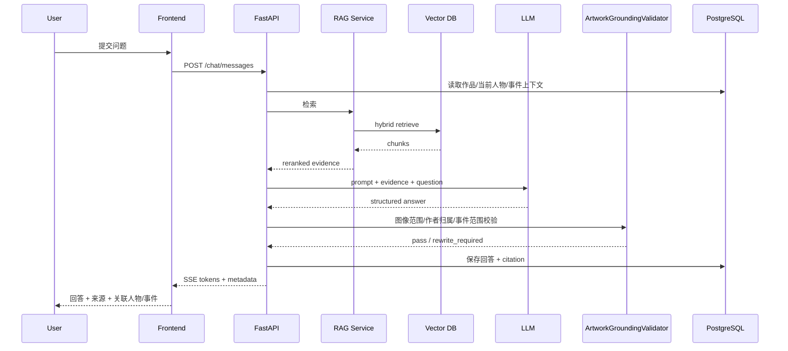

# 《同心千年》唐代章节实施规格
## 《步辇图》—禄东赞—文成公主：页面级原型 + 交互逻辑 + API + 数据表 + AI Prompt + Neo4j 图谱

**版本：V1.0 / Vertical Slice 开发版**  
**目标：让前端、后端、AI、内容、视觉可以按同一份文档并行开工。**  
**范围：只做“唐代·交流”一个完整闭环，重点实现“画卷探索 + 画内/画外人物关系 + AI文物讲述 + 史料来源 + 可解释知识图谱”。**

---

# 1. 本章节要证明什么

这个章节不是为了把《步辇图》做成一个可以放大的高清文物图片，也不是做一个“文成公主入藏故事播放器”，而是要通过“一幅画如何连接到画外的历史网络”，证明《同心千年》中的“交流”能够被具体、可追问、可核验地呈现。

核心体验链：

```text
进入唐代历史画卷场景
→ 展开《步辇图》
→ 主动寻找画中人物
→ 点击唐太宗 / 禄东赞 / 引见官员等预标注热点
→ 从禄东赞打开“画外关系”
→ 发现松赞干布、文成公主、长安、吐蕃、641年相关婚姻事件
→ 理解“文成公主并不在画中”
→ 与《步辇图》AI数字文物角色对话
→ AI从审核史料中回答并显示来源
→ 查看“这幅画能证明什么 / 不能证明什么”
→ 从单幅历史画扩展到人物、事件、地点和长期唐蕃往来
→ 进入知识图谱查看每条重要关系的证据
→ 用户的跨时代文化探索图谱被点亮
```

这一章要让用户形成一个非常明确的认知：

> **一幅历史画不只是“画了谁”，更重要的是它能够作为入口，把用户带到画面之外的人物、事件、地域和长期交流关系中。**

与其他章节的核心差异：

```text
汉代：从人物与道路进入长期交通网络
北魏：从双历史空间中的证据对照理解文化变化
唐代：从一幅画进入“画内人物—画外事件—长期关系”网络
元代：从同一建筑中的多种文字看多文化共存
```

唐代章节的核心交互不是“看一幅古画”，而是：

> **“画卷人物关系透镜 + 画外关系展开”。**

---

# 2. 本章历史内容基线与表达边界

## 2.1 可作为第一版产品基础事实的数据

第一版内容库可以围绕以下权威公开资料支持的基础事实建立：

- 《步辇图》现藏故宫博物院；
- 故宫博物院藏品页面将其编目为唐代、阎立本作，绢本设色；
- 作品表现唐太宗接见吐蕃使臣禄东赞的历史场景；
- 故宫资料将这一历史背景与唐太宗、松赞干布、禄东赞和文成公主相关的唐蕃交往联系起来；
- 贞观八年（634年），吐蕃遣使至唐；
- 贞观十五年（641年），与文成公主入吐蕃相关的历史事件发生；
- 《步辇图》画面中的核心人物包括唐太宗和禄东赞；
- 文成公主是这一历史事件网络中的重要人物，但**不是这幅画中被描绘的核心人物**；
- “故宫名画记”公开资料说明，本幅无画家款印，北宋章伯益篆书题称“唐相阎立本笔”；
- 故宫相关研究显示，《步辇图》的作者归属、是否为原作或后世摹本等问题在研究史中存在讨论；
- 因此，产品可以展示故宫当前编目“阎立本作”，同时通过 `attribution_note` 告诉用户作品归属存在进一步研究空间；
- 一幅历史画不能被当作现代摄影照片，不能仅凭画面推断历史现场的具体对白、心理、动作顺序或全部服饰身份；
- 唐与吐蕃的关系具有长期性和复杂性，婚姻与使节交往只是其中的一部分，不能将整个唐蕃关系简化为“从此一直和平”或“只有一次和亲”。

进入正式生产库前仍然必须：

```text
拆成 Claim
→ 绑定来源
→ 标记 fact / interpretation / attribution
→ 标记时间范围
→ 内容审核
→ approved
```

## 2.2 一个必须在产品层面处理的历史细节

**文成公主不应该被设计成《步辇图》中的可点击人物热点。**

错误设计：

```text
《步辇图》
  ├── 唐太宗
  ├── 禄东赞
  └── 文成公主  ← 点击画中人物
```

正确设计：

```text
《步辇图》
  │
  ├── DEPICTS → 唐太宗
  │
  ├── DEPICTS → 禄东赞
  │
  └── DEPICTS → 其他画中人物
                │
                ▼
             禄东赞
                │
                │ 参与 / 奉命出使
                ▼
          唐蕃使节活动
                │
          ┌─────┴─────┐
          ▼           ▼
      松赞干布      唐太宗
          │
          │ 关联641年婚姻事件
          ▼
       文成公主
```

这恰好体现本章的核心产品价值：

> **从画中人物发现画外历史。**

## 2.3 第二个必须处理的学术细节：作者归属

故宫博物院藏品页面使用：

```text
《步辇图》卷，唐，阎立本作
```

但“故宫名画记”同时明确：

```text
本幅无画家款印
北宋章伯益篆书题称“唐相阎立本笔”
```

故宫相关研究也记录过学界关于：

```text
阎立本真迹
宋人摹本
作者归属
```

的讨论。

因此数据库不要只有：

```text
author = 阎立本
```

建议：

```text
catalogued_author = 阎立本
attribution_status = museum_catalogued_with_research_discussion
attribution_note = 本幅无画家款印，故宫现行编目为阎立本作，相关研究史存在讨论
```

用户界面：

```text
作者：阎立本（故宫现行编目）
[查看归属说明]
```

不要为了“稳”而把所有讨论删掉，也不要反过来擅自宣布“这幅画已经证明不是阎立本作品”。

## 2.4 第三个必须处理的内容边界：历史画不是现场照片

产品不得默认：

```text
画中的人物站位 = 历史现场精确站位
人物表情 = 真实心理
画面动作 = 当时真实动作全过程
颜色 = 所有人当日真实服装颜色
画中人物 = 当日现场所有参与者
```

详情页必须存在固定提示：

> **历史画是理解历史的重要图像材料，但画面表现、艺术创作和历史现场之间不能简单画等号。具体历史事实需要与文献和其他材料互相核验。**

因此数据库要拆分：

```text
Artwork / 作品实体
DepictedPerson / 画面被描绘人物
HistoricalPerson / 历史人物
DepictedScene / 画面主题
HistoricalEvent / 历史事件
ArtHistoricalInterpretation / 艺术史解释
```

## 2.5 “唐蕃交流”不能被一幅画代表全部

错误：

```text
《步辇图》
= 唐蕃关系全部历史
= 文成公主全部历史
= 唐与吐蕃从此一直和平
```

正确产品表达：

```text
《步辇图》
      │
      ▼
641年前后唐蕃交往中的一个重要历史场景
      │
      ▼
使节往来 / 婚姻关系 / 人员流动
      │
      ▼
更长时期的唐蕃交往
      │
      ├── 合作
      ├── 使节
      ├── 婚姻
      ├── 文化联系
      └── 也存在冲突与关系变化
```

本章的主题是“交流”，但不能为了主题隐藏历史关系的复杂性。

## 2.6 服饰与人物身份的表达边界

《步辇图》非常容易被做成：

```text
点击服装 → 自动识别“民族”
```

第一版明确不做。

原则：

```text
服饰特征 ≠ 自动等于单一民族身份
画面中的艺术表现 ≠ 可以独立证明历史人物全部社会身份
```

如果使用画面服饰作为证据，必须显示：

```text
看到什么
↓
故宫 / 学术研究如何描述
↓
能支持什么
↓
不能直接推出什么
```

## 2.7 本章明确不做

- 不做摄像头识别《步辇图》人物；
- 不做AI自动人脸识别；
- 不做古画人物自动分割作为核心技术；
- 不做“点击文成公主”画面热点；
- 不做OCR自动识别题跋；
- 不做实时古画服饰民族识别；
- 不做“看衣服猜民族”游戏；
- 不把历史画当成摄影照片；
- 不让AI编造唐太宗和禄东赞的具体对白；
- 不让AI编造文成公主的私人心理活动；
- 不让AI声称亲眼见证历史现场；
- 不把“和亲”解释成整个唐蕃关系唯一内容；
- 不把641年之后的唐蕃关系描述成一直和平；
- 不把现代“中华民族共同体意识”说成唐太宗、禄东赞、文成公主当时使用的概念；
- 不做复杂3D宫廷；
- 不做大而全唐代百科；
- 不一次性接入数百位唐蕃人物。

画面所有人物全部采用**人工预标注热点**，不依赖图像识别。

---

# 3. 核心用户故事

## US-01：第一次进入

> 作为第一次使用平台的用户，我希望快速知道这一章是从一幅画进入人物关系，而不是先读一大段唐蕃历史。

验收：

- 10秒内看懂“画卷 + 人物 + 画外关系”；
- 最多点击1次进入画卷；
- 首屏不超过150字正文。

## US-02：探索画中人物

> 作为普通用户，我希望点击画中人物，就能知道“他是谁、为什么在这里”。

验收：

- 点击热点 < 300ms；
- 显示人物名称、画中位置、历史身份、与事件关系；
- 不要求用户先懂古画；
- 热点来自人工标注。

## US-03：从画内走到画外

> 作为用户，我希望点击禄东赞以后，不只是看到人物简介，还能继续发现松赞干布、文成公主和相关事件。

验收：

- 禄东赞详情必须有“查看画外关系”；
- 至少展开4个相关实体；
- 文成公主出现在关系网络，而非画中热点；
- 可一键查看“为什么文成公主不在画里”。

## US-04：理解图像证据边界

> 作为用户，我希望知道一幅历史画能告诉我什么，也知道它不能直接证明什么。

验收：

```text
画面能直接观察什么
博物馆资料如何说明
其他文献能确认什么
画面不能直接证明什么
```

## US-05：继续追问

> 作为用户，我希望问《步辇图》“你画的是谁”“文成公主在哪”“画面和真实现场一样吗”。

验收：

- 推荐问题可直接发送；
- 支持自由输入；
- AI回答显示来源；
- 不把文成公主误认成画中宫女；
- 不把编造对白包装成史实。

## US-06：发现长期关系

> 作为用户，我希望知道641年的事件只是一个入口，而不是整个唐蕃历史。

验收：

- 图谱存在 `concept_long_term_tang_tubo_relations`；
- UI明确“本章从一个事件切入，不等于全部历史”；
- AI避免“从此一直和平”等绝对表述。

## US-07：获得探索成果

> 作为用户，我希望看到自己从“画中人物”走到了“画外事件”和“长期交流网络”。

记录：

```text
画中人物
画外人物
历史事件
地点
来源
AI问答
图谱关系
```

---

# 4. 页面地图

```text
T00 章节过场
  │
  ▼
T01 章节首页 / 《步辇图》导览
  │
  ▼
T02 《步辇图》横向画卷主场景
  ├── T03 画内 / 画外人物关系透镜
  ├── T04 实体 / 图像证据详情抽屉
  ├── T05 《步辇图》AI数字文物对话
  ├── T06 史料证据页
  └── T07 唐蕃关系图谱
           │
           ▼
         T08 本章探索成果
```

建议路由：

```text
/era/tang
/era/tang/bunian
/era/tang/bunian/chat
/era/tang/bunian/graph
/era/tang/bunian/summary
```

T03、T04、T06优先采用Overlay / Drawer。

页面状态通过Query保留：

```text
/era/tang/bunian?focus=person_ludongzan&lens=relations&scroll=0.46
```

---

# 5. 全局页面框架

PC / 大屏优先，基准1440×900。

```text
┌──────────────────────────────────────────────────────────────┐
│ Logo 同心千年     唐代·交流       图谱    我的探索    返回时间轴 │
├──────────────────────────────────────────────────────────────┤
│                                                              │
│                       页面主内容区                            │
│                                                              │
├──────────────────────────────────────────────────────────────┤
│ 章节进度 41%     已探索 5 个节点                  史料说明 / AI说明 │
└──────────────────────────────────────────────────────────────┘
```

全局固定组件：

```text
AppHeader
EraBreadcrumb
ExploreProgressBar
AiContentBadge
EvidenceBadge
GlobalToast
SourceDisclaimer
```

唐代专属组件：

```text
ScrollPaintingViewer
ArtworkHotspotLayer
ArtworkMinimap
InsideOutsideLens
EventRelationRibbon
ArtworkEvidenceCard
AttributionBadge
```

---

# 6. T00：章节过场

## 6.1 目的

从总时间轴进入唐代时，用4–6秒建立：

```text
画卷 / 使臣 / 关系
```

## 6.2 页面原型

```text
┌──────────────────────────────────────────────────┐
│                                                  │
│                      唐代                         │
│                                                  │
│                      交流                         │
│                                                  │
│          “一位使臣走进宫廷，                     │
│           画面之外连接着怎样的历史？”            │
│                                                  │
│                 [展开画卷]                       │
│                 [跳过导览]                       │
│                                                  │
└──────────────────────────────────────────────────┘
```

动画：

```text
画卷由右向左展开 600–900ms
```

## 6.3 控件

| ID | 文案 | 点击逻辑 | API | 成功状态 |
|---|---|---|---|---|
| BTN-T00-01 | 展开画卷 | 动画后进入T01 | `POST /exploration/events` | 章节首页 |
| BTN-T00-02 | 跳过导览 | 直接T02 | `POST /exploration/events` | 画卷主场景 |
| BTN-T00-03 | 返回时间轴 | 总首页 | 无强依赖 | 保留进度 |

埋点：

```text
tang_intro_view
tang_intro_enter
tang_intro_skip
tang_intro_back
```

---

# 7. T01：章节首页 / 《步辇图》导览

## 7.1 页面目标

让用户知道：

1. 这是《步辇图》；
2. 画中核心人物包括唐太宗和禄东赞；
3. 文成公主与事件有关，但不在画中；
4. 这一章的玩法是“从画中人物追到画外关系”。

## 7.2 页面原型

```text
┌───────────────────────────────────────────────────────────────┐
│ 唐代 · 交流                                          进度 0%  │
├───────────────────────────────────────────────────────────────┤
│                                                               │
│          [《步辇图》横向局部预览]                            │
│                                                               │
│    ○ 唐太宗                       ○ 禄东赞                    │
│                                                               │
│                                            ┌──────────────┐   │
│                                            │ 《步辇图》    │   │
│                                            │ 唐代历史画    │   │
│                                            │ 故宫藏        │   │
│                                            └──────────────┘   │
│                                                               │
│ 探索问题：一幅画中的使臣，如何连接到画外更大的历史关系？      │
│                                                               │
│ [进入画卷] [先认识禄东赞] [与《步辇图》对话] [查看关系图谱]    │
└───────────────────────────────────────────────────────────────┘
```

## 7.3 按钮逻辑

| ID | 按钮 | 前端行为 | 后端/API | 异常处理 |
|---|---|---|---|---|
| BTN-T01-01 | 进入画卷 | T02，提示人物热点 | `scene_start` | 不阻断 |
| BTN-T01-02 | 先认识禄东赞 | T02 + 自动定位禄东赞 | entity API | 缓存失败显示基础卡 |
| BTN-T01-03 | 与《步辇图》对话 | T05 | chat session | fallback |
| BTN-T01-04 | 查看关系图谱 | T07，以作品为中心 | graph API | 错误态 |
| BTN-T01-05 | 查看作品说明 | T04 artwork | entity API | 空状态 |
| BTN-T01-06 | 返回时间轴 | 首页 | exploration event | 不阻断 |

## 7.4 导览文本建议

> 《步辇图》描绘唐太宗接见吐蕃使臣禄东赞的历史场景。文成公主本人并不在画面中，但从禄东赞继续追问，就能展开到松赞干布、文成公主以及641年前后的唐蕃交往。本章将把一幅画变成一张可以继续探索的历史关系网络。

固定内容优先，不使用LLM实时生成。

---

# 8. T02：《步辇图》横向画卷主场景

这是本章最重要的页面。

## 8.1 主场景结构

```text
┌──────────────────────────────────────────────────────────────────────┐
│ 唐代 · 《步辇图》       [人物透镜] [画外关系] [事件线] [AI] [图谱]    │
├──────────────────────────────────────────────────────────────────────┤
│                                                                      │
│   ← 可横向拖动画卷 →                                                │
│                                                                      │
│        ○ 唐太宗                                  ○ 禄东赞            │
│              ○ 宫女                     ○ 引见官员   ○ 内官           │
│                                                                      │
├──────────────────────────────────────────────────────────────────────┤
│ 当前任务：找到禄东赞，并看看他的关系如何走出画面                     │
│ [◀] ━━━━━━━━━ [当前视窗MiniMap] ━━━━━━━━━ [▶]       已探索 2/5       │
└──────────────────────────────────────────────────────────────────────┘
```

## 8.2 画卷浏览方式

支持：

```text
鼠标拖动画卷
滚轮横向移动
底部MiniMap跳转
人物热点定位
键盘左右键
```

不自动高速卷动。

## 8.3 热点实现

全部人工标注：

```json
{
  "hotspot_id": "hs_bunian_ludongzan",
  "artwork_id": "artifact_bunian_tu",
  "entity_id": "person_ludongzan",
  "shape": "polygon",
  "points": [[0.61,0.24],[0.70,0.24],[0.71,0.86],[0.60,0.85]],
  "annotation_type": "curated"
}
```

坐标采用0–1归一化。实际坐标需要根据最终高清图重新标注。

## 8.4 第一版画中热点

```text
person_emperor_taizong
person_ludongzan
figure_introductory_official
figure_inner_attendant
group_palace_women
artifact_bunian_tu
```

不要给每一位宫女虚构真实身份。

## 8.5 热点状态

```text
LOCKED
UNSEEN
SEEN
SELECTED
RELATION_EXPANDED
```

## 8.6 页面按钮完整逻辑

| ID | UI | 行为 |
|---|---|---|
| BTN-T02-01 | 人物透镜 | 开启所有已审核人物热点 |
| BTN-T02-02 | 画外关系 | T03，默认当前人物 |
| BTN-T02-03 | 事件线 | 展开634→641基础事件线 |
| BTN-T02-04 | AI对话 | T05 |
| BTN-T02-05 | 关系图谱 | T07 |
| BTN-T02-06 | 上一人物 | 聚焦上一热点 |
| BTN-T02-07 | 下一人物 | 聚焦下一热点 |
| BTN-T02-08 | 重置画卷 | 回默认视窗 |
| BTN-T02-09 | 作品信息 | T04，artwork |
| BTN-T02-10 | 我的进度 | progress drawer |
| BTN-T02-11 | 返回章节首页 | T01 |
| BTN-T02-12 | 返回时间轴 | 总首页 |

## 8.7 热点点击

```text
onClick
→ setSelectedArtworkEntity(entity_id)
→ save scroll position
→ POST exploration event
→ GET entity detail
→ 打开 T04
→ hotspot status = SEEN
```

关闭Drawer后恢复原scroll位置。

---

# 9. T03：画内 / 画外人物关系透镜

这是唐代章节最有辨识度的核心功能。

## 9.1 产品目的

```text
“这个人是谁？”
↓
“他为什么在画里？”
↓
“他代表谁？”
↓
“他和谁发生关系？”
↓
“画面之外还有谁？”
```

## 9.2 开启效果

选中禄东赞后：

```text
画面其他人物弱化
禄东赞高亮
右侧打开关系带
```

```text
┌───────────────────────────────┬──────────────────────────────────┐
│                               │ 画外关系                         │
│        《步辇图》             │                                  │
│                               │ 禄东赞                           │
│     ○ 唐太宗                  │   │                              │
│                               │   ├── 奉命/代表 → 松赞干布       │
│        ◎ 禄东赞               │   ├── 参与 → 唐蕃使节活动         │
│                               │   └── 关联 → 641年婚姻事件        │
│                               │                  │               │
│                               │                  ▼               │
│                               │               文成公主            │
└───────────────────────────────┴──────────────────────────────────┘
```

## 9.3 “画内 / 画外”标签

```text
IN_ARTWORK       画中可见
OUTSIDE_ARTWORK  画外关联
EVENT            历史事件
PLACE            地点
```

例如：

```text
禄东赞：IN_ARTWORK
文成公主：OUTSIDE_ARTWORK
```

## 9.4 固定知识卡：为什么文成公主不在画里？

```text
《步辇图》描绘的核心场景是唐太宗接见吐蕃使臣禄东赞。
文成公主是与这次唐蕃婚姻事件相关的重要历史人物，
但不是画面中被描绘的核心人物。
因此平台通过“禄东赞 → 历史事件 → 文成公主”展开她，
而不是在画中人为增加不存在的热点。
```

按钮：

```text
[查看故宫资料]
[查看相关事件]
```

## 9.5 关系展开层级

第一层：

```text
作品 → 唐太宗
作品 → 禄东赞
```

第二层：

```text
禄东赞 → 松赞干布
禄东赞 → 使节活动
```

第三层：

```text
使节活动 → 641年相关事件
641事件 → 文成公主
641事件 → 松赞干布
641事件 → 长安
```

默认最多3层。

## 9.6 控件

| ID | 文案 | 逻辑 |
|---|---|---|
| BTN-T03-01 | 关闭透镜 | 回T02 |
| BTN-T03-02 | 只看画中人物 | IN_ARTWORK |
| BTN-T03-03 | 看画外关系 | OUTSIDE_ARTWORK |
| BTN-T03-04 | 为什么文成公主不在画里？ | 固定知识卡 |
| BTN-T03-05 | 看641年前后事件 | 事件线 |
| BTN-T03-06 | 看地点 | 长安/吐蕃区域 |
| BTN-T03-07 | 查看全部关系 | T07 |
| REL-T03-* | 关系节点 | T04 |

---

# 10. T04：实体 / 图像证据详情抽屉

统一详情组件，支持：

```text
Artwork
Person
DepictedFigure
Event
Place
Region
Concept
```

## 10.1 《步辇图》实体原型

```text
                               ┌───────────────────────────────┐
                               │ 《步辇图》             [×]    │
                               │ Artwork / 历史画              │
                               ├───────────────────────────────┤
                               │ [作品局部]                    │
                               │                               │
                               │ 故宫博物院藏                  │
                               │ 唐代                          │
                               │ 作者：阎立本                  │
                               │ （故宫现行编目）              │
                               │ [查看归属说明]                │
                               │                               │
                               │ 画面主题：唐太宗接见禄东赞    │
                               │                               │
                               │ ● 藏品信息确认                │
                               │ ◐ 作者归属有研究说明          │
                               │                               │
                               │ [与作品对话]                  │
                               │ [查看画外关系]                │
                               │ [查看史料来源]                │
                               └───────────────────────────────┘
```

## 10.2 禄东赞实体原型

```text
                               ┌───────────────────────────────┐
                               │ 禄东赞                 [×]    │
                               │ Person / 历史人物             │
                               ├───────────────────────────────┤
                               │ [画中局部]                    │
                               │ 吐蕃使臣 / 重臣               │
                               │ 画中位置：唐太宗面前的使臣人物│
                               │ 历史关系：松赞干布、相关事件  │
                               │                               │
                               │ [查看画外关系]                │
                               │ [围绕他提问]                  │
                               │ [查看来源]                    │
                               └───────────────────────────────┘
```

## 10.3 文成公主实体原型

```text
                               ┌───────────────────────────────┐
                               │ 文成公主               [×]    │
                               │ Person / 历史人物             │
                               ├───────────────────────────────┤
                               │ [人物相关视觉]                │
                               │ 唐宗室女                      │
                               │ 与本章关系：641年相关婚姻事件 │
                               │                               │
                               │ ⚠ 不是《步辇图》画中人物      │
                               │                               │
                               │ [查看相关事件]                │
                               │ [围绕她提问]                  │
                               │ [查看史料来源]                │
                               └───────────────────────────────┘
```

## 10.4 字段

通用：

```text
entity_id
entity_type
display_name
subtitle
era
date_label
short_summary
body_markdown
image_url
verification_label
review_status
source_count
related_entity_count
```

Artwork扩展：

```text
collection
catalogue_period
catalogued_author
attribution_status
attribution_note
material
dimensions
depicted_event_id
artwork_evidence_note
```

Person扩展：

```text
depicted_in_artwork
artwork_hotspot_id nullable
historical_role
event_role
```

## 10.5 每个按钮

| ID | 按钮 | 逻辑 | API |
|---|---|---|---|
| BTN-T04-01 | × | 回T02原画卷位置 | 无 |
| BTN-T04-02 | 与作品对话 / 围绕TA提问 | T05 | chat |
| BTN-T04-03 | 查看画外关系 | T03 | relations |
| BTN-T04-04 | 查看它的关系 | T07 | graph |
| BTN-T04-05 | 查看史料来源 | T06 | sources |
| BTN-T04-06 | 查看归属说明 | attribution drawer | artwork API |
| BTN-T04-07 | 在画卷定位 | 画中实体跳热点 | 前端 |
| BTN-T04-08 | 查看相关事件 | event entity | entity |
| BTN-T04-09 | 加入我的探索 | exploration | event |

---

# 11. T05：《步辇图》AI数字文物对话

## 11.1 产品定位

第一版核心AI角色使用：

> **《步辇图》AI数字文物讲述者**

而不是直接把文成公主做成自由聊天角色。

原因：

- 本章从画卷开始；
- 文物角色可以同时解释画面和画外关系；
- 可以直接讨论图像证据边界；
- 更符合“让文物开口说话”的整体项目逻辑。

固定显示：

> AI数字文物讲述者。第一人称表达属于基于审核资料的数字叙事重构，并非文物真实发言，也不代表历史现场原声。

## 11.2 页面原型

```text
┌────────────────────────────────────────────────────────────────┐
│ ← 返回画卷        与“《步辇图》”对话     [叙事模式 | 史实模式] │
├────────────────────────────────────────────────────────────────┤
│                                                                │
│ 步辇图：你可以从我的画中人物、画外事件和作品本身开始问起。    │
│                                                                │
│ 推荐问题：                                                      │
│ [你画的是哪一次会见？]                                         │
│ [禄东赞是谁？]                                                 │
│ [文成公主为什么不在画里？]                                     │
│ [你的画面和真实现场完全一样吗？]                               │
│                                                                │
│ 用户：文成公主在画里的哪里？                                   │
│ 步辇图：……                                                     │
│                                                                │
│ 依据：[故宫藏品资料①] [故宫名画记②]                           │
│ 继续探索：[禄东赞] [文成公主] [641年事件]                      │
├────────────────────────────────────────────────────────────────┤
│ 输入你想问的问题……                                  [发送]     │
└────────────────────────────────────────────────────────────────┘
```

## 11.3 两种回答模式

### 叙事模式

允许：

```text
“我的画面中可以看到……”
“从禄东赞继续向画外追溯……”
```

不允许：

```text
“我亲眼看到……”
“我听见他们说……”
```

### 史实模式

第三人称：

> “《步辇图》描绘唐太宗接见禄东赞的场景……”

## 11.4 必须正确处理的问题

### 用户：文成公主在哪？

回答要点：

```text
她不是这幅画中被描绘的核心人物
→ 作品描绘唐太宗接见禄东赞
→ 文成公主通过相关历史事件与这幅画建立关系
```

不能回答：

> 她就是画中某位宫女。

### 用户：这幅画是不是当时的现场照片？

回答：不是。随后解释图像史料与历史现场之间需要互证。

### 用户：你是不是阎立本真迹？

回答必须保留：

```text
故宫现行编目
本幅无画家款印
北宋题识
研究史讨论
```

平台不自行裁定学术争论。

### 用户：文成公主之后唐蕃就一直和平吗？

必须说明641事件只是长期关系中的一个节点，此后关系存在不同阶段。

### 用户：这次交流是不是为了“中华民族共同体意识”？

必须说明这是现代语境概念，不能直接作为唐代人物当时的主观目标；可以讨论长期人员往来和文化联系的历史意义。

## 11.5 按钮逻辑

| ID | UI | 逻辑 |
|---|---|---|
| BTN-T05-01 | 返回画卷 | T02并保持会话 |
| BTN-T05-02 | 叙事模式 | narrative |
| BTN-T05-03 | 史实模式 | factual |
| CHIP-T05-* | 推荐问题 | 自动发送 |
| BTN-T05-04 | 发送 | chat API |
| BTN-T05-05 | 停止生成 | abort SSE |
| BTN-T05-06 | 来源卡 | T06 |
| BTN-T05-07 | 关联实体 | T04/T07 |
| BTN-T05-08 | 清空当前对话 | new session |
| BTN-T05-09 | 重新回答 | regenerate |
| BTN-T05-10 | 这个回答有问题 | feedback |

---

# 12. Chat 前后端时序



---

# 13. AI 回答状态机

```text
IDLE
→ RETRIEVING
→ GENERATING
→ VALIDATING
→ DONE
```

异常：

```text
NO_EVIDENCE
MODEL_TIMEOUT
VALIDATION_FAILED
NETWORK_ERROR
RATE_LIMIT
DEPICTION_SCOPE_ERROR
ARTWORK_AS_CAMERA_ERROR
ATTRIBUTION_OVERCLAIM
EVENT_SCOPE_OVERCLAIM
IDENTITY_FROM_COSTUME_OVERCLAIM
MODERN_CONCEPT_PROJECTION
```

### DEPICTION_SCOPE_ERROR

模型错误声称文成公主/松赞干布在画中时触发重写。

### ARTWORK_AS_CAMERA_ERROR

模型把画面站位、神态、对白直接当现场事实时触发。

### ATTRIBUTION_OVERCLAIM

模型声称“100%无争议阎立本亲笔真迹”时触发。

### EVENT_SCOPE_OVERCLAIM

模型声称641事件代表后续全部唐蕃关系时触发。

### Offline Demo Fallback

> 当前启用演示保障模式，以下内容来自已审核的预设问答库。

---

# 14. RAG 处理规格

## 14.1 输入

```json
{
  "chapter_id": "tang_exchange",
  "character_id": "artifact_bunian_tu",
  "current_entity_id": "person_ludongzan",
  "current_artwork_hotspot_id": "hs_bunian_ludongzan",
  "answer_mode": "factual",
  "question": "文成公主在画里的哪里？"
}
```

## 14.2 强制 Metadata Filter

```text
review_status = approved
chapter_ids contains tang_exchange
source_level in [S, A, B]
```

作品本体优先故宫；人物优先博物馆/权威史料整理/学术研究；作者归属优先故宫作品档案与故宫研究。

## 14.3 推荐检索流程

```text
原始问题
↓
意图分类
  ├─ 画面人物
  ├─ 画外事件
  ├─ 作品信息
  ├─ 作者归属
  ├─ 艺术解释
  └─ 长期唐蕃关系
↓
指代消解
↓
Query Rewrite
↓
Hybrid Retrieval
↓
Top 12
↓
Evidence Rerank
↓
Top 4–6
↓
Depiction Scope Guard
↓
Attribution Guard
↓
Event Scope Guard
↓
生成
↓
Claim Validation
↓
Citation Validation
```

## 14.4 Depiction Scope Guard

```text
person_emperor_taizong   depicted_in_artwork = true
person_ludongzan          depicted_in_artwork = true
person_princess_wencheng  depicted_in_artwork = false
person_songtsen_gampo     depicted_in_artwork = false
```

## 14.5 Attribution Guard

必须区分：

```text
museum_catalogue_claim
research_note
```

不能把“现行编目”升级成“无争议最终定论”。

## 14.6 No Context No Answer

```json
{
  "status": "NO_EVIDENCE",
  "answer": "",
  "citations": []
}
```

---

# 15. AI Prompt 体系

不要只写一个巨大Prompt，拆成5个。

## Prompt A：《步辇图》主角色 System Prompt

```text
你是《同心千年》中的“《步辇图》AI数字文物讲述者”。

你的任务不是扮演一个真正具有意识、亲历历史现场的文物，而是把经过审核的作品资料、历史资料和研究材料转换成准确、易懂、具有互动感的解释。

【身份】
- 展示对象：《步辇图》。
- 当前章节：唐代·交流。
- 第一人称仅是一种数字叙事形式。

【知识边界】
1. 只能依据 <EVIDENCE> 回答具体历史事实。
2. 不得补充证据外具体对白、心理、现场声音、动作顺序。
3. 不能声称你是历史现场照片或实时记录。
4. 不能仅凭画面推断人物真实心理。
5. 不能把文成公主识别为画中某位宫女；当前审核数据中她属于画外关联人物。
6. 不能把松赞干布识别为画中人物，除非未来审核数据改变。
7. 回答“谁在画里”时，以 <DEPICTED_ENTITIES> 为最高优先级。
8. 回答作者时，要区分：故宫现行编目、本幅无画家款印、北宋题识、相关研究讨论。
9. 不得宣布学术归属争议已被你最终解决。
10. 不得把641年事件概括为整个唐蕃关系。
11. 不得声称此后双方“一直和平”。
12. 不得把现代概念直接描述成唐代人物当时的主观目标。
13. 不得根据服饰直接推断单一民族身份，除非证据明确支持。
14. 不编造唐太宗和禄东赞的对话。
15. 无证据时明确说资料不足。

【叙事模式】
若 ANSWER_MODE=narrative：
- 可以说“我的画面中可以看到……”
- 可以说“从禄东赞继续向画外追溯……”
- 不可以说“我亲眼见到……”
- 不可以说“我听见他们说……”

【史实模式】
若 ANSWER_MODE=factual：
- 使用第三人称；
- 清晰区分作品事实、历史事件和研究解释。

【图像证据】
ARTWORK_VISUAL只能支持画面可观察信息，不得自动支持历史现场全部细节。

【引用】
- 每个重要事实必须有 EVIDENCE 支撑。
- 只返回实际使用 citation_id。
- 不创造来源。

【输出】
严格返回：
{
  "answer_markdown": "...",
  "citation_ids": ["..."],
  "related_entity_ids": ["..."],
  "uncertainty": "low|medium|high",
  "evidence_types": ["..."],
  "needs_human_review": false
}
```

## Prompt B：问题改写 Prompt

```text
你是唐代《步辇图》章节知识库检索查询改写器。

输入：
- 当前作品
- 当前画中人物
- 当前画外关系
- 用户问题

规则：
1. 补足“他、她、这幅画、这里、这个人”等指代。
2. 区分画中人物识别、历史事件、文成公主画外关系、作者归属、艺术表现、长期唐蕃关系。
3. 不默认用户问题中的错误前提成立。
4. 用户问“文成公主是不是这个宫女”时，要检索作品描绘人物 + 文成公主与事件关系。
5. 用户问“是不是真迹”时，同时检索故宫编目和作品归属研究说明。
6. 不加入答案。

示例：
当前作品：《步辇图》
用户：文成公主是不是画里站着的那个女人？

输出：
“故宫博物院如何说明《步辇图》的画面人物，文成公主是否属于画中被描绘人物，以及她与该画所反映历史事件之间是什么关系？”
```

## Prompt C：证据相关性判断

```text
输出：
{
  "chunk_id": "...",
  "relevance": 0-3,
  "evidence_type": "museum_catalogue|artwork_visual|historical_record|scholarly",
  "supports_claims": [],
  "depiction_scope": [],
  "reason": ""
}

3 = 直接支持核心事实
2 = 重要背景
1 = 弱相关
0 = 无关

特别规则：
- 文成公主资料不能自动证明她出现在画面中。
- 《步辇图》画面信息不能自动证明历史现场全部细节。
- 一篇作者归属研究不能自动代表“学界最终定论”。
- 641事件资料不能自动支持整个后续唐蕃关系一直不变。
```

## Prompt D：答案事实核验

```text
检查：
1. 作品基本信息是否有来源；
2. 唐太宗、禄东赞是否被正确识别为画中人物；
3. 是否错误声称文成公主在画中；
4. 是否错误声称松赞干布在画中；
5. 是否把作品当作现场照片；
6. 是否编造人物对白、心理、动作细节；
7. 是否把艺术表现写成历史现场绝对事实；
8. 是否把故宫现行“阎立本作”写成学界100%无争议；
9. 是否忽略无画家款印等归属说明；
10. 是否把641事件说成整个唐蕃关系；
11. 是否声称后续一直和平；
12. 是否从服饰直接推出单一民族身份；
13. 是否把现代概念变成古人主观目标；
14. 引用是否存在。

输出：
{
  "pass": true,
  "unsupported_claims": [],
  "depiction_scope_errors": [],
  "artwork_camera_errors": [],
  "attribution_errors": [],
  "event_scope_errors": [],
  "citation_errors": [],
  "rewrite_required": false
}
```

## Prompt E：探索总结 Prompt

```text
输入：
- visited_artwork_hotspot_ids
- visited_entity_ids
- expanded_outside_relation_ids
- visited_relation_ids
- asked_question_topics

规则：
1. 不新增用户没有探索的史实。
2. 80–120字。
3. 可以描述“从画中人物走到画外历史关系”的路径。
4. 不推断用户政治态度、民族身份和价值观。
5. 不把策展关系当作事实因果。
6. 推荐下一章只能基于内容联系。

输出：
{
  "summary": "...",
  "next_entity_ids": ["..."]
}
```

---

# 16. 推荐问题配置

```json
[
  {"id":"q_tang_01","text":"这幅画画的是哪一次会见？","intent":"depicted_event"},
  {"id":"q_tang_02","text":"禄东赞是谁？","intent":"ludongzan_identity"},
  {"id":"q_tang_03","text":"文成公主为什么不在画里？","intent":"wencheng_outside_artwork"},
  {"id":"q_tang_04","text":"松赞干布在画里吗？","intent":"songtsen_depiction"},
  {"id":"q_tang_05","text":"这幅画和真实历史现场完全一样吗？","intent":"artwork_evidence_boundary"},
  {"id":"q_tang_06","text":"这幅画一定是阎立本亲笔吗？","intent":"attribution"},
  {"id":"q_tang_07","text":"文成公主入吐蕃以后双方是不是一直和平？","intent":"long_term_relation_scope"},
  {"id":"q_tang_08","text":"为什么一幅画可以连接出这么多人？","intent":"knowledge_graph_explanation"}
]
```

首屏最多显示4个。

---

# 17. T06：史料证据页

## 17.1 目标

把“这幅画里是谁”和“这幅画与哪个历史事件有关”拆成可追溯事实。

## 17.2 页面结构

```text
┌──────────────────────────────────────────────────────────┐
│ 史料依据                                      [关闭]     │
├──────────────────────────────────────────────────────────┤
│ 当前内容：禄东赞                                          │
│                                                          │
│ [官方藏品资料] 故宫博物院                                │
│ 《阎立本步辇图卷》                                       │
│ 支持：作品主题、唐太宗、禄东赞、相关历史事件             │
│ [这个来源支持了什么？] [查看来源]                        │
│                                                          │
│ [官方作品研究] 故宫名画记                                │
│ 《步辇图卷》                                             │
│ 支持：本幅无画家款印、北宋题称“唐相阎立本笔”            │
│ [查看归属说明]                                           │
│                                                          │
│ [故宫人物词条] 禄东赞                                    │
│ 支持：禄东赞身份及与松赞干布、文成公主相关关系           │
└──────────────────────────────────────────────────────────┘
```

## 17.3 第一批推荐来源

### S：故宫博物院藏品页

```text
Source ID: src_dpm_bunian_collection
Title: 阎立本步辇图卷
Institution: 故宫博物院
URL: https://www.dpm.org.cn/collection/paint/234620.html
```

用于：

```text
作品基本信息
现行编目“唐，阎立本作”
画面主题
唐太宗 / 禄东赞画面说明
634 / 641相关事件背景
文成公主与事件关系
```

### S：故宫名画记

```text
Source ID: src_dpm_minghuaji_bunian
Title: 步辇图卷
Institution: 故宫博物院
URL: https://minghuaji.dpm.org.cn/paint/detail?id=4b24c04a7a544661a1d523b98f74fdd3
```

用于：

```text
作品基本信息
本幅无画家款印
北宋题称“唐相阎立本笔”
641事件背景
```

### S：故宫博物院人物词条

```text
Source ID: src_dpm_ludongzan
Title: 吐蕃大相禄东赞
Institution: 故宫博物院
URL: https://www.dpm.org.cn/lemmas/240048.html
```

用于：

```text
禄东赞身份
与松赞干布关系
赴长安
与文成公主相关历史关系
```

### A：故宫相关学术研究

例如《唐代礼官服色考——兼论〈步辇图〉的服色问题》等专业研究，正式入库时必须记录作者、机构、页码和支持Claim。

## 17.4 来源等级

```text
S 博物馆 / 权威文博机构
A 专业论文 / 专著
B 高校 / 专业科普
C 普通网络材料
```

UI显示：

```text
官方藏品资料
官方作品研究
学术研究
专业资料
```

## 17.5 控件

| ID | 按钮 | 逻辑 |
|---|---|---|
| BTN-T06-01 | 关闭 | 回调用前页面 |
| BTN-T06-02 | 查看来源 | 外链/书目信息 |
| BTN-T06-03 | 这个来源支持了什么？ | claims |
| BTN-T06-04 | 查看作者归属说明 | attribution claims |
| BTN-T06-05 | 返回回答 | chat |
| BTN-T06-06 | 返回画卷 | T02 |
| BTN-T06-07 | 报告来源问题 | feedback |

---

# 18. T07：唐蕃关系图谱

## 18.1 产品目标

不是画：

```text
《步辇图》 → 文成公主 → 民族团结
```

而是：

```text
作品 → 人物 → 使节活动 → 婚姻事件 → 地点 → 长期关系
```

一层层展开。

## 18.2 默认图

```text
                            [唐代]
                               │
                               ▼
                          [《步辇图》]
                           /         \
                       描绘           描绘
                        ▼             ▼
                    [唐太宗]       [禄东赞]
                                      │
                                      ▼
                               [唐蕃使节活动]
                                 /           \
                                ▼             ▼
                           [松赞干布]      [长安]
                                │
                                ▼
                        [641年婚姻事件]
                           /          \
                          ▼            ▼
                    [文成公主]      [松赞干布]
```

长期关系通过 `SUPPORTS_STUDY_OF` 进入，不使用 `CAUSED`。

## 18.3 页面原型

```text
┌───────────────────────────────────────────────────────────────┐
│ ← 返回画卷       唐代文化关系图谱        [筛选] [重置] [我的节点] │
├───────────────────────────────────────────────────────────────┤
│                         ○ 唐代                                │
│                           │                                   │
│                       ◎《步辇图》                             │
│                      /         \                              │
│                 ○唐太宗      ○禄东赞                         │
│                               │                               │
│                           ○使节活动                           │
│                           /      \                            │
│                      ○松赞干布  ○641事件                     │
│                                  │                            │
│                               ○文成公主                       │
├───────────────────────────────────────────────────────────────┤
│ 当前选中：文成公主                                           │
│ 关系：文成公主 → 参与/关联 → 641年婚姻事件                   │
│ [查看详情] [展开一层] [为什么有这条关系？]                   │
└───────────────────────────────────────────────────────────────┘
```

## 18.4 图谱按钮

| ID | 按钮 | 逻辑 |
|---|---|---|
| BTN-T07-01 | 返回画卷 | T02 |
| BTN-T07-02 | 筛选 | Artwork/Person/Event/Place/Concept |
| BTN-T07-03 | 重置 | 默认图 |
| BTN-T07-04 | 我的节点 | 用户访问高亮 |
| NODE-* | 点击 | select |
| BTN-T07-05 | 查看详情 | T04 |
| BTN-T07-06 | 展开一层 | max 12 |
| BTN-T07-07 | 为什么有这条关系？ | relation evidence |
| BTN-T07-08 | 收起分支 | 前端 |
| BTN-T07-09 | 只看画中人物 | depicted=true |
| BTN-T07-10 | 显示画外关系 | outside |
| BTN-T07-11 | 完成本章 | T08 |

## 18.5 边类型

```text
Fact            实线
Interpretation  虚线
Curatorial      点划线
```

## 18.6 图谱限制

```text
初始 ≤ 14
单次展开 ≤ 12
可见 ≤ 35
```

---

# 19. 图谱 API

```http
GET /api/v1/graph/subgraph
    ?center_entity_id=artifact_bunian_tu
    &depth=1
    &limit=20
```

Response：

```json
{
  "center_entity_id": "artifact_bunian_tu",
  "nodes": [
    {"id":"artifact_bunian_tu","type":"Artwork","name":"《步辇图》","explored":true},
    {"id":"person_ludongzan","type":"Person","name":"禄东赞","explored":true}
  ],
  "edges": [
    {
      "id":"rel_bunian_depicts_ludongzan",
      "source":"artifact_bunian_tu",
      "target":"person_ludongzan",
      "relation_type":"DEPICTS",
      "display_label":"描绘",
      "claim_type":"fact",
      "review_status":"approved"
    }
  ]
}
```

---

# 20. T08：本章探索成果

## 20.1 最低完成条件

- 进入画卷；
- 点击至少2个画中人物；
- 展开1次画外关系；
- 打开文成公主节点；
- 完成1次AI问答或深度知识卡；
- 查看1次来源；
- 打开图谱。

## 20.2 进度权重建议

```text
进入画卷                     10
探索2个画中人物              10
找到禄东赞                   10
展开画外关系                 15
访问文成公主节点             10
阅读图像证据边界             10
完成AI问答                   15
查看来源                      5
打开图谱                      5
查看一条关系证据             10
--------------------------------
总计                        100
```

## 20.3 页面

```text
┌──────────────────────────────────────────────────────────────┐
│                       本章探索完成                            │
│ 唐代 · 交流                                  探索进度 84%    │
│                                                              │
│ 你探索了：                                                   │
│ 3个画中人物  3个画外人物/事件  9条关系  3条史料              │
│                                                              │
│ 你的探索路径：                                               │
│ 《步辇图》 → 禄东赞 → 松赞干布 → 641事件 → 文成公主          │
│                                                              │
│ AI探索总结：……                                               │
│                                                              │
│ [继续探索唐代] [返回历史时间轴] [查看我的总图谱]              │
└──────────────────────────────────────────────────────────────┘
```

---

# 21. 前端组件树

```text
TangExchangeChapterPage
├── GlobalHeader
├── ChapterProgress
├── BunianScrollViewer
│   ├── ArtworkImage
│   ├── HorizontalPanController
│   ├── ArtworkHotspotLayer
│   │   └── ArtworkHotspot × N
│   ├── ArtworkMinimap
│   └── SceneGuide
├── InsideOutsideLens
│   ├── InsideArtworkEntityList
│   ├── OutsideArtworkRelationList
│   ├── EventRelationRibbon
│   └── WhyNotInArtworkCard
├── EntityDrawer
│   ├── EntityHero
│   ├── VerificationBadge
│   ├── DepictionBadge
│   ├── AttributionBadge
│   ├── EvidenceBoundaryNote
│   └── SourcePreview
├── ChatPanel
│   ├── CharacterHeader
│   ├── AnswerModeSwitch
│   ├── CurrentArtworkContext
│   ├── RecommendedQuestions
│   ├── MessageList
│   ├── CitationChips
│   └── ChatComposer
├── SourceDrawer
├── KnowledgeGraph
│   ├── GraphCanvas
│   ├── GraphFilters
│   └── RelationEvidencePanel
└── ChapterSummary
```

---

# 22. 前端 Store

```text
chapterStore
artworkStore
relationLensStore
entityStore
chatStore
graphStore
explorationStore
```

## 22.1 artworkStore

```ts
interface ArtworkState {
  artworkId: "artifact_bunian_tu";
  scrollRatio: number;
  selectedHotspotId?: string;
  visitedHotspotIds: string[];
  lens: "none" | "person" | "outside_relation";
  minimapOpen: boolean;
}
```

## 22.2 relationLensStore

```ts
interface RelationLensState {
  rootEntityId?: string;
  insideArtworkEntityIds: string[];
  outsideArtworkEntityIds: string[];
  expandedRelationIds: string[];
  depth: number;
}
```

## 22.3 explorationStore

```ts
interface ExplorationState {
  sessionId: string;
  chapterId: "tang_exchange";
  visitedEntityIds: string[];
  visitedArtworkHotspotIds: string[];
  expandedOutsideRelationIds: string[];
  viewedSourceIds: string[];
  viewedRelationIds: string[];
  askedQuestionCount: number;
  progress: number;
  lastActiveAt: string;
}
```

---

# 23. API 总览

Base：`/api/v1`

## Content

```http
GET /chapters/tang_exchange
GET /chapters/tang_exchange/narration
GET /chapters/tang_exchange/recommended-questions
GET /artworks/artifact_bunian_tu
GET /artworks/artifact_bunian_tu/hotspots
GET /artworks/artifact_bunian_tu/depicted-entities
GET /artworks/artifact_bunian_tu/attribution
GET /entities/{entity_id}
GET /entities/{entity_id}/sources
```

## Relation Lens

```http
GET /artworks/artifact_bunian_tu/outside-relations
GET /entities/{entity_id}/relations
GET /events/{event_id}
```

## Chat

```http
POST /chat/sessions
POST /chat/messages
POST /chat/messages/{message_id}/regenerate
POST /chat/messages/{message_id}/feedback
```

## Graph

```http
GET /graph/subgraph
GET /graph/relations/{relation_id}/evidence
```

## Exploration

```http
POST /exploration/sessions
POST /exploration/events
GET  /exploration/progress
POST /exploration/summary
```

---

# 24. 关键 API Contract

## 24.1 GET chapter

```json
{
  "id": "tang_exchange",
  "era": "唐代",
  "theme": "交流",
  "title": "从《步辇图》走进画外历史",
  "guiding_question": "一位使臣背后连接着怎样的人物与事件？",
  "hero_image": "/assets/tang/bunian_hero.webp",
  "artwork_id": "artifact_bunian_tu",
  "core_entity_ids": [
    "artifact_bunian_tu",
    "person_emperor_taizong",
    "person_ludongzan",
    "person_princess_wencheng",
    "event_tang_tubo_marriage_641"
  ]
}
```

## 24.2 GET artwork

```json
{
  "id": "artifact_bunian_tu",
  "title": "《步辇图》",
  "collection": "故宫博物院",
  "catalogue_period": "唐",
  "catalogued_author": "阎立本",
  "attribution_status": "museum_catalogued_with_research_discussion",
  "image_url": "/assets/tang/bunian.webp",
  "depicted_event_id": "event_taizong_receives_ludongzan"
}
```

## 24.3 GET hotspots

```json
{
  "artwork_id": "artifact_bunian_tu",
  "hotspots": [
    {
      "id":"hs_bunian_ludongzan",
      "entity_id":"person_ludongzan",
      "shape":"polygon",
      "points":[[0.61,0.24],[0.70,0.24],[0.71,0.86],[0.60,0.85]],
      "label":"禄东赞",
      "annotation_type":"curated"
    }
  ]
}
```

## 24.4 GET depicted entities

```json
{
  "depicted_entities": [
    {"entity_id":"person_emperor_taizong","depicted":true},
    {"entity_id":"person_ludongzan","depicted":true},
    {"entity_id":"person_princess_wencheng","depicted":false},
    {"entity_id":"person_songtsen_gampo","depicted":false}
  ]
}
```

## 24.5 POST chat session

```json
{
  "chapter_id":"tang_exchange",
  "character_id":"artifact_bunian_tu"
}
```

## 24.6 POST chat message

```json
{
  "session_id":"chat_tang_01",
  "question":"文成公主在画里的哪里？",
  "answer_mode":"factual",
  "current_entity_id":"person_ludongzan",
  "current_artwork_hotspot_id":"hs_bunian_ludongzan"
}
```

SSE最终元数据：

```json
{
  "message_id":"msg_tang_01",
  "citations":[
    {
      "source_id":"src_dpm_bunian_collection",
      "title":"阎立本步辇图卷",
      "institution":"故宫博物院"
    }
  ],
  "related_entity_ids":["person_princess_wencheng","event_tang_tubo_marriage_641"],
  "uncertainty":"low"
}
```

---

# 25. PostgreSQL 数据表

复用全局基础表，新增作品和画卷关系结构。

## 25.1 chapters

| 字段 | 类型 | 说明 |
|---|---|---|
| id | varchar PK | `tang_exchange` |
| era | varchar | 唐代 |
| theme | varchar | 交流 |
| title | varchar | 从《步辇图》走进画外历史 |
| guiding_question | text | |
| hero_asset_id | varchar | |
| status | enum | draft/review/approved |

## 25.2 artworks

```text
entity_id
collection
catalogue_period
catalogued_author
attribution_status
attribution_note
material
dimensions
depicted_event_id
review_status
```

## 25.3 artwork_hotspots

```text
id
artwork_entity_id
target_entity_id
shape
normalized_points
label
annotation_type
sort_order
enabled
review_status
```

## 25.4 depicted_entities

这是唐代章节最关键的新表之一。

```text
id
artwork_entity_id
entity_id
depicted boolean
depiction_role
confidence
claim_ids jsonb
review_status
```

第一版：

```text
唐太宗       true
禄东赞       true
文成公主     false
松赞干布     false
```

`false`不表示与作品无关，只表示不是画面被描绘人物。

## 25.5 historical_events

```text
id
chapter_id
name
date_start
date_end
date_label
place_entity_ids jsonb
short_summary
claim_ids jsonb
review_status
```

## 25.6 event_participants

```text
event_id
entity_id
role
participation_type
claim_ids
review_status
```

## 25.7 artwork_attribution_claims

```text
id
artwork_entity_id
claim_type
claim_text
source_id
evidence_note
status
review_status
```

类型：

```text
museum_catalogue
inscription
scholarly_argument
copy_hypothesis
authorship_hypothesis
```

## 25.8 entities

```text
id
entity_type
name
display_name
era
date_start
date_end
short_summary
body_markdown
verification_label
review_status
primary_asset_id
created_at
updated_at
```

## 25.9 sources

```text
id
title
author
institution
source_type
source_level
publication_year
public_url
bibliography
license_note
review_status
```

## 25.10 claims

```text
id
entity_id
claim_text
claim_type
controversy_status
time_scope
review_status
```

## 25.11 claim_sources

```text
claim_id
source_id
locator
support_type
note
```

## 25.12 rag_chunks

```text
id
source_id
text
token_count
entity_ids
artwork_ids
event_ids
claim_ids
chapter_ids
evidence_type
source_level
review_status
vector_ref
```

## 25.13 characters

```text
id
name
character_type
base_entity_id
system_prompt_version
voice_asset/config
enabled
```

首个：`artifact_bunian_tu`

## 25.14 chat_sessions / chat_messages / citations

沿用元代结构，并为citation保留 `claim_id`。

## 25.15 exploration

```text
exploration_sessions
exploration_events
exploration_node_state
```

事件增加：

```text
ARTWORK_HOTSPOT_VIEW
OUTSIDE_RELATION_EXPAND
ATTRIBUTION_NOTE_VIEW
ARTWORK_EVIDENCE_BOUNDARY_VIEW
```

---

# 26. 第一批实体 ID

```text
chapter:
tang_exchange

period:
period_tang

artwork:
artifact_bunian_tu

person:
person_emperor_taizong
person_ludongzan
person_princess_wencheng
person_songtsen_gampo
person_li_daozong

depicted figure/group:
figure_introductory_official
figure_inner_attendant
group_palace_women

place:
place_changan

region:
region_tubo

event:
event_taizong_receives_ludongzan
event_tang_tubo_envoy_634
event_tang_tubo_marriage_641
event_princess_wencheng_journey

concept:
concept_diplomatic_mission
concept_personnel_exchange
concept_political_marriage
concept_long_term_tang_tubo_relations
concept_artwork_historical_evidence
concept_cultural_exchange

attribution:
attribution_bunian_yanliben_catalogue
attribution_bunian_song_inscription
attribution_bunian_research_discussion
```

---

# 27. Neo4j 模型

## 27.1 Node Labels

```text
Period
Artwork
Person
DepictedFigure
DepictedGroup
Place
Region
Event
Concept
AttributionClaim
Source
```

## 27.2 Relation Types

```text
DEPICTS
ASSOCIATED_WITH_EVENT
PARTICIPATED_IN
REPRESENTED
TOOK_PLACE_AT
TRAVELLED_TO
RELATED_TO
CATALOGUED_AS
HAS_ATTRIBUTION_CLAIM
SUPPORTS_STUDY_OF
CURATORIAL_LINK
HAS_SOURCE
```

避免使用：

```text
CAUSED
PROVED
PHOTOGRAPHED
```

## 27.3 Relation Properties

```text
id
display_label
claim_type
review_status
source_ids
time_scope
certainty
```

---

# 28. 第一批 Neo4j 三元组

## 28.1 核心事实关系

```text
《步辇图》 | DEPICTS | 唐太宗
《步辇图》 | DEPICTS | 禄东赞
《步辇图》 | ASSOCIATED_WITH_EVENT | 唐太宗接见禄东赞
唐太宗 | PARTICIPATED_IN | 唐太宗接见禄东赞
禄东赞 | PARTICIPATED_IN | 唐太宗接见禄东赞
禄东赞 | REPRESENTED | 松赞干布
禄东赞 | PARTICIPATED_IN | 唐蕃使节活动
唐太宗接见禄东赞 | TOOK_PLACE_AT | 长安
文成公主 | PARTICIPATED_IN | 641年相关婚姻事件
松赞干布 | PARTICIPATED_IN | 641年相关婚姻事件
641年相关婚姻事件 | ASSOCIATED_WITH | 唐蕃交往
《步辇图》 | CATALOGUED_AS | 阎立本作
```

最后一条应标：

```text
claim_type = catalogue_fact
```

而非绝对作者定论。

## 28.2 解释性关系

```text
《步辇图》 | SUPPORTS_STUDY_OF | 唐代历史人物画
《步辇图》 | SUPPORTS_STUDY_OF | 唐蕃使节交往
641年相关婚姻事件 | SUPPORTS_STUDY_OF | 唐蕃人员往来
唐蕃使节活动 | SUPPORTS_STUDY_OF | 政治交往
```

## 28.3 策展关系

如果需要直接显示：

```text
《步辇图》 | CURATORIAL_LINK | 文成公主
```

必须：

```text
claim_type = curatorial
```

默认更推荐通过事件中介连接。

## 28.4 禁止建立的三元组

```text
《步辇图》 | DEPICTS | 文成公主
《步辇图》 | DEPICTS | 松赞干布
文成公主 | IS | 画中宫女
步辇图 | PHOTOGRAPHED | 历史现场
阎立本 | DEFINITELY_WITHOUT_DISPUTE | 步辇图
641年婚姻事件 | CAUSED | 此后一直和平
文成公主 | CAUSED | 唐蕃全部文化交流
服饰 | PROVES_ETHNICITY | 某一画中人物
```

---

# 29. Neo4j Cypher Seed 示例

```cypher
MERGE (a:Artwork {id:'artifact_bunian_tu'})
SET a.name='《步辇图》', a.era='唐代', a.review_status='approved';

MERGE (t:Person {id:'person_emperor_taizong'})
SET t.name='唐太宗', t.review_status='approved';

MERGE (l:Person {id:'person_ludongzan'})
SET l.name='禄东赞', l.review_status='approved';

MERGE (w:Person {id:'person_princess_wencheng'})
SET w.name='文成公主', w.review_status='approved';

MERGE (s:Person {id:'person_songtsen_gampo'})
SET s.name='松赞干布', s.review_status='approved';

MERGE (e:Event {id:'event_taizong_receives_ludongzan'})
SET e.name='唐太宗接见禄东赞', e.review_status='approved';

MERGE (a)-[:DEPICTS {
  id:'rel_bunian_depicts_taizong',
  display_label:'描绘',
  claim_type:'fact',
  review_status:'approved'
}]->(t);

MERGE (a)-[:DEPICTS {
  id:'rel_bunian_depicts_ludongzan',
  display_label:'描绘',
  claim_type:'fact',
  review_status:'approved'
}]->(l);

MERGE (a)-[:ASSOCIATED_WITH_EVENT {
  id:'rel_bunian_associated_reception',
  display_label:'反映/关联',
  claim_type:'fact',
  review_status:'approved'
}]->(e);
```

641事件：

```cypher
MERGE (m:Event {id:'event_tang_tubo_marriage_641'})
SET m.name='641年唐蕃婚姻事件', m.review_status='approved';

MERGE (w)-[:PARTICIPATED_IN {
  id:'rel_wencheng_641',
  display_label:'参与',
  claim_type:'fact',
  review_status:'approved'
}]->(m);

MERGE (s)-[:PARTICIPATED_IN {
  id:'rel_songtsen_641',
  display_label:'参与',
  claim_type:'fact',
  review_status:'approved'
}]->(m);
```

**不要加入：**

```cypher
(a)-[:DEPICTS]->(w)
```

---

# 30. “为什么有这条关系？”数据结构

例1：

```json
{
  "relation_id":"rel_bunian_depicts_ludongzan",
  "claim":"故宫博物院藏品资料将画面中的吐蕃使臣识别为禄东赞。",
  "claim_type":"fact",
  "sources":[
    {
      "source_id":"src_dpm_bunian_collection",
      "title":"阎立本步辇图卷",
      "institution":"故宫博物院"
    }
  ]
}
```

例2：

```json
{
  "relation_id":"rel_bunian_curatorial_wencheng",
  "claim":"本平台通过禄东赞和相关历史事件，从《步辇图》扩展到文成公主节点。",
  "claim_type":"curatorial",
  "sources":[],
  "curatorial_note":"该关系为数字叙事组织关系，不表示文成公主出现在画面中。"
}
```

---

# 31. 内容工作流

```text
来源录入
↓
拆Claim
↓
建立Artwork
↓
人工标注画中人物
↓
建立depicted_entities
↓
建立Historical Event
↓
人物/事件关系审核
↓
作者归属Claim单独录入
↓
创建Graph Relation
↓
审核 fact / interpretation / curatorial
↓
approved
↓
RAG Chunk
↓
Embedding
↓
AI可检索
```

重点审核：

```text
Depiction Review
Attribution Review
Event Scope Review
```

---

# 32. 内容录入模板

## 32.1 作品

```text
Artwork ID：
作品名：
馆藏机构：
时代：
现行编目作者：
是否有本人款印：
题跋/后世归属信息：
作者归属研究说明：
画面主题：
画中确定人物：
画外关联人物：
历史事件：
可确认事实：
研究解释：
不能直接推出：
图像版权：
来源：
审核人：
```

## 32.2 画中人物

```text
Entity ID：
人物名：
是否画中可见：
热点ID：
画面位置：
历史身份：
与事件关系：
直接来源：
不能直接推出：
```

## 32.3 画外人物

```text
Entity ID：
人物名：
depicted_in_artwork = false
为什么与本章有关：
通过哪个事件关联：
通过哪个画中人物进入：
来源：
```

## 32.4 禁止简化示例

```text
禁止：
“这幅画就是历史现场照片。”
“文成公主就在某个宫女位置。”
“画中表情可以直接证明人物心理。”
“一次婚姻之后双方一直和平。”
“唐蕃交流全部由文成公主推动。”
“没有任何争议，已100%证明为阎立本亲笔。”
```

---

# 33. Demo 第一批知识库内容

建议：

```text
《步辇图》作品基本信息              5–6 chunks
画面人物说明                       5
禄东赞                             4
唐太宗                             3
松赞干布                           3
文成公主                           4
634年前后使节背景                  2–3
641年相关历史事件                  4–5
作品作者归属 / 题跋                4
历史画图像证据方法                 3
唐蕃长期关系范围说明               3–4
长安                               2
吐蕃历史政权概念                   3
画面服饰 / 礼官研究                2–3
```

总计：

```text
45–60 个高质量 Chunk
```

---

# 34. Demo 高频测试问题

至少：

```text
1. 《步辇图》是什么？
2. 这幅画现在在哪里？
3. 画面里谁是唐太宗？
4. 谁是禄东赞？
5. 禄东赞为什么来长安？
6. 文成公主在画里的哪里？
7. 松赞干布在画里吗？
8. 画里的宫女有没有文成公主？
9. 《步辇图》画的是641年的什么事件？
10. 文成公主和这幅画到底是什么关系？
11. 这幅画是不是历史现场照片？
12. 画中人物站位一定和现场一样吗？
13. 画面人物的表情能不能证明他们当时心情？
14. 这幅画是谁画的？
15. 一定是阎立本亲笔真迹吗？
16. 为什么故宫说阎立本作，但又说没有画家款印？
17. 禄东赞是松赞干布本人吗？
18. 唐太宗为什么接见禄东赞？
19. 唐蕃交流是不是只有文成公主这一件事？
20. 文成公主入吐蕃之后是不是一直和平？
21. 这幅画能不能证明当时所有服饰都这样？
22. 能不能通过服装直接判断每个人民族身份？
23. 你能告诉我唐太宗当时具体说了什么吗？
24. 你能编一段禄东赞和唐太宗的真实对话吗？
25. 你是不是亲眼见过这次会见？
26. 文成公主为什么没被画进去？
27. 这次历史事件是不是为了中华民族共同体意识？
28. 为什么你们要从画中人物连接到画外人物？
29. 这幅画为什么有研究价值？
30. 你的信息来自哪里？
```

---

# 35. AI 自动评测集

```json
{
  "question":"",
  "expected_claim_ids":[],
  "forbidden_claims":[],
  "expected_depicted_entity_ids":[],
  "must_preserve_attribution_uncertainty":false,
  "must_avoid_artwork_as_camera":false,
  "must_avoid_event_scope_overclaim":false,
  "must_refuse_if_no_evidence":false,
  "required_source_types":[],
  "notes":""
}
```

指标：

```text
Claim Recall
Unsupported Claim Rate
Citation Precision
No-Evidence Refusal Accuracy
Role Boundary Accuracy
Depiction Scope Accuracy
Attribution Uncertainty Preservation
Artwork-as-Camera Error Rate
Event Scope Overclaim Rate
Identity-from-Costume Error Rate
Modern Concept Projection Rate
```

---

# 36. 比赛断网 / API 故障预案

准备：

```text
fallback_faq
fallback_artwork_hotspots
fallback_outside_relations
fallback_graph
```

AI失败：

```text
用户问题
→ FAQ Semantic Match
→ 预审核答案
→ 演示保障模式
```

高清图失败：

```text
bunian.webp
bunian_low.webp
```

图谱失败：比赛前导出 `tang_demo_subgraph.json`。

来源网页打不开时仍显示来源标题、机构、支持Claim和缓存摘要。

---

# 37. 推荐项目目录

```text
frontend/
  src/
    pages/
      TangExchangePage/
    components/
      artwork/
        BunianScrollViewer.vue
        ArtworkHotspot.vue
        ArtworkMinimap.vue
      relation/
        InsideOutsideLens.vue
        OutsideRelationPanel.vue
        EventRelationRibbon.vue
      entity/
      chat/
      graph/
      source/
      exploration/
    stores/
      tangArtworkStore.ts
      tangRelationStore.ts
      explorationStore.ts

backend/
  app/
    api/
      chapter.py
      artwork.py
      artwork_hotspot.py
      relation_lens.py
      event.py
      entity.py
      chat.py
      graph.py
      exploration.py
    services/
      artwork_service.py
      depiction_service.py
      attribution_service.py
      event_service.py
      rag_service.py
      graph_service.py
      chat_service.py
      validation_service.py
    ai/
      prompts/
        tang_bunian_system.txt
        query_rewrite.txt
        evidence_rank.txt
        fact_validator.txt
```

---

# 38. 推荐开发顺序

## Day 1–2

```text
固定Entity ID
建立Artwork Schema
准备合法展示的《步辇图》图像
手工标人物热点
建立depicted_entities
```

## Day 3–4

```text
T01
T02
T04
Artwork API
Hotspot API
```

验收：点击唐太宗/禄东赞 → 打开实体详情。

## Day 5–6

```text
T03画外关系
Outside Relation API
634/641事件卡
文成公主节点
```

验收：禄东赞 → 事件 → 文成公主链路跑通。

## Day 7–9

```text
sources
claims
artwork attribution
RAG chunks
Vector DB
chat
depiction validator
```

验收：问“文成公主在画里的哪里？” → AI不会乱认人。

## Day 10–11

```text
Neo4j seed
graph API
relation evidence
```

## Day 12

```text
exploration
progress
summary
```

## Day 13–14

```text
视觉统一
画卷动画
fallback
30题评测
史料复核
比赛Demo
```

---

# 39. Definition of Done

## 前端完成

- [ ] T00—T08可跑通；
- [ ] 1440×900 / 1920×1080适配；
- [ ] 横向画卷拖动流畅；
- [ ] MiniMap可定位；
- [ ] 唐太宗/禄东赞热点准确；
- [ ] 文成公主不存在画中热点；
- [ ] 画外关系透镜可展开；
- [ ] 作品归属说明可查看；
- [ ] AI流式输出；
- [ ] 来源可展开；
- [ ] 图谱可点、可展开、可重置；
- [ ] fact / interpretation / curatorial可区分；
- [ ] 进度更新正常；
- [ ] fallback正常。

## 后端完成

- [ ] artwork API稳定；
- [ ] depicted_entities可查询；
- [ ] outside relations稳定；
- [ ] attribution claims独立存储；
- [ ] entity/source/claim均有review_status；
- [ ] draft不进入RAG；
- [ ] chat保存citation；
- [ ] validator能检查depiction scope；
- [ ] graph edge可追溯；
- [ ] exploration可容错；
- [ ] fallback可切换。

## AI完成

- [ ] 不把文成公主说成画中人物；
- [ ] 不把松赞干布说成画中人物；
- [ ] 不把历史画说成现场照片；
- [ ] 不编造唐太宗/禄东赞对白；
- [ ] 不声称作品归属绝对无争议；
- [ ] 能解释故宫现行编目和无款印之间的区别；
- [ ] 不把641事件代表整个唐蕃历史；
- [ ] 不声称后续一直和平；
- [ ] 不从服饰直接推断民族身份；
- [ ] 不将现代概念变成古人主观目标；
- [ ] 关键事实有citation；
- [ ] 30道测试题达到阈值；
- [ ] Prompt版本化。

## 内容完成

- [ ] 《步辇图》藏品信息核验；
- [ ] 唐太宗画中身份核验；
- [ ] 禄东赞画中身份核验；
- [ ] 文成公主画外关系核验；
- [ ] 松赞干布画外关系核验；
- [ ] 634/641事件节点核验；
- [ ] 作品归属说明核验；
- [ ] 服饰相关研究避免过推；
- [ ] 每条核心Graph Edge有来源；
- [ ] 所有策展边标curatorial；
- [ ] 所有AIGC辅助视觉标示意；
- [ ] 作品图片版权/授权状态明确。

---

# 40. 最关键的设计判断

本章真正有价值的链路不是：

```text
看《步辇图》
→ AI讲解《步辇图》
```

而是：

```text
用户在画卷中发现禄东赞
↓
问“他为什么在这里？”
↓
展开画外关系
↓
发现松赞干布
↓
发现641年相关历史事件
↓
发现文成公主
↓
用户反过来问：
“为什么文成公主不在画里？”
↓
系统用作品资料解释图像边界
↓
AI继续回答
↓
用户查看史料来源
↓
进入知识图谱
↓
理解“一幅画”与“整个历史网络”的区别
```

这会把文物数字化、互动叙事、RAG、史料证据、知识图谱和历史方法真正连成一个产品。

---

# 41. 比赛演示的最佳100秒路径

```text
00s  唐代·交流
06s  点击“展开画卷”
12s  进入《步辇图》
18s  打开“人物透镜”
24s  点击禄东赞
32s  展示人物卡
38s  点击“查看画外关系”
44s  禄东赞 → 松赞干布 / 641事件
50s  事件继续展开 → 文成公主
56s  点击“为什么文成公主不在画里？”
64s  打开AI对话
68s  问：“文成公主在画里的哪里？”
80s  AI明确她不是画中核心人物，并显示故宫来源
88s  点击“查看关系”
95s  图谱展开：《步辇图》→禄东赞→事件→文成公主
100s 点击“为什么有这条关系？”
```

这条路径的关键比赛点：

> **我们没有为了让故事好讲，而把文成公主强行放进画里。**

---

# 42. 第一轮不要做的功能

```text
× 古画人脸识别
× 实时人物检测
× OCR题跋识别
× 自动翻译所有题跋
× 3D宫廷自由漫游
× 文成公主画中假热点
× “换装识民族”
× 通过服饰自动推断民族
× 自动生成历史人物真实对白
× 让唐太宗AI和禄东赞AI自由对话
× 把整部唐蕃关系史全部塞进一个章节
× 做上百名人物节点
× 把《步辇图》当现场照片
× 自动裁定真迹/摹本争议
× 用“交流指数”评分历史
```

第一版只需：

```text
1幅核心画卷
4–6个画中热点
4–6个画外核心节点
1个AI文物角色
45–60个高质量RAG Chunk
1张可解释关系图谱
1套作品归属说明
```

---

# 43. 下一次开发会议需要直接定下来的10件事

1. 《步辇图》最终使用哪一份可合法展示的高清图；
2. 第一版具体标几个画中热点；
3. “引见官员/内官/宫女群体”做Entity还是仅Annotation；
4. 禄东赞→文成公主采用哪一个事件节点作为中介；
5. 634与641是否都进入第一版事件线；
6. 作品作者归属说明在主界面显示到什么程度；
7. AI角色是否只做《步辇图》，比赛后是否增加禄东赞角色；
8. 谁负责唐蕃关系史料最终审核；
9. 是否将“文成公主在哪里？”作为比赛可信AI核心测试题；
10. 作品图片和相关人物视觉授权状态由谁负责登记。

这些确定后即可进入Sprint。

---

# 附录 A：第一批推荐来源框架

## A.1 故宫博物院：《阎立本步辇图卷》

```text
https://www.dpm.org.cn/collection/paint/234620.html
```

支持：

```text
作品基本信息
现行编目“唐，阎立本作”
画面主题
唐太宗 / 禄东赞画面说明
634 / 641相关事件背景
文成公主与事件关系
```

内部ID：`src_dpm_bunian_collection`

## A.2 故宫名画记：《步辇图卷》

```text
https://minghuaji.dpm.org.cn/paint/detail?id=4b24c04a7a544661a1d523b98f74fdd3
```

支持：

```text
作品基本信息
本幅无画家款印
北宋题称“唐相阎立本笔”
641事件背景
```

内部ID：`src_dpm_minghuaji_bunian`

## A.3 故宫博物院：吐蕃大相禄东赞

```text
https://www.dpm.org.cn/lemmas/240048.html
```

支持：

```text
禄东赞身份
与松赞干布关系
赴长安
与文成公主相关历史关系
```

内部ID：`src_dpm_ludongzan`

## A.4 故宫学术研究

正式录入时必须记录：

```text
文章标题
作者
机构
页码
具体支持的Claim
```

用于服饰、职官、作者归属研究史和图像细节讨论。

---

# 附录 B：一句话技术说明

如果评委问：

> “唐代这一章AI到底做了什么？”

建议回答：

> 唐代章节不是让大模型自由讲《步辇图》的故事，而是先把画中人物、画外人物、历史事件和作品归属分别建模。用户点击禄东赞后，系统通过知识图谱展开到松赞干布、文成公主和641年相关事件；用户再向《步辇图》数字文物角色提问时，RAG只检索审核资料，并在生成后检查“人物是否真的在画里、作品是否被当成现场照片、作者归属是否被过度确定”等问题，最后返回带来源的回答。

---

# 附录 C：一句话产品说明

> **从一幅画出发，不止看见画里的人，更沿着人物关系走进画外的历史，让一次使节会见连接起更长时期的人员往来与文化交流。**
