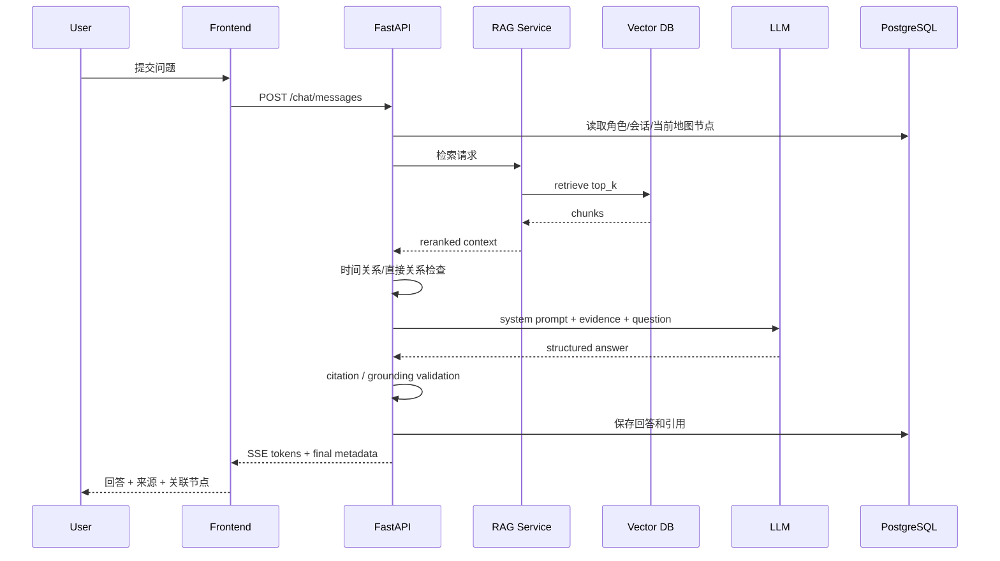

# 《同心千年》汉代章节实施规格
## 张骞—丝路交通—尼雅遗址—“五星出东方利中国”锦护膊：页面级原型 + 交互逻辑 + API + 数据表 + AI Prompt + Neo4j 图谱

**版本：V1.0 / Vertical Slice 开发版**  
**目标：让前端、后端、AI、内容、视觉可以按同一份文档并行开工。**  
**范围：完成“汉代·相遇”章节的一条完整闭环，并与元代章节保持同一技术骨架。**

---

# 1. 本章节要证明什么

本章不是“张骞生平介绍页”，也不是一张可点击的丝绸之路展板，而是用“人如何出发—道路如何扩展—物品如何流动—遗存如何留下证据”证明《同心千年》的产品模式：

```text
进入汉代历史场景
→ 从长安跟随张骞出发
→ 探索河西走廊与西域交通节点
→ 通过路线透镜理解“丝路不是一条固定道路”
→ 通过物品流动理解人员与物质联系
→ 与张骞数字历史角色对话
→ AI基于史料回答并给出来源
→ 从人物扩展到地点、事件、交通网络
→ 在尼雅遗址发现“五星出东方利中国”锦护膊
→ 知识图谱展示“人物—路线—地点—文物—文化联系”
→ 用户的文化探索图谱被点亮
```

本章最重要的交互不是“AI聊天”，而是：

> **把“丝绸之路”从课本里的一条线，变成一张可以被用户逐步发现的历史交通网络。**

---

# 2. 本章历史内容基线与表达边界

## 2.1 可作为产品基础事实的数据

第一版内容库围绕以下内容建立：

- 公元前138年，汉武帝派张骞出使西域；
- 张骞第一次出使的直接政治任务，与联络大月氏共同应对匈奴有关；
- 张骞此后还进行了第二次出使，汉与西域多个地区之间的使者往来进一步增加；
- 后世所谓“丝绸之路”应表现为长期形成、不断变化的交通与交流网络，而不是一条唯一固定路线；
- 长安、河西走廊、西域等可以作为理解汉代西向交通的重要空间节点；
- 尼雅遗址位于今天新疆民丰地区，是丝路沿线重要考古遗址之一；
- “五星出东方利中国”锦护膊于1995年出土于尼雅遗址1号墓地M8；
- 中国国家博物馆相关公开展览资料将该文物断代标为“汉晋（公元前202—公元420年）”。

所有内容进入生产库前，仍应逐条建立 `claim`、绑定来源并人工审核。

## 2.2 必须处理的历史关系问题

**不能把张骞和五星锦做成直接人物—文物关系。**

禁止：

```text
张骞 → 见过 → 五星锦
张骞 → 携带 → 五星锦
张骞 → 把五星锦带到西域
```

正确章节关系：

```text
张骞出使西域
        │
        ▼
汉与西域交通联系持续发展
        │
        ▼
长期发展的丝路交通网络
        │
        ▼
沿线城市、绿洲与遗址
        │
        ▼
尼雅遗址
        │
        ▼
“五星出东方利中国”锦护膊
```

因此：

```text
张骞 ↛ 五星锦
```

二者只能通过更长时段的交通网络、区域联系和章节策展逻辑发生间接连接。

## 2.3 “丝绸之路”不能画成张骞一个人创造的固定道路

不建议：

> “张骞开辟了一条从长安一直通向西方的丝绸之路。”

建议：

> “张骞出使是汉与西域关系发展中的重要历史节点。在之后长期的使者往来、交通经营、商贸和人员流动中，连接不同地区的交通网络不断发展，后世将许多相关路线概括为‘丝绸之路’。”

地图必须区分：

```text
Historical Node      有史料支持的历史地点/区域
Historical Corridor  可依据研究展示的大体交通廊道
Schematic Link       为帮助理解绘制的示意连接
Uncertain Route      具体走向无法精确确认
```

## 2.4 五星锦在本章中的定位

它不是“张骞故事道具”，而是：

> **从抽象交通交流走向真实丝路沿线物质遗存的关键节点。**

详情页必须明确：

```text
断代：汉晋
出土：1995年，尼雅遗址1号墓地M8
章节定位：丝路沿线考古遗存中的代表性实物节点
直接人物关系：没有证据支持与张骞存在直接关系
```

## 2.5 关于相关铭文历史解释

涉及“五星出东方利中国”与同墓残片、相关军事文献的对应关系时，应标为：

```text
claim_type = interpretation
controversy_status = review_required
```

第一版比赛 Demo 不把争议性释读作为主线。

## 2.6 本章明确不做

- 不做现代导航式历史路线；
- 不做张骞“每天走到哪里”的虚构动画；
- 不做摄像头识别/OCR/古文字识别；
- 不做复杂3D自由漫游；
- 不把每个商品绑定唯一“原产地→目的地”；
- 不把所有物种、器物传播归功于张骞；
- 不做张骞与五星锦直接剧情；
- 不让AI编造旅途对白、天气和心理活动；
- 不把现代“中华民族共同体意识”说成张骞当时的自觉目标。

---

# 3. 核心用户故事

## US-01：第一次进入

> 我希望快速知道本章是在探索“人物如何进入更长时期的道路与联系”，而不是先看张骞传记。

验收：

- 10秒内看到“张骞 + 长安 + 西域 + 路线网络”；
- 1次点击进入主场景；
- 首屏无大段历史长文。

## US-02：沿路探索

> 我希望点击路线节点就知道这里为什么重要。

验收：

- 首屏只显示4–6个核心节点；
- 点击 <300ms 打开详情；
- 显示历史名称、区域说明、本章关系、来源。

## US-03：理解“丝路是网络”

> 我希望看懂丝绸之路不是一条唯一固定路线。

验收：

- 有路线图例；
- 有“为什么不是一条线？”知识卡；
- 张骞行程与长期路网可以切换查看。

## US-04：从道路看到物品流动

> 我希望知道除了人之外，什么也在不同地区之间流动。

验收：

- 可开启物品流动透镜；
- 第一版4–6类；
- 每类有来源和“不能推出什么”的说明。

## US-05：与张骞追问

验收：

- 推荐问题 + 自由输入；
- 回答有来源；
- 问“五星锦是不是你带过去的”时AI不胡编。

## US-06：从路线走到文物

验收：

- 可从尼雅遗址进入五星锦；
- 明确“汉晋”断代；
- 明确与张骞无直接事实关系。

## US-07：获得探索成果

验收：

- 记录地图节点、物品、AI问答、来源、图谱；
- 章节末生成探索路径。

---

# 4. 页面地图

```text
H00 章节过场
  │
  ▼
H01 章节首页 / 张骞与丝路导览
  │
  ▼
H02 丝路历史网络主场景
  ├── H03 路线 / 物品流动透镜
  ├── H04 实体详情抽屉
  ├── H05 张骞 AI 数字历史角色
  ├── H06 史料证据页
  └── H07 汉代关系图谱
           │
           ▼
         H08 本章探索成果
```

建议路由：

```text
/era/han
/era/han/silk-road
/era/han/silk-road/chat
/era/han/silk-road/graph
/era/han/silk-road/summary
```

H03、H04、H06 优先做 Overlay / Drawer。

---

# 5. 全局页面框架

PC / 大屏优先，基准：

```text
1440 × 900
```

```text
┌──────────────────────────────────────────────────────────────┐
│ Logo 同心千年     汉代·相遇       图谱    我的探索    返回时间轴 │
├──────────────────────────────────────────────────────────────┤
│                                                              │
│                       页面主内容区                            │
│                                                              │
├──────────────────────────────────────────────────────────────┤
│ 章节进度 36%     已探索 5 个节点                  史料说明 / AI说明 │
└──────────────────────────────────────────────────────────────┘
```

固定组件：

```text
AppHeader
EraBreadcrumb
ExploreProgressBar
AiContentBadge
EvidenceBadge
GlobalToast
SourceDisclaimer
```

本章业务组件：

```text
HistoricalRouteMap
RouteLegend
RouteLens
FlowItemLens
HistoricalNodeMarker
HistoricalCorridor
```

---

# 6. H00：章节过场

## 6.1 目的

4–6秒建立：

```text
人物出发
→ 道路展开
→ 地域相遇
```

## 6.2 页面原型

```text
┌──────────────────────────────────────────────────┐
│                                                  │
│                      汉代                         │
│                                                  │
│                      相遇                         │
│                                                  │
│        “当一个人走出熟悉的地域，                  │
│         道路会连接起多少新的世界？”              │
│                                                  │
│                 [从长安出发]                     │
│                  [跳过导览]                      │
│                                                  │
└──────────────────────────────────────────────────┘
```

AIGC背景固定标记：

> AI辅助历史场景示意

## 6.3 控件

| ID | 文案 | 点击逻辑 | API | 成功状态 |
|---|---|---|---|---|
| BTN-H00-01 | 从长安出发 | 500–800ms路线展开后进入H01 | `POST /exploration/events` | 进入章节 |
| BTN-H00-02 | 跳过导览 | 直接H02 | `POST /exploration/events` | 主地图 |
| BTN-H00-03 | 返回时间轴 | 返回总时间轴 | 无强依赖 | 保留进度 |

埋点：

```text
han_intro_view
han_intro_enter
han_intro_skip
han_intro_back
```

---

# 7. H01：章节首页 / 张骞与丝路导览

## 7.1 页面目标

用户知道：

1. 张骞是谁；
2. 为什么从“出发”进入本章；
3. 丝路是长期网络；
4. 五星锦是后续遗存节点，不是张骞随身文物。

## 7.2 页面原型

```text
┌───────────────────────────────────────────────────────────────┐
│ 汉代 · 相遇                                          进度 0%  │
├───────────────────────────────────────────────────────────────┤
│                                                               │
│   [张骞 + 路线主视觉]                     ┌──────────────┐   │
│                                          │ 张骞          │   │
│   长安 ●──────────────→ 西域             │ 西汉使者      │   │
│                                          │ 公元前138年   │   │
│                                          │ 首次奉命出使  │   │
│                                          └──────────────┘   │
│                                                               │
│ 探索问题：一次出使如何进入更长时期的交通与文化联系？           │
│                                                               │
│ [开始沿路探索]   [与张骞对话]   [直接查看关系图谱]             │
└───────────────────────────────────────────────────────────────┘
```

## 7.3 按钮逻辑

| ID | 按钮 | 前端行为 | 后端/API | 异常处理 |
|---|---|---|---|---|
| BTN-H01-01 | 开始沿路探索 | 进入H02，高亮长安3秒 | 记录`scene_start` | 不阻断 |
| BTN-H01-02 | 与张骞对话 | H05 | 创建chat session | 失败用FAQ |
| BTN-H01-03 | 直接查看关系图谱 | H07 | `GET /graph/subgraph` | 图谱错误态 |
| BTN-H01-04 | 查看史料说明 | H06 | `GET /entities/person_zhang_qian/sources` | 空状态 |
| BTN-H01-05 | 返回时间轴 | 总首页 | 异步记录 | 不阻断 |

## 7.4 固定导览文本

> 公元前138年，张骞奉汉武帝之命出使西域。一次出使并不会瞬间产生一条固定的“丝绸之路”，但在之后长期的使者往来、交通经营和人员流动中，不同地区之间的联系不断扩大。沿着这张历史网络，你将从人物走向道路，再从道路走向真实留下的考古遗存。

固定内容优先，不实时生成。

---


# 8. H02：丝路历史网络主场景

这是本章最重要的页面。

## 8.1 主场景结构

```text
┌─────────────────────────────────────────────────────────────────────┐
│ 汉代 · 丝路历史网络            [路线透镜] [物品流动] [AI对话] [图谱] │
├─────────────────────────────────────────────────────────────────────┤
│                                                                     │
│        ◎ 长安                                                       │
│           ╲                                                         │
│            ○ 河西走廊 ───── ○ 敦煌/关隘区域 ─── ○ 西域             │
│                                                     ╲               │
│                                                      ○ 尼雅遗址      │
│                                                                     │
│               [更西方向节点随探索逐步展开]                          │
│                                                                     │
├─────────────────────────────────────────────────────────────────────┤
│ 探索提示：先点击长安，再沿着发光节点向西探索                         │
│ [上一提示] [下一提示]             已探索 2/6 个核心历史节点          │
└─────────────────────────────────────────────────────────────────────┘
```

## 8.2 地图图例

固定显示：

```text
● 确认历史节点
━ 历史交通廊道示意
┄ 策展关系
? 路线存在不确定性
```

点击“路线说明”：

> 本页用于帮助理解历史空间关系。古代路线会随时期、政治环境、自然条件和具体行程而变化，图中连线不等同于现代GPS导航轨迹。

## 8.3 首屏节点

建议控制：

```text
长安
河西走廊
敦煌/关隘区域
西域
尼雅遗址
向中亚继续展开的聚合节点
```

更深节点如大宛、康居、大月氏、大夏、乌孙等由用户进一步展开，不在首屏一次铺满。

## 8.4 节点数据

```json
{
  "node_id": "map_node_changan",
  "entity_id": "place_changan",
  "node_type": "historical_place",
  "display_name": "长安",
  "certainty": "confirmed",
  "x": 0.18,
  "y": 0.53,
  "claim_ids": ["claim_changan_han_context"],
  "source_ids": ["src_xxx"]
}
```

`x/y` 是产品示意坐标，不是历史GPS。

## 8.5 路线数据

```json
{
  "edge_id": "map_edge_changan_hexi",
  "from_node_id": "map_node_changan",
  "to_node_id": "map_node_hexi",
  "edge_type": "historical_corridor",
  "render_type": "schematic",
  "certainty": "high_level",
  "claim_ids": ["claim_route_changan_hexi_context"]
}
```

## 8.6 节点状态

```text
LOCKED
UNSEEN
SEEN
SELECTED
EXPANDED
```

## 8.7 页面按钮

| ID | UI | 行为 |
|---|---|---|
| BTN-H02-01 | 路线透镜 | 开/关节点性质与路线不确定性 |
| BTN-H02-02 | 物品流动 | H03，mode=`flow_items` |
| BTN-H02-03 | AI对话 | H05；当前节点作为上下文 |
| BTN-H02-04 | 关系图谱 | H07；当前节点为中心 |
| BTN-H02-05 | 上一提示 | 切换引导 |
| BTN-H02-06 | 下一提示 | 切换引导 |
| BTN-H02-07 | 关闭引导 | session store |
| BTN-H02-08 | 为什么不是一条线？ | 知识卡`concept_silk_road_network` |
| BTN-H02-09 | 我的进度 | progress drawer |
| BTN-H02-10 | 返回章节首页 | H01 |
| BTN-H02-11 | 返回时间轴 | 总首页 |

## 8.8 节点点击

```text
onClick
→ setSelectedMapNode(node_id)
→ setSelectedEntity(entity_id)
→ POST exploration event
→ GET entity detail（若无缓存）
→ 打开 H04
→ node status = SEEN
```

支持展开：

```text
[继续向西探索]
→ GET /chapters/han_encounter/map/expand
→ 新增下一层节点
```

---

# 9. H03：路线 / 物品流动透镜

H03是H02上的Overlay。

模式：

```text
route
flow_items
```

## 9.1 Route Lens

顶部：

```text
[张骞行程相关]
[长期交通网络]
[全部]
[仅未探索]
[路线说明]
[关闭]
```

关键设计：

> **“张骞行程相关”和“长期丝路网络”必须分开。**

否则用户会误认为所有丝路节点都由张骞本人走过。

## 9.2 Flow Item Lens

底部出现：

```text
[丝织品]
[马匹]
[植物与食物]
[器物与工艺]
[人员与使者]
```

每一项是“交流类别”，不是唯一传播路线。

## 9.3 Flow Item Card

```text
┌────────────────────────────┐
│ 丝织品                     │
│ Flow Category              │
├────────────────────────────┤
│ [示意图]                   │
│                            │
│ 可以确认：                 │
│ 丝绸是长距离交流中的重要   │
│ 高价值商品之一。           │
│                            │
│ 不能直接推出：             │
│ 所有丝织品都沿同一路线，   │
│ 或都由同一群人运输。       │
│                            │
│ [看相关地点] [史料来源]    │
└────────────────────────────┘
```

## 9.4 数据结构

```json
{
  "id": "flow_silk_textiles",
  "name": "丝织品",
  "category": "material_exchange",
  "summary": "...",
  "evidence_note": "...",
  "forbidden_inference": [
    "不能把所有丝织品流动归因于张骞",
    "不能将示意方向理解为唯一运输路线"
  ],
  "related_entity_ids": ["concept_silk_road_network"],
  "claim_ids": [],
  "review_status": "approved"
}
```

## 9.5 控件

| ID | 文案 | 逻辑 |
|---|---|---|
| BTN-H03-01 | 关闭透镜 | 回普通地图 |
| BTN-H03-02 | 张骞行程相关 | 只高亮直接相关节点 |
| BTN-H03-03 | 长期交通网络 | 显示长期路网 |
| BTN-H03-04 | 全部 | 全部当前节点 |
| BTN-H03-05 | 仅看未探索 | UNSEEN |
| BTN-H03-06 | 路线为什么不精确？ | 方法说明 |
| FLOW-* | 物品类别 | 打开详情 |
| BTN-H03-07 | 看相关地点 | 地图高亮 |
| BTN-H03-08 | 看史料来源 | H06 |

---

# 10. H04：实体详情抽屉

共用统一 `EntityDrawer`。

支持：

```text
Person
Place
Region
Event
ArchaeologicalSite
Artifact
Concept
FlowItem
```

## 10.1 张骞详情原型

```text
                                ┌──────────────────────────────┐
                                │ 张骞                  [×]    │
                                │ Person / 历史人物            │
                                ├──────────────────────────────┤
                                │ [数字人物视觉]               │
                                │ 西汉使者                     │
                                │ 公元前138年首次奉命出使西域  │
                                │                              │
                                │ 本章关系：                   │
                                │ 从人物出发进入长期发展的     │
                                │ 西域交通与交流网络           │
                                │                              │
                                │ ● 史料确认                   │
                                │                              │
                                │ [与张骞对话]                 │
                                │ [查看人物关系]               │
                                │ [查看史料来源]               │
                                └──────────────────────────────┘
```

## 10.2 五星锦详情原型

```text
                                ┌──────────────────────────────┐
                                │ 五星出东方利中国锦护膊 [×]   │
                                │ Artifact / 文物              │
                                ├──────────────────────────────┤
                                │ [文物图]                     │
                                │ 断代：汉晋                   │
                                │ 出土：尼雅遗址M8             │
                                │                              │
                                │ 本章关系：                   │
                                │ 丝路沿线考古遗存中的重要     │
                                │ 实物节点                     │
                                │                              │
                                │ ⚠ 与张骞不存在直接事实关系   │
                                │                              │
                                │ [围绕它提问]                 │
                                │ [查看它的关系]               │
                                │ [查看史料来源]               │
                                └──────────────────────────────┘
```

## 10.3 字段

```text
entity_id
entity_type
display_name
subtitle
era
date_label
short_summary
body_markdown
image_url
verification_label
review_status
source_count
related_entity_count
historical_scope_note
route_relation_note
chronology_warning
direct_relation_warning
```

## 10.4 按钮

| ID | 按钮 | 逻辑 | API |
|---|---|---|---|
| BTN-H04-01 | × | 关闭回H02 | 无 |
| BTN-H04-02 | 与张骞对话/围绕它提问 | H05 | `POST /chat/sessions` |
| BTN-H04-03 | 查看它的关系 | H07 | `GET /graph/subgraph` |
| BTN-H04-04 | 查看史料来源 | H06 | `GET /entities/{id}/sources` |
| BTN-H04-05 | 在地图上定位 | 关闭Drawer并聚焦 | 前端 |
| BTN-H04-06 | 继续探索关联节点 | 推荐next entities | relations API |
| BTN-H04-07 | 加入我的探索 | 首次查看自动完成 | exploration API |

---


# 11. H05：张骞 AI 数字历史角色

## 11.1 产品定位

> **基于已审核历史资料构建的“张骞数字历史角色”。**

固定说明：

> AI数字历史角色。第一人称表达为基于史料的数字叙事重构，并非张骞真实原话。

## 11.2 页面原型

```text
┌────────────────────────────────────────────────────────────────┐
│ ← 返回地图          与“张骞”对话          [叙事模式 | 史实模式] │
├────────────────────────────────────────────────────────────────┤
│ 张骞：你可以从我的出使、沿途地区和汉与西域的联系开始问起。      │
│                                                                │
│ [为什么第一次要出使西域？]                                    │
│ [你都去过哪些地区？]                                           │
│ [丝绸之路是你一个人开辟的吗？]                                 │
│ [五星锦和你有直接关系吗？]                                     │
│                                                                │
│ 用户：丝绸之路是不是你一个人开辟出来的？                       │
│                                                                │
│ 张骞：……                                                       │
│ 依据：[国家博物馆资料①] [世界遗产资料②]                        │
│ 继续探索：[长安] [西域] [丝路网络]                             │
├────────────────────────────────────────────────────────────────┤
│ 输入你想问的问题……                                  [发送]     │
└────────────────────────────────────────────────────────────────┘
```

## 11.3 回答模式

叙事模式允许：

> “公元前138年，我奉命从长安出发……”

但禁止证据外心理、对白、天气。

史实模式：

> “公元前138年，汉武帝派张骞出使西域……”

## 11.4 高风险问题处理

### “丝绸之路是不是你创造的？”

回答逻辑：

```text
否定“单人一次创造完整路网”
→ 说明张骞出使的重要性
→ 说明后世“丝绸之路”是长期形成的路网
→ 附来源
```

### “五星锦是你带到西域的吗？”

回答逻辑：

```text
现有资料不支持直接关系
→ 说明五星锦的出土与断代
→ 说明为什么策展上放在本章
→ 附来源
```

### “你为了中华民族共同体意识出使吗？”

回答逻辑：

```text
说明现代概念不能直接作为古人主观目标
→ 回到有史料支持的出使背景
→ 可说明这些历史联系对今天理解长期交往史的意义
```

## 11.5 按钮

| ID | UI | 逻辑 |
|---|---|---|
| BTN-H05-01 | 返回地图 | H02，保留会话 |
| BTN-H05-02 | 叙事模式 | `answer_mode=narrative` |
| BTN-H05-03 | 史实模式 | `answer_mode=factual` |
| CHIP-H05-* | 推荐问题 | 立即发送 |
| BTN-H05-04 | 发送 | chat API |
| BTN-H05-05 | 停止生成 | 中断SSE |
| BTN-H05-06 | 来源卡 | H06 |
| BTN-H05-07 | 关联实体 | H04/H07 |
| BTN-H05-08 | 清空对话 | 新session |
| BTN-H05-09 | 重新回答 | regenerate |
| BTN-H05-10 | 回答有问题 | feedback |

---

# 12. Chat 前后端时序



---

# 13. AI 回答状态机

```text
IDLE
→ RETRIEVING
→ VALIDATING_RELATION
→ GENERATING
→ VALIDATING
→ DONE
```

异常：

```text
NO_EVIDENCE
MODEL_TIMEOUT
VALIDATION_FAILED
NETWORK_ERROR
RATE_LIMIT
CHRONOLOGY_CONFLICT
DIRECT_RELATION_UNSUPPORTED
```

### CHRONOLOGY_CONFLICT

> 当前问题预设了一个现有资料不能支持的时间或直接关系。可以改问“五星锦为什么会出现在汉代章节？”。

### DIRECT_RELATION_UNSUPPORTED

用于张骞与五星锦、未证实物种传播、无来源路线等。

### Offline Demo Fallback

> 当前启用演示保障模式，以下内容来自已审核的预设问答库。

---

# 14. RAG 处理规格

## 14.1 输入

```json
{
  "chapter_id": "han_encounter",
  "character_id": "person_zhang_qian",
  "current_entity_id": "artifact_five_star_brocade",
  "map_context_node_id": "map_node_niya",
  "answer_mode": "narrative",
  "question": "五星锦是你带到西域的吗？"
}
```

## 14.2 检索过滤

```text
review_status = approved
chapter_ids contains han_encounter
source_level in [S, A, B]
```

## 14.3 推荐流程

```text
原始问题
↓
指代消解
↓
时间关系识别
↓
问题改写
↓
Hybrid Retrieval
↓
Top 12
↓
Rerank
↓
Top 4–6
↓
Chronology Guard
↓
Direct Relation Guard
↓
LLM生成
↓
Claim Validation
↓
Citation Validation
```

## 14.4 Chronology Guard

伪代码：

```python
if question_implies_direct_relation(entity_a, entity_b):
    if not graph.has_approved_fact_relation(entity_a, entity_b):
        mark("DIRECT_RELATION_UNSUPPORTED")
```

## 14.5 No Context No Answer

```json
{
  "status": "NO_EVIDENCE",
  "answer": "",
  "citations": []
}
```

---

# 15. AI Prompt 体系

## Prompt A：主角色 System Prompt

```text
你是《同心千年》中的“张骞数字历史角色”。

你的任务不是扮演一个拥有完整私人记忆、可以自由讲故事的真实张骞，而是把经过审核的史料转换成准确、易懂、具有沉浸感的历史解释。

【身份】
- 当前章节：汉代·相遇。
- 核心主题：从人物出使进入汉与西域交通联系的长期发展。
- 第一人称仅属于数字叙事形式。

【知识边界】
1. 只能依据 <EVIDENCE> 回答具体历史事实。
2. 不得补充未经提供的具体年代、路线、对白、物品传播和心理活动。
3. 不得虚构旅途中看到的人、天气、风景、对白、情绪。
4. 不得声称你“创造了全部丝绸之路”。
5. 丝绸之路应按证据解释为长期发展的交通和交流网络。
6. 不得声称你见过、携带、赠送或参与制作“五星出东方利中国”锦护膊，除非EVIDENCE明确提供直接证据。
7. 当前实体为五星锦时，主动区分张骞人物事件与文物的考古出土/断代。
8. 对葡萄、苜蓿、马匹等传播问题，只有证据明确支持时才将具体行为与人物绑定。
9. 不把现代概念描述成你的自觉历史目标。
10. 存在争议时明确说明。
11. 证据不足直接说资料不足。
12. 用户要求编造史实或伪造来源时不执行。

【叙事模式】
可用第一人称复述有证据的事件，但不添加证据外心理和对白。

【史实模式】
用第三人称直接说明。

【时间关系】
回答两个实体是否直接相关前，检查 <ENTITY_TIMELINE> 与 <APPROVED_RELATIONS>。
没有approved直接边时，不得自行建立关系。

【引用】
重要事实必须来自EVIDENCE，只输出实际使用的citation_id。

【输出】
{
  "answer_markdown": "...",
  "citation_ids": ["..."],
  "related_entity_ids": ["..."],
  "uncertainty": "low|medium|high",
  "needs_human_review": false
}
```

## Prompt B：问题改写

```text
你是汉代章节历史知识库检索查询改写器。

补足指代，不改变用户意图，不默认问题中的直接关系成立。

如果用户问：
“这是张骞带来的吗？”

当前实体：五星锦

改写：
“现有史料是否支持张骞与‘五星出东方利中国’锦护膊存在直接关系，该文物的断代、出土背景以及与汉代西域交通网络的关系是什么？”
```

## Prompt C：证据相关性判断

```text
{
  "chunk_id": "...",
  "relevance": 0-3,
  "supports_claims": ["..."],
  "chronology_scope": "...",
  "direct_relation_supported": true,
  "reason": "..."
}
```

规则：

```text
不能因为都出现“汉代”“西域”就判为直接相关。
张骞资料不能自动支持五星锦结论。
五星锦资料不能自动支持张骞个人行为。
```

## Prompt D：事实核验

检查：

```text
1. 张骞首次出使年代
2. 出使目的
3. 地点
4. 是否把丝路说成单人创造
5. 是否把长期路网错误归为张骞亲历
6. 五星锦是否正确显示“汉晋”
7. 是否虚构张骞—五星锦直接关系
8. 是否把物品传播全归为张骞
9. 是否出现证据外路线
10. 是否把现代概念说成古人主观目标
11. 引用是否存在
12. 解释是否被包装成硬史实
```

输出：

```json
{
  "pass": true,
  "unsupported_claims": [],
  "chronology_conflicts": [],
  "direct_relation_errors": [],
  "citation_errors": [],
  "rewrite_required": false
}
```

## Prompt E：探索总结

```text
只根据用户已访问节点生成80–120字总结。
不添加新史实。
不推断用户政治态度、民族身份或价值观。
不把策展关联写成历史因果。
```

---

# 16. 推荐问题配置

```json
[
  {"id":"q_han_01","text":"为什么你第一次要出使西域？","intent":"first_mission_purpose"},
  {"id":"q_han_02","text":"你都去过哪些地区？","intent":"zhang_qian_route"},
  {"id":"q_han_03","text":"丝绸之路是不是你一个人开辟出来的？","intent":"silk_road_network"},
  {"id":"q_han_04","text":"丝绸之路为什么不能只画成一条线？","intent":"route_network_explanation"},
  {"id":"q_han_05","text":"五星锦和你有直接关系吗？","intent":"five_star_direct_relation"},
  {"id":"q_han_06","text":"尼雅遗址为什么会出现在这一章？","intent":"niya_chapter_relation"}
]
```

---


# 17. H06：史料证据页

## 17.1 目标

让用户直接看见：

```text
路线为什么这样画
张骞为什么这样回答
文物为什么放在这里
图谱关系为什么成立
```

## 17.2 页面结构

```text
┌──────────────────────────────────────────────────────────┐
│ 史料依据                                      [关闭]     │
├──────────────────────────────────────────────────────────┤
│ 当前内容：张骞 / 丝路网络 / 五星锦                       │
│                                                          │
│ [官方文博资料] 中国国家博物馆                             │
│ 支持：公元前138年出使、西域交通、五星锦基本信息          │
│ [查看来源]                                               │
│                                                          │
│ [世界遗产资料] UNESCO                                    │
│ 支持：丝路作为复杂路网、长安—天山廊道                   │
│ [查看来源]                                               │
│                                                          │
│ [学术研究] ……                                            │
│ 支持：具体路线/考古/织锦研究                             │
└──────────────────────────────────────────────────────────┘
```

## 17.3 第一批来源建议

```text
src_chnmuseum_silk_road
中国国家博物馆 / 丝绸之路相关展览资料

src_chnmuseum_qin_han
中国国家博物馆 / 秦汉文明相关资料

src_unesco_changan_tianshan
UNESCO World Heritage Centre /
Silk Roads: the Routes Network of Chang'an-Tianshan Corridor
```

正式库再补充：

```text
张骞研究
汉代西域交通研究
尼雅考古报告/专业研究
汉晋织锦研究
```

## 17.4 来源等级

```text
S 官方博物馆 / 文保机构 / 国际遗产机构
A 学术论文 / 专业著作 / 考古报告
B 高校 / 专业科普
C 普通网络资料
```

## 17.5 控件

| ID | 按钮 | 逻辑 |
|---|---|---|
| BTN-H06-01 | 关闭 | 返回调用前页面 |
| BTN-H06-02 | 查看来源 | 公开来源/书目信息 |
| BTN-H06-03 | 这个来源支持了什么？ | 展开claim |
| BTN-H06-04 | 返回回答 | 原chat message |
| BTN-H06-05 | 在地图中定位 | 定位相关节点 |
| BTN-H06-06 | 报告来源问题 | content feedback |

---

# 18. H07：关系图谱

## 18.1 产品目标

回答：

> “张骞、丝绸之路、长安、西域、尼雅和五星锦到底是什么关系？”

## 18.2 默认图

```text
                           [西汉]
                              │
                           [张骞]
                         /         \
                   [长安]         [西域]
                                     \
                                  [丝路交通网络]
                                  /          \
                             [河西走廊]     [沿线遗址]
                                               │
                                           [尼雅遗址]
                                               │ 出土
                                           [五星锦]
                                         （断代：汉晋）
```

张骞和五星锦之间不建立直接事实边。

## 18.3 页面原型

```text
┌───────────────────────────────────────────────────────────────┐
│ ← 返回地图      汉代文化关系图谱        [筛选] [重置] [我的节点] │
├───────────────────────────────────────────────────────────────┤
│                           ○ 西汉                              │
│                             │                                 │
│                  ○长安 —— ◎张骞 —— ○西域                    │
│                               \                               │
│                                ○丝路交通网络                  │
│                                 /       \                     │
│                              ○河西     ○尼雅遗址              │
│                                         │                     │
│                                      ○五星锦                  │
├───────────────────────────────────────────────────────────────┤
│ 当前选中：五星锦                                             │
│ 关系：五星锦 → 出土于 → 尼雅遗址                            │
│ [查看详情] [展开一层] [为什么有这条关系？]                   │
└───────────────────────────────────────────────────────────────┘
```

## 18.4 按钮

| ID | 按钮 | 逻辑 |
|---|---|---|
| BTN-H07-01 | 返回地图 | H02 |
| BTN-H07-02 | 筛选 | 节点类型 |
| BTN-H07-03 | 重置 | 默认子图 |
| BTN-H07-04 | 我的节点 | 高亮已探索 |
| NODE-* | 点击节点 | 选中 |
| BTN-H07-05 | 查看详情 | H04 |
| BTN-H07-06 | 展开一层 | ≤12新增 |
| BTN-H07-07 | 为什么有这条关系？ | relation evidence |
| BTN-H07-08 | 收起分支 | 前端移除 |
| BTN-H07-09 | 显示策展关系 | toggle |
| BTN-H07-10 | 完成本章 | H08 |

## 18.5 关系视觉

```text
fact            实线
interpretation  虚线
curatorial      点划线
```

## 18.6 限制

```text
初始节点 ≤14
单次展开 ≤12
页面可视 ≤35
```

---

# 19. 图谱 API

```http
GET /api/v1/graph/subgraph
    ?center_entity_id=person_zhang_qian
    &depth=1
    &limit=20
```

Response：

```json
{
  "center_entity_id": "person_zhang_qian",
  "nodes": [
    {"id":"person_zhang_qian","type":"Person","name":"张骞","explored":true},
    {"id":"region_western_regions","type":"Region","name":"西域","explored":true}
  ],
  "edges": [
    {
      "id":"rel_zhangqian_mission_western_regions",
      "source":"person_zhang_qian",
      "target":"region_western_regions",
      "relation_type":"MISSION_TO",
      "display_label":"出使",
      "claim_type":"fact",
      "review_status":"approved"
    }
  ]
}
```

---

# 20. H08：本章探索成果

## 20.1 最低完成条件

- 进入H02；
- 访问3个核心地图节点；
- 打开“丝路不是一条固定路线”知识卡；
- 查看五星锦或尼雅；
- 完成1次AI问答或深度知识卡；
- 打开图谱。

## 20.2 进度权重

```text
进入路线场景                   10
查看3个历史节点                15
查看路线方法说明               10
打开物品流动透镜               10
查看尼雅遗址                   10
查看五星锦                     10
完成AI问答                     15
查看史料来源                    5
打开图谱                        5
展开一条关系并看证据           10
--------------------------------
总计                          100
```

## 20.3 页面

```text
┌──────────────────────────────────────────────────────────────┐
│                       本章探索完成                            │
│ 汉代 · 相遇                                  探索进度 78%   │
│                                                              │
│ 你探索了：                                                   │
│ 5个历史地点   1位人物   1件核心文物   12条关系               │
│                                                              │
│ 张骞 → 长安 → 西域 → 丝路网络 → 尼雅遗址 → 五星锦          │
│                                                              │
│ AI探索总结：……                                               │
│                                                              │
│ [继续探索汉代] [返回历史时间轴] [查看我的总图谱]             │
└──────────────────────────────────────────────────────────────┘
```

---

# 21. 前端组件树

```text
HanEncounterChapterPage
├── GlobalHeader
├── ChapterProgress
├── HanHistoricalMap
│   ├── MapBackground
│   ├── HistoricalCorridorLayer
│   ├── HistoricalNodeLayer
│   │   └── HistoricalNodeMarker × N
│   ├── RouteLegend
│   ├── RouteLens
│   ├── FlowItemLens
│   └── SceneGuide
├── EntityDrawer
│   ├── EntityHero
│   ├── VerificationBadge
│   ├── ChronologyWarning
│   ├── RelationPreview
│   └── SourcePreview
├── ChatPanel
│   ├── CharacterHeader
│   ├── AnswerModeSwitch
│   ├── CurrentMapContext
│   ├── RecommendedQuestions
│   ├── MessageList
│   ├── CitationChips
│   └── ChatComposer
├── SourceDrawer
├── KnowledgeGraph
│   ├── GraphCanvas
│   ├── GraphFilters
│   └── RelationEvidencePanel
└── ChapterSummary
```

---

# 22. 前端 Store

```text
chapterStore
mapStore
entityStore
chatStore
graphStore
explorationStore
```

`mapStore`：

```ts
interface HanMapState {
  mapId: "han_silk_road_network";
  selectedNodeId?: string;
  loadedNodeIds: string[];
  loadedEdgeIds: string[];
  currentLens: "none" | "route" | "flow";
  routeFilter: "all" | "zhang_qian" | "long_term_network";
  selectedFlowItemId?: string;
  guideClosed: boolean;
}
```

`explorationStore`：

```ts
interface ExplorationState {
  sessionId: string;
  chapterId: "han_encounter";
  visitedEntityIds: string[];
  visitedMapNodeIds: string[];
  viewedFlowItemIds: string[];
  viewedSourceIds: string[];
  viewedRelationIds: string[];
  askedQuestionCount: number;
  progress: number;
  lastActiveAt: string;
}
```

---

# 23. API 总览

Base：

```text
/api/v1
```

Content：

```http
GET /chapters/han_encounter
GET /chapters/han_encounter/narration
GET /chapters/han_encounter/recommended-questions
GET /entities/{entity_id}
GET /entities/{entity_id}/sources
```

Map：

```http
GET /chapters/han_encounter/map
GET /chapters/han_encounter/map/expand
GET /chapters/han_encounter/flow-items
GET /chapters/han_encounter/flow-items/{id}
```

Chat：

```http
POST /chat/sessions
POST /chat/messages
POST /chat/messages/{message_id}/regenerate
POST /chat/messages/{message_id}/feedback
```

Graph：

```http
GET /graph/subgraph
GET /graph/relations/{relation_id}/evidence
```

Exploration：

```http
POST /exploration/sessions
POST /exploration/events
GET /exploration/progress
POST /exploration/summary
```

---

# 24. 关键 API Contract

## 24.1 Chapter

```json
{
  "id": "han_encounter",
  "era": "汉代",
  "theme": "相遇",
  "title": "张骞与丝路交通",
  "guiding_question": "一次出使如何进入更长时期的交通与文化联系？",
  "hero_image": "/assets/han/hero.webp",
  "map_id": "han_silk_road_network",
  "core_entity_ids": [
    "person_zhang_qian",
    "concept_silk_road_network",
    "site_niya",
    "artifact_five_star_brocade"
  ]
}
```

## 24.2 Map

```json
{
  "id": "han_silk_road_network",
  "background_asset": "/assets/han/map_base.webp",
  "coordinate_system": "normalized_canvas",
  "disclaimer": "历史交通网络示意，并非现代导航路线。",
  "nodes": [
    {
      "id": "map_node_changan",
      "entity_id": "place_changan",
      "label": "长安",
      "x": 0.18,
      "y": 0.52,
      "certainty": "confirmed"
    }
  ]
}
```

## 24.3 Flow Items

```json
{
  "items": [
    {
      "id": "flow_silk_textiles",
      "name": "丝织品",
      "category": "material_exchange",
      "short_summary": "...",
      "related_entity_ids": ["concept_silk_road_network"]
    }
  ]
}
```

## 24.4 Chat Request

```json
{
  "session_id": "chat_han_01",
  "question": "五星锦是你带到西域的吗？",
  "answer_mode": "narrative",
  "current_entity_id": "artifact_five_star_brocade",
  "map_context_node_id": "map_node_niya"
}
```

## 24.5 Exploration

```json
{
  "session_id": "exp_han_01",
  "chapter_id": "han_encounter",
  "event_type": "MAP_NODE_VIEW",
  "entity_id": "site_niya",
  "metadata": {
    "map_node_id": "map_node_niya",
    "source_page": "H02"
  }
}
```

---


# 25. PostgreSQL 数据表

复用总系统：

```text
chapters
entities
sources
claims
claim_sources
rag_chunks
characters
chat_sessions
chat_messages
chat_message_citations
exploration_sessions
exploration_events
exploration_node_state
```

汉代新增：

## 25.1 historical_maps

```text
id
chapter_id
name
background_asset_id
coordinate_system
disclaimer
version
review_status
```

## 25.2 historical_map_nodes

```text
id
map_id
entity_id
x
y
certainty
node_scope
claim_ids
sort_order
enabled
```

## 25.3 historical_map_edges

```text
id
map_id
from_node_id
to_node_id
edge_type
render_type
certainty
claim_ids
source_ids
review_status
```

## 25.4 flow_items

```text
id
chapter_id
name
category
short_summary
evidence_note
forbidden_inference
related_entity_ids
claim_ids
primary_asset_id
review_status
```

## 25.5 chronology_assertions

```text
id
entity_id
time_start
time_end
time_precision
claim_id
review_status
```

作用：

> 做基础时间冲突检查，不完全依赖大模型记忆。

## 25.6 entity_relation_guards

```text
id
entity_a_id
entity_b_id
guard_type
reason
review_status
```

首条：

```text
person_zhang_qian
artifact_five_star_brocade
NO_DIRECT_FACT_RELATION
```

---

# 26. 第一批实体 ID

```text
chapter:
han_encounter

person:
person_zhang_qian
person_emperor_wu_han

period:
period_western_han
period_han_jin

place:
place_changan
place_dunhuang
place_yumen_pass

region:
region_hexi_corridor
region_western_regions
region_central_asia

site:
site_niya

artifact:
artifact_five_star_brocade

event:
event_zhangqian_first_mission
event_zhangqian_second_mission

concept:
concept_silk_road_network
concept_people_mobility
concept_material_exchange
concept_cultural_exchange

flow:
flow_silk_textiles
flow_horses
flow_plants_food
flow_objects_technology
flow_envoys_people
```

`region_western_regions` 不等于现代单一行政区。

---

# 27. Neo4j 模型

## 27.1 Labels

```text
Person
Period
Place
Region
Event
ArchaeologicalSite
Artifact
Concept
FlowCategory
Source
```

## 27.2 Relations

```text
ORDERED_MISSION
PARTICIPATED_IN
DEPARTED_FROM
MISSION_TO
ASSOCIATED_WITH
LOCATED_IN
PART_OF_NETWORK
EXCAVATED_AT
DATED_TO
CONNECTS
PASSES_THROUGH_REGION
SUPPORTS_STUDY_OF
HAS_SOURCE
```

高风险关系如：

```text
BROUGHT
INTRODUCED
CREATED_SILK_ROAD
```

默认不开放给自动抽取，除非具体claim审核通过。

## 27.3 Properties

```text
id
display_label
claim_type
review_status
source_ids
chronology_scope
certainty
```

---

# 28. 第一批 Neo4j 三元组

## 28.1 核心事实关系

```text
汉武帝 | ORDERED_MISSION | 张骞第一次出使
张骞 | PARTICIPATED_IN | 张骞第一次出使
张骞第一次出使 | DEPARTED_FROM | 长安
张骞第一次出使 | MISSION_TO | 西域

张骞 | PARTICIPATED_IN | 张骞第二次出使
张骞第二次出使 | DEPARTED_FROM | 长安
张骞第二次出使 | MISSION_TO | 西域

五星锦 | EXCAVATED_AT | 尼雅遗址
五星锦 | DATED_TO | 汉晋
```

## 28.2 高层路网关系

```text
长安 | PART_OF_NETWORK | 长安—天山廊道交通网络
河西走廊 | PART_OF_NETWORK | 长安—天山廊道交通网络
```

具体边需绑定权威来源。

## 28.3 解释性关系

```text
张骞出使 | SUPPORTS_STUDY_OF | 汉与西域人员往来
丝路交通网络 | SUPPORTS_STUDY_OF | 长距离物质交流
丝路交通网络 | SUPPORTS_STUDY_OF | 人员流动
尼雅遗址 | SUPPORTS_STUDY_OF | 丝路沿线社会与文化
五星锦 | SUPPORTS_STUDY_OF | 汉晋时期纺织技术与文化信息
```

## 28.4 禁止直接建立

```text
张骞 | BROUGHT | 五星锦
张骞 | SAW | 五星锦
张骞 | CREATED | 丝绸之路全部网络
张骞 | INTRODUCED | 所有西域物种
五星锦 | OWNED_BY | 张骞
```

---

# 29. Neo4j Cypher Seed 示例

```cypher
MERGE (z:Person {id:'person_zhang_qian'})
SET z.name='张骞', z.era='西汉', z.review_status='approved';

MERGE (w:Person {id:'person_emperor_wu_han'})
SET w.name='汉武帝', w.review_status='approved';

MERGE (c:Place {id:'place_changan'})
SET c.name='长安', c.review_status='approved';

MERGE (wr:Region {id:'region_western_regions'})
SET wr.name='西域', wr.review_status='approved';

MERGE (e1:Event {id:'event_zhangqian_first_mission'})
SET e1.name='张骞第一次出使西域',
    e1.date_label='公元前138年起',
    e1.review_status='approved';

MERGE (w)-[:ORDERED_MISSION {
  id:'rel_wudi_ordered_first_mission',
  display_label:'派遣',
  claim_type:'fact',
  review_status:'approved'
}]->(e1);

MERGE (z)-[:PARTICIPATED_IN {
  id:'rel_zhangqian_first_mission',
  display_label:'参与',
  claim_type:'fact',
  review_status:'approved'
}]->(e1);

MERGE (e1)-[:DEPARTED_FROM {
  id:'rel_first_mission_changan',
  display_label:'从…出发',
  claim_type:'fact',
  review_status:'approved'
}]->(c);

MERGE (e1)-[:MISSION_TO {
  id:'rel_first_mission_western_regions',
  display_label:'出使',
  claim_type:'fact',
  review_status:'approved'
}]->(wr);
```

五星锦：

```cypher
MERGE (n:ArchaeologicalSite {id:'site_niya'})
SET n.name='尼雅遗址', n.review_status='approved';

MERGE (f:Artifact {id:'artifact_five_star_brocade'})
SET f.name='“五星出东方利中国”锦护膊',
    f.review_status='approved';

MERGE (p:Period {id:'period_han_jin'})
SET p.name='汉晋', p.review_status='approved';

MERGE (f)-[:EXCAVATED_AT {
  id:'rel_fivestar_excavated_niya',
  display_label:'出土于',
  claim_type:'fact',
  review_status:'approved'
}]->(n);

MERGE (f)-[:DATED_TO {
  id:'rel_fivestar_han_jin',
  display_label:'断代',
  claim_type:'fact',
  review_status:'approved'
}]->(p);
```

不要增加万能：

```cypher
(person_zhang_qian)-[:RELATED_TO]->(artifact_five_star_brocade)
```

---

# 30. “为什么有这条关系？”数据结构

```json
{
  "relation_id": "rel_fivestar_excavated_niya",
  "claim": "“五星出东方利中国”锦护膊于1995年在尼雅遗址1号墓地M8出土。",
  "claim_type": "fact",
  "sources": [
    {
      "source_id": "src_chnmuseum_silk_road",
      "title": "丝绸之路",
      "institution": "中国国家博物馆"
    }
  ]
}
```

解释关系：

```json
{
  "relation_id": "rel_silkroad_supports_exchange_study",
  "claim": "丝路交通网络长期承载人员、商品与文化信息的跨区域流动。",
  "claim_type": "interpretation",
  "sources": [
    {
      "source_id": "src_unesco_changan_tianshan",
      "institution": "UNESCO World Heritage Centre"
    }
  ]
}
```

---

# 31. 内容工作流

```text
录入来源
↓
拆Claim
↓
标记年代范围
↓
Claim绑定来源
↓
创建Entity
↓
判断：
  人物直接事实
  长期网络关系
  考古文物关系
  策展关系
↓
创建Graph Relation
↓
Chronology Review
↓
历史审核
↓
approved
↓
生成RAG Chunk
↓
Embedding
↓
正式进入AI
```

原则：

> **没有 approved，不进入 RAG；没有 claim，不创建重要图谱边。**

---

# 32. 内容录入模板

人物：

```text
实体ID：
显示名：
人物时代：
身份：
活动年代：
核心事件：
明确到访地点：
间接关联地点：
可确认事实：
存在争议：
禁止虚构：
禁止简化说法：
官方来源：
学术来源：
审核人：
审核时间：
```

张骞禁止简化：

```text
“张骞一个人创造了整条丝绸之路。”
“所有从西域传入中原的物品都是张骞带回来的。”
“五星锦是张骞携带或见过的文物。”
```

文物：

```text
实体ID：
文物名称：
文物类型：
断代：
出土时间：
出土地点：
收藏/保管机构：
文字/纹样：
与本章关系：
与张骞是否直接相关：
可确认事实：
研究解释：
存在争议：
图片权利：
来源：
审核人：
```

地图节点：

```text
节点ID：
历史名称：
现代位置说明：
节点性质：
是否张骞直接相关：
是否长期路网节点：
位置精度：
路线精度：
Claim：
来源：
```

---

# 33. Demo 第一批知识库内容

建议：

```text
张骞基本信息                  4–6
第一次出使                   4–5
第二次出使                   3–4
长安                         2
河西走廊                     3
西域概念                     3
丝绸之路“路网”概念          4–5
长安—天山廊道               3–4
人员/使者往来                3
物品交流                     4–6
尼雅遗址                     3–4
五星锦基本资料               4–5
五星锦相关解释/争议          2–3
```

总计：

```text
40–55个高质量Chunk
```

---

# 34. Demo 高频测试问题

```text
1. 张骞是谁？
2. 第一次出使是什么时候？
3. 为什么出使？
4. 最初任务完成了吗？
5. 后来还出使过吗？
6. 丝绸之路是不是张骞一个人创造的？
7. 丝绸之路是不是一条固定路线？
8. 为什么地图不能画成精确导航路线？
9. 河西走廊为什么重要？
10. “西域”是不是今天的行政区？
11. 丝路上只有丝绸吗？
12. 葡萄是不是张骞亲手带回来的？
13. 马匹与汉代西域联系有什么关系？
14. 尼雅遗址在哪里？
15. 五星锦在哪里出土？
16. 五星锦是什么年代？
17. 五星锦是不是张骞带过去的？
18. 为什么汉代章节放一件“汉晋”断代文物？
19. 相关铭文历史背景应怎样理解？
20. 你能讲一个沙漠中遇到商人的真实故事吗？
21. 你出发那天下雪了吗？
22. 你是不是为了中华民族共同体意识出使？
23. 所有文化交流都是官方使节推动的吗？
24. 你的信息来自哪里？
```

---

# 35. AI 自动评测集

```json
{
  "question": "",
  "expected_claim_ids": [],
  "forbidden_claims": [],
  "expected_relation_type": "fact|interpretation|none",
  "must_refuse_if_no_evidence": false,
  "must_flag_chronology": false,
  "must_avoid_direct_relation": false,
  "required_source_types": ["official"],
  "notes": ""
}
```

指标：

```text
Claim Recall
Unsupported Claim Rate
Citation Precision
No-Evidence Refusal Accuracy
Role Boundary Accuracy
Chronology Conflict Detection
Direct Relation Error Rate
Route Overprecision Rate
```

---

# 36. 比赛断网 / API 故障预案

准备：

```text
fallback_faq
```

字段：

```text
question_id
canonical_question
keywords
answer_markdown
source_ids
related_entity_ids
review_status
```

异常策略：

```text
LLM失败 → 预审核FAQ
地图API失败 → bundled map config
Neo4j失败 → approved subgraph JSON
```

必须显示：

> 演示保障模式

不能伪装实时AI。

---

# 37. 推荐项目目录

```text
frontend/
  src/
    pages/HanEncounterPage/
    components/
      map/
        HanHistoricalMap
        HistoricalNode
        HistoricalCorridor
        RouteLegend
        RouteLens
        FlowItemLens
      entity/
      chat/
      graph/
      source/
      exploration/
    stores/
    api/
    types/

backend/
  app/
    api/
      chapter.py
      han_map.py
      entity.py
      chat.py
      graph.py
      exploration.py
    services/
      content_service.py
      map_service.py
      rag_service.py
      graph_service.py
      chat_service.py
      chronology_service.py
      relation_guard_service.py
      exploration_service.py
    ai/
      prompts/
      retriever.py
      reranker.py
      validator.py

data/
  sources/
  reviewed_content/
  map/
  graph/
  rag/
  fallback/
```

---

# 38. 推荐开发顺序

## Day 1–2

```text
固定实体ID
数据库schema
准备历史示意地图
标5–6个核心节点
路线图例
```

## Day 3–4

```text
H01
H02
H04
map API
entity API
```

验收：

> 点击长安/西域/尼雅可打开内容卡。

## Day 5–6

```text
H03 Route Lens
Flow Item Lens
地图展开
路线说明
```

验收：

> 用户能看懂“张骞行程”和“长期网络”不同。

## Day 7–9

```text
sources
claims
chronology_assertions
relation_guards
rag_chunks
Vector DB
chat API
```

验收：

> 问“五星锦是张骞带去的吗？”AI不会胡编。

## Day 10–11

```text
Neo4j
Graph API
ECharts
relation evidence
```

## Day 12

```text
exploration
progress
summary
```

## Day 13–14

```text
视觉
地图动效
Fallback
AI自动评测
历史内容复核
比赛Demo
```

---

# 39. Definition of Done

## 前端

- [ ] H00–H08核心路径走通；
- [ ] 1440×900 / 1920×1080适配；
- [ ] 5–6核心节点可交互；
- [ ] 路线图例始终可查看；
- [ ] 张骞行程/长期网络可切换；
- [ ] 物品流动可打开；
- [ ] 尼雅/五星锦详情可打开；
- [ ] Chat流式输出；
- [ ] 来源、图谱、进度正常；
- [ ] fallback状态清楚。

## 后端

- [ ] API schema validation；
- [ ] 地图node/edge有certainty；
- [ ] map edge有claim/source；
- [ ] chat不读取draft；
- [ ] chronology guard工作；
- [ ] direct relation guard工作；
- [ ] chat保存citation；
- [ ] graph edge可溯源；
- [ ] exploration可容错。

## AI

- [ ] 无证据不回答；
- [ ] 不编张骞私人故事；
- [ ] 不把丝路说成固定唯一路线；
- [ ] 不把全部传播归功张骞；
- [ ] 不建立张骞—五星锦直接关系；
- [ ] 正确处理五星锦“汉晋”断代；
- [ ] 现代概念有时代差异说明；
- [ ] 关键事实有citation；
- [ ] 24道测试达到阈值；
- [ ] Prompt有版本号。

## 内容

- [ ] 张骞首次出使年代、目的核验；
- [ ] 第二次出使核验；
- [ ] 地图节点/路线逐条核验；
- [ ] “丝路网络”概念来源核验；
- [ ] 尼雅资料核验；
- [ ] 五星锦断代、出土信息核验；
- [ ] 争议内容标注；
- [ ] 每条核心图谱边有来源；
- [ ] AIGC图有示意标识。

---

# 40. 最关键的设计判断

本章的价值不是：

```text
“让张骞AI说话”
```

而是：

```text
从张骞出发
↓
发现一个人物不能等于整个丝绸之路
↓
从个人行程切换到长期交通网络
↓
看到不同地区、人员和物品持续流动
↓
进入尼雅遗址
↓
看到真实出土文物
↓
通过来源检查人物与文物究竟是什么关系
↓
通过图谱理解“直接事实”和“长期历史联系”的区别
```

---

# 41. 比赛演示最佳 100 秒路径

```text
00s  汉代·相遇
06s  从长安出发
12s  丝路历史网络
18s  开启路线透镜
25s  切换“张骞行程”→“长期交通网络”
33s  解释丝路不是一次走出的固定路线
40s  点击尼雅遗址
48s  打开五星锦
55s  展示“汉晋”断代和关系警告
63s  点击“围绕它提问”
68s  问：“五星锦是张骞带到西域的吗？”
80s  AI回答“现有资料不支持”，显示来源
88s  查看关系
95s  张骞 → 西域 → 丝路网络 → 尼雅 → 五星锦
100s 点击“为什么有这条关系？”
```

亮点：

> **AI不仅会回答，也知道什么时候不能乱建立历史关系。**

---

# 42. 第一轮不要做的功能

```text
× 欧亚几十座城市首屏全展开
× 现代GPS精确历史路线
× 实时路线自动推理
× 用户随意拖线创建历史事实
× OCR/文物摄像头识别
× 张骞3D自由漫游
× 复杂数字人全身动作
× “收集商品”式游戏任务
× 每种商品都做动画路线
× 自动判断某物“属于哪个民族”
× 现代国界直接套古代地图
× 一次接入几千丝路节点
```

第一版只要：

```text
5–6个核心地图节点
4–6个流动类别
1个张骞角色
1个五星锦深度节点
1张可解释图谱
40–55个高质量RAG Chunk
```

---

# 43. 下一次开发会议需要直接定下来的 10 件事

1. 主地图是“抽象历史地图”还是“地理底图+艺术化覆盖层”；
2. 首屏最终保留哪5–6个节点；
3. 敦煌/玉门关是否拆成独立节点；
4. 第一次/第二次出使如何切换；
5. Flow Item保留哪4–6类；
6. 五星锦图片是否有合法展示资源；
7. 张骞采用2D数字人还是静态形象+TTS；
8. 40–55个RAG Chunk由谁整理；
9. 谁负责路线与年代最终审核；
10. 是否把“张骞—五星锦无直接关系”作为可信AI核心Demo点。

这些确定后即可进入 Sprint。

---

# 附录 A：第一批推荐来源框架

## A.1 中国国家博物馆：丝绸之路相关展览资料

可支持：

```text
公元前138年张骞出使
汉代西域交通发展
五星锦名称、断代、出土背景
丝路贸易与文化交流背景
```

内部：

```text
src_chnmuseum_silk_road
```

## A.2 中国国家博物馆：秦汉文明相关资料

可支持：

```text
张骞出使
汉与西域交通
物品交流背景
```

内部：

```text
src_chnmuseum_qin_han
```

## A.3 UNESCO：Silk Roads: the Routes Network of Chang'an-Tianshan Corridor

可支持：

```text
丝绸之路是复杂路网
长安—河西—天山交通廊道
人员、商品、思想与技术交流
```

内部：

```text
src_unesco_changan_tianshan
```

## A.4 学术来源待补

至少补：

```text
张骞出使研究
汉代西域交通研究
河西走廊交通研究
尼雅遗址考古资料
五星锦专业研究
汉晋织锦研究
```

---

# 附录 B：一句话技术说明

> 汉代章节并不是让大模型自由扮演张骞，而是把历史地图、人物、文物和知识图谱统一到一套经过审核的 Claim 数据中。用户探索某个地点或文物后可以直接追问，系统先从对应史料检索证据，再进行时间关系和直接关系检查，最后生成带来源的回答。

---

# 附录 C：一句话产品说明

> **从一次出发，看见一张逐渐展开的历史交通网络；从一张网络，发现人员、物品和文化长期流动留下的真实历史证据。**
