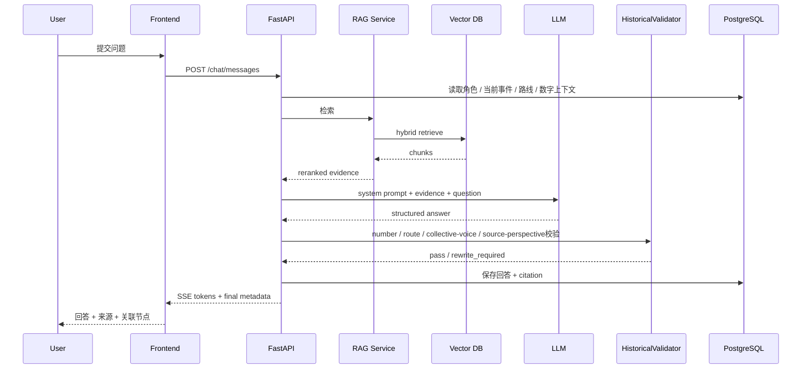

# 《同心千年》清代章节实施规格
## 渥巴锡—土尔扈特东归—伊犁—承德：页面级原型 + 交互逻辑 + API + 数据表 + AI Prompt + Neo4j 图谱

**版本：V1.0 / Vertical Slice 开发版**  
**目标：让前端、后端、AI、内容、视觉可以按同一份文档并行开工。**  
**范围：只做“清代·归属”一个完整闭环，重点实现“迁徙路线 + 证据时间轴 + 渥巴锡AI + 史料来源 + 可解释知识图谱”。**

---

# 1. 本章节要证明什么

这个章节不是为了做一个“渥巴锡英雄故事页”，也不是在欧亚地图上画一条从伏尔加河到伊犁的长箭头，而是要让用户通过“出发—迁徙—抵达—接见—赈济—安置—历史记忆”这一条有证据支撑的链路，理解一次大规模迁徙事件如何连接人群、空间、政治关系和历史记忆。

核心体验链：

```text
进入清代历史场景
→ 看到伏尔加河流域与伊犁之间的空间距离
→ 点击“开始东归”
→ 沿证据时间轴推进1771年事件
→ 查看确定地点与不确定迁徙区段
→ 理解“历史路线不是GPS轨迹”
→ 在抵达伊犁节点查看接应、赈济与安置资料
→ 从渥巴锡展开到土尔扈特部众、清廷、伊犁、承德
→ 查看《土尔扈特全部归顺记》《优恤土尔扈特部众记》等历史记忆节点
→ 与渥巴锡数字历史角色对话
→ AI基于审核史料回答，并保留不同来源中的人数、时间与动因表述差异
→ 进入知识图谱检查“人物—群体—迁徙—地点—文献—制度关系”
→ 用户的跨时代文化探索图谱被点亮
```

这一章要证明：

> **“归属”不能只靠一句宏观结论表达，而要通过迁徙选择、长期联系、抵达后的政治关系、赈济安置和历史记忆等具体证据逐层呈现。**

与其他章节的差异：

```text
汉代：
从人物出发，进入长期交通网络

北魏：
从双历史空间中的证据对照理解文化变化

唐代：
从一幅画进入画外人物与事件网络

元代：
从同一建筑中的多种文字看文化共存

清代：
从一次大规模迁徙的空间过程，
进入“故土记忆—政治关系—接纳安置—历史书写”的多层联系
```

本章最重要的交互不是：

```text
“拖动一条很长的地图路线”
```

而是：

> **“迁徙地图 + 证据时间轴 + 路线不确定性可视化”。**

---

# 2. 本章历史内容基线与表达边界

## 2.1 可作为第一版产品基础事实的数据

第一版内容库可以围绕以下经过故宫博物院、中国国家博物馆及专业研究资料支持的基础事实建立：

- 土尔扈特是厄鲁特蒙古的重要组成部分之一；
- 17世纪前期，土尔扈特部众西迁至伏尔加河下游地区长期生活；
- 在西迁之后，土尔扈特与清朝之间仍存在使节、贡使等联系；
- 故宫博物院和中国国家博物馆公开资料均记载，1771年渥巴锡率领大批土尔扈特部众开始东返；
- 不同公开资料对参与人数使用“约17万人”“16.8万余人”等不同表述，正式产品不能把其中一个数字当成绝对唯一值；
- 1771年夏季，东归部众到达伊犁河流域；
- 清廷随后组织接应、赈济和安置；
- 渥巴锡等部族首领之后前往热河/承德地区觐见乾隆帝；
- 与这一历史事件相关的清代历史文献和物质遗存包括《土尔扈特全部归顺记》《优恤土尔扈特部众记》、相关碑刻、玉册、图像和印章等；
- 故宫资料记载，普陀宗乘之庙等地保存/曾保存与这些御制文字相关的碑刻；
- 中国国家博物馆相关资料介绍了1771年东归、伊犁抵达、承德接见以及赈济安置等历史背景；
- 中国国家博物馆“土尔扈特银印”等文物可作为观察东归后清廷封爵、行政关系与安置体系的后续物证之一。

以上基础事实正式进入生产库前仍然必须：

```text
Source
↓
Claim
↓
时间范围
↓
空间范围
↓
来源视角
↓
审核
↓
approved
```

---

## 2.2 一个必须在产品层面处理的问题：人数不是一个“唯一标准答案”

不同权威公开资料采用不同统计口径：

```text
约17万人
16.8万余人
三万多户
到达人数 / 幸存人数又可能使用另一种统计口径
```

因此产品不能：

```text
后台找到几个数字
↓
自动求平均
↓
显示“准确人数：X”
```

必须建立：

```text
HistoricalEstimate
```

例如：

```text
metric:
departure_population

value_text:
约17万人

source:
故宫博物院公开资料

scope:
出发/东归部众

estimate_type:
source_reported
```

另一条：

```text
value_text:
16.8万余人

source:
相关专业研究

scope:
东归队伍统计
```

用户端：

> 不同资料采用的统计口径存在差异，平台保留来源原始表述，不将估算数字合并为一个虚假的“唯一精确值”。

这会成为本章“可信AI”的重要能力。

---

## 2.3 第二个必须处理的问题：迁徙路线不能画成现代GPS

错误产品：

```text
伏尔加河
→ 某城
→ 某城
→ 某山口
→ 某湖
→ 某城
→ 伊犁

每一段都画成精确公路导航
```

即使某些研究能够重建大体路线，第一版也不能让视觉精度超过证据精度。

地图必须区分：

```text
CONFIRMED_AREA
史料支持的地区 / 抵达节点

APPROXIMATE_CORRIDOR
依据史料和研究重建的大体迁徙廊道

UNCERTAIN_SEGMENT
具体路线存在不确定性的区段

CURATORIAL_CONNECTOR
为了帮助理解前后事件而绘制的策展连接
```

固定图例：

```text
● 确认地点
━ 较高置信历史廊道
≈ 大体迁徙区段
? 路线存在不确定性
┄ 策展关联
```

---

## 2.4 第三个必须处理的问题：迁徙路线与“首领赴承德”不能混成一条线

这是本章非常重要的产品细节。

大规模东归的核心空间链：

```text
伏尔加河流域
↓
跨越欧亚草原的迁徙
↓
伊犁河流域 / 清境内接应区域
↓
后续安置地区
```

而：

```text
渥巴锡等首领
↓
前往热河 / 承德
↓
觐见乾隆帝
```

属于**抵达之后的首领活动**。

不能把地图画成：

```text
17万人全部从伏尔加
一路迁到承德
```

因此路线数据必须有：

```text
route_scope
```

取值：

```text
MASS_MIGRATION
大规模部众迁徙

LEADER_AUDIENCE_JOURNEY
首领觐见行程

SETTLEMENT_DISTRIBUTION
抵达后的安置分布

CURATORIAL
策展连接
```

前端默认：

```text
MASS_MIGRATION
```

用户到达伊犁节点之后，才解锁：

```text
[继续看渥巴锡赴承德]
```

---

## 2.5 第四个必须处理的问题：为什么东归不能只有一个动因按钮

公开文博资料常将：

```text
摆脱沙俄控制 / 压迫
怀念故土
与清朝保持联系
```

作为重要历史背景。

更深入研究往往会讨论：

```text
政治环境
军事压力
草场与生存环境
部族内部政治
与清朝长期联系
历史记忆
```

等多种因素。

因此产品不能设置：

```text
[唯一原因：思念故乡]
```

或：

```text
[唯一原因：俄国压迫]
```

正确结构：

```text
“为什么东归？”
↓
原因证据卡

① 文博公开叙述
② 清代文献中的表述
③ 现代专业研究中的分析
```

每条原因带：

```text
claim_type
source_perspective
source_ids
```

AI回答时使用：

> “公开资料和研究通常从多个因素讨论这一决定……”

而不是替历史群体统一宣告单一心理。

---

## 2.6 “归顺”“归附”“东归”“回归故土”不是完全相同的词

清代官方文献中：

```text
《土尔扈特全部归顺记》
```

使用的是“归顺”。

现代博物馆、公众历史叙述常使用：

```text
东归
回归故土
回归祖国
```

产品需要区分：

```text
historical_term
清代文献中的历史用语

modern_narrative_term
现代展览/研究中的叙述用语
```

不能让 AI 说：

> “1771年的所有参与者都明确把自己的行动称为今天这一套现代术语。”

建议本章 UI 主标题继续使用：

```text
土尔扈特东归
```

因为它是当代公众熟悉的事件名称。

在史料卡中明确：

> 清代御制文献使用“归顺”等表述；不同史料和后世研究使用的术语与叙事视角并不完全相同。

---

## 2.7 “归属”是本项目的章节叙事关键词，不是单一历史事实标签

项目六章使用：

```text
相遇
交融
交流
共存
归属
传承
```

这些是数字叙事组织词。

因此：

```text
归属
```

不应作为：

```text
event_torghut_return_1771
```

的唯一“历史学定论属性”。

数据库：

```text
chapter_theme = 归属
claim_type = curatorial
```

用户可理解为：

> 本章通过迁徙、故土记忆、政治关系、接纳与安置，讨论“归属”这一主题。

而不是：

> 每一位历史参与者都留下了完全相同的“归属感”表述。

---

## 2.8 本章明确不做

第一版不做：

- 不做现代GPS式精确东归路线；
- 不做“每天走到哪里”的虚构日历；
- 不做完整欧亚大陆3D迁徙模拟；
- 不做战斗游戏；
- 不做“沿路损失人数实时掉血”；
- 不将伤亡做娱乐化数值；
- 不设置“民族忠诚度”等评分；
- 不让 AI 替所有土尔扈特人声称相同心理；
- 不把全部东归原因压成一个动因；
- 不把渥巴锡个人动机和整个群体动机完全等同；
- 不把“17万人”说成无争议的精确值；
- 不把首领赴承德路线与大部众迁徙路线合并；
- 不声称全部土尔扈特成员都参与了1771年东归；
- 不自动生成没有来源的具体中途城镇；
- 不做历史地图自动路径规划；
- 不做摄像头识别；
- 不做碑文OCR；
- 不做清代满文/蒙古文自动识读；
- 不让AI编造迁徙途中对白、天气、私人经历；
- 不把现代“中华民族共同体意识”直接说成渥巴锡当时使用的概念。

---

# 3. 核心用户故事

## US-01：第一次进入

> 作为第一次使用平台的用户，我希望快速知道这一章发生的是一次跨越巨大空间的大规模迁徙，而不是先读长篇人物生平。

验收：

- 10秒内看到“伏尔加河流域 → 伊犁”；
- 用户最多点击1次进入迁徙地图；
- 首屏不超过160字说明；
- 首屏明确“路线为历史示意”。

## US-02：沿时间线理解东归过程

> 作为用户，我希望知道1771年发生了哪些关键节点，而不是只看到一条长箭头。

验收：

- 底部时间轴至少有4个核心节点；
- 每个节点可展开史料卡；
- 确定时间与约略时间使用不同显示；
- 不伪造具体日期。

## US-03：理解路线不确定性

> 作为用户，我希望知道哪些地方能确认、哪些路线只是大体重建。

验收：

- 地图固定显示图例；
- 至少三种路线置信度；
- 点击任一路段可查看“依据是什么”；
- 不使用现代路线导航语言。

## US-04：理解人数为什么会不同

> 作为用户，我希望知道为什么有的资料说17万人，有的资料写16.8万余人。

验收：

- 数字卡支持多来源并列；
- 不自动合并；
- AI能解释“统计口径和来源表述可能不同”；
- 来源可点击。

## US-05：与渥巴锡继续追问

> 作为用户，我希望问“为什么东归”“怎么走”“到了以后发生什么”。

验收：

- 推荐问题；
- 自由输入；
- 回答带来源；
- 不替所有部众说统一心理；
- 不编具体途中私人故事。

## US-06：从迁徙走到接纳与安置

> 作为用户，我希望知道抵达伊犁以后发生什么，而不是地图到终点就结束。

验收：

- 解锁“抵达之后”；
- 能看到接应、赈济、安置；
- 能继续展开渥巴锡等首领赴承德节点；
- 清楚区分“部众迁徙”和“首领活动”。

## US-07：从事件走到历史记忆

> 作为用户，我希望看到这一事件后来如何被文献、碑刻、玉册、绘画和印章记录下来。

验收：

至少出现：

```text
《土尔扈特全部归顺记》
《优恤土尔扈特部众记》
万法归一图屏
土尔扈特相关印章/册页
```

具体上线对象以图片权利和内容审核为准。

## US-08：获得探索成果

> 作为用户，我希望看到自己从“路线”走到了“人群—政治关系—安置—历史记忆”。

验收：

记录：

```text
路线节点
时间事件
人物
历史群体
文献
文物
来源
AI问答
图谱关系
```

---

# 4. 页面地图

```text
Q00 章节过场
  │
  ▼
Q01 章节首页 / 东归导览
  │
  ▼
Q02 东归迁徙主地图
  ├── Q03 证据时间轴 / 路线透镜
  ├── Q04 实体 / 事件详情抽屉
  ├── Q05 渥巴锡 AI 数字历史角色
  ├── Q06 史料证据页
  └── Q07 清代关系图谱
           │
           ▼
         Q08 本章探索成果
```

建议路由：

```text
/era/qing
/era/qing/torghut-return
/era/qing/torghut-return/chat
/era/qing/torghut-return/graph
/era/qing/torghut-return/summary
```

Q03、Q04、Q06：

```text
Overlay / Drawer
```

优先不独立跳路由。

URL状态：

```text
/era/qing/torghut-return
  ?event=event_arrival_ili_1771
  &route_scope=mass_migration
  &time=1771-summer
```

---

# 5. 全局页面框架

PC / 比赛大屏优先。

基准：

```text
1440 × 900
```

```text
┌──────────────────────────────────────────────────────────────┐
│ Logo 同心千年     清代·归属       图谱    我的探索    返回时间轴 │
├──────────────────────────────────────────────────────────────┤
│                                                              │
│                       页面主内容区                            │
│                                                              │
├──────────────────────────────────────────────────────────────┤
│ 章节进度 43%     已探索 5 个节点                  史料说明 / AI说明 │
└──────────────────────────────────────────────────────────────┘
```

全局复用：

```text
AppHeader
EraBreadcrumb
ExploreProgressBar
AiContentBadge
EvidenceBadge
GlobalToast
SourceDisclaimer
```

清代专属：

```text
MigrationMap
MigrationTimeline
RouteEvidenceLens
RouteLegend
HistoricalEstimateCard
ArrivalAftermathPanel
TerminologyNote
```

---

# 6. Q00：章节过场

## 6.1 目的

4–6秒建立：

```text
迁徙
故土
长距离
```

三个认知。

不播放苦难化、战斗化镜头。

## 6.2 页面原型

```text
┌──────────────────────────────────────────────────┐
│                                                  │
│                      清代                         │
│                                                  │
│                      归属                         │
│                                                  │
│          “跨越漫长距离的迁徙，                   │
│           如何连接故土、关系与记忆？”            │
│                                                  │
│                 [打开东归路线]                   │
│                 [跳过导览]                       │
│                                                  │
└──────────────────────────────────────────────────┘
```

背景：

```text
欧亚草原抽象地形
伏尔加河与伊犁两个发光区域
```

右下角：

> AI辅助历史场景示意

## 6.3 控件

| ID | 文案 | 点击逻辑 | API | 成功状态 |
|---|---|---|---|---|
| BTN-Q00-01 | 打开东归路线 | 500–800ms地图缩放进入Q01 | `POST /exploration/events` | 进入章节首页 |
| BTN-Q00-02 | 跳过导览 | 直接Q02 | `POST /exploration/events` | 主地图 |
| BTN-Q00-03 | 返回时间轴 | 总首页 | 无强依赖 | 保留进度 |

埋点：

```text
qing_intro_view
qing_intro_enter
qing_intro_skip
qing_intro_back
```

---

# 7. Q01：章节首页 / 东归导览

## 7.1 页面目标

让用户知道：

1. 谁参与；
2. 从哪里出发；
3. 大体到哪里；
4. 到达后还有接应、安置和首领觐见；
5. 地图不是精确路线。

## 7.2 页面原型

```text
┌───────────────────────────────────────────────────────────────┐
│ 清代 · 归属                                          进度 0%  │
├───────────────────────────────────────────────────────────────┤
│                                                               │
│  伏尔加河流域        欧亚草原迁徙廊道          伊犁河流域      │
│       ◎   ━━━━━━━━━━━≈≈≈≈≈≈≈━━━━━━━━━━━   ◎                  │
│                                                               │
│       1771年初                              1771年夏季          │
│                                                               │
│                      渥巴锡                                   │
│                 土尔扈特首领                                  │
│                                                               │
│  探索问题：一次迁徙抵达以后，又形成了怎样的关系和历史记忆？   │
│                                                               │
│ [开始东归路线] [与渥巴锡对话] [查看历史记忆] [查看关系图谱]    │
└───────────────────────────────────────────────────────────────┘
```

## 7.3 按钮逻辑

| ID | 按钮 | 前端行为 | 后端/API | 异常处理 |
|---|---|---|---|---|
| BTN-Q01-01 | 开始东归路线 | Q02，时间轴定位1771年初 | scene_start | 不阻断 |
| BTN-Q01-02 | 与渥巴锡对话 | Q05 | chat session | fallback |
| BTN-Q01-03 | 查看历史记忆 | Q04打开文献集合 | entity API | 空状态 |
| BTN-Q01-04 | 查看关系图谱 | Q07 | graph API | 错误态 |
| BTN-Q01-05 | 为什么路线不是精确线？ | 打开固定方法卡 | 无/内容API | 本地fallback |
| BTN-Q01-06 | 返回时间轴 | 总首页 | exploration event | 不阻断 |

## 7.4 导览文本建议

固定，不实时生成：

> 1771年，渥巴锡率领大批土尔扈特部众从伏尔加河流域向东迁徙，并于同年抵达伊犁河流域。抵达以后，事件并没有结束：接应、赈济、安置、首领觐见以及后来的文献和文物记录，共同构成了这一历史过程。

控制：

```text
100–140 中文字
```

---

# 8. Q02：东归迁徙主地图

这是清代章节最重要的页面。

## 8.1 主场景结构

```text
┌──────────────────────────────────────────────────────────────────────┐
│ 清代 · 土尔扈特东归        [路线证据] [时间轴] [抵达以后] [AI] [图谱] │
├──────────────────────────────────────────────────────────────────────┤
│                                                                      │
│ ◎ 伏尔加河流域                                                       │
│      ╲                                                               │
│       ╲                                                              │
│        ≈≈≈≈≈≈≈≈≈ 中亚 / 欧亚草原迁徙区段 ≈≈≈≈≈≈≈≈                 │
│                                               ╲                      │
│                                                ◎ 伊犁河流域          │
│                                                                      │
│           [局部历史地点随证据审核逐步加入]                           │
│                                                                      │
├──────────────────────────────────────────────────────────────────────┤
│ 1771年初 ━━━━━━━●━━━━━━━━━━━━○━━━━━━━○ 1771年后续                 │
│ 当前：开始东归             路线性质：历史示意   已探索 2/6           │
└──────────────────────────────────────────────────────────────────────┘
```

## 8.2 地图核心原则

默认不使用今天政治边界作为主视觉。

可以淡化显示现代地理参照，但必须标：

```text
“现代位置参照”
```

历史地图主表达：

```text
河流
草原
山地
大区域
历史地点
```

## 8.3 首屏核心节点建议

第一版：

```text
1. 伏尔加河下游 / 土尔扈特长期生活区域
2. 东归出发节点（区域级）
3. 欧亚草原中段聚合区段
4. 伊犁河流域 / 接应区域
5. 安置地区聚合节点
6. 承德 / 热河（首领赴觐后解锁）
```

其中：

```text
承德
```

不属于大部众迁徙终点。

必须有：

```text
route_scope = LEADER_AUDIENCE_JOURNEY
```

## 8.4 节点数据结构

```json
{
  "node_id": "map_node_volga_region",
  "entity_id": "region_volga_lower",
  "label": "伏尔加河下游",
  "node_type": "historical_region",
  "route_scope": "MASS_MIGRATION",
  "certainty": "confirmed_region",
  "x": 0.16,
  "y": 0.42,
  "claim_ids": ["claim_torghut_volga_residence"]
}
```

坐标：

```text
产品画布0–1坐标
```

不是历史GPS。

## 8.5 路线数据结构

```json
{
  "segment_id": "seg_qing_migration_02",
  "from_node_id": "map_node_volga_region",
  "to_node_id": "map_node_ili_region",
  "route_scope": "MASS_MIGRATION",
  "render_type": "schematic_corridor",
  "certainty": "approximate",
  "geometry": [],
  "claim_ids": [],
  "source_ids": [],
  "review_status": "approved"
}
```

如果还没有足够资料：

```text
geometry
```

宁可只画宽带状区域，不画细线。

## 8.6 路线状态

```text
LOCKED
尚未解锁

AVAILABLE
可探索

SEEN
已访问

SELECTED
当前

UNCERTAIN
需要显示?标识
```

## 8.7 页面按钮完整逻辑

| ID | UI | 行为 |
|---|---|---|
| BTN-Q02-01 | 路线证据 | Q03 mode=route |
| BTN-Q02-02 | 时间轴 | Q03 mode=timeline |
| BTN-Q02-03 | 抵达以后 | 到达伊犁后解锁 aftermath panel |
| BTN-Q02-04 | AI对话 | Q05 |
| BTN-Q02-05 | 关系图谱 | Q07 |
| BTN-Q02-06 | 大部众迁徙 | route_scope=MASS_MIGRATION |
| BTN-Q02-07 | 首领赴承德 | route_scope=LEADER_AUDIENCE_JOURNEY |
| BTN-Q02-08 | 安置分布 | route_scope=SETTLEMENT_DISTRIBUTION |
| BTN-Q02-09 | 图例 | 展开路线可信度 |
| BTN-Q02-10 | 为什么不是GPS？ | 方法卡 |
| BTN-Q02-11 | 我的进度 | progress drawer |
| BTN-Q02-12 | 返回章节首页 | Q01 |
| BTN-Q02-13 | 返回总时间轴 | 保留进度 |

## 8.8 点击路线区段

```text
onClick(segment)
→ setSelectedSegment
→ POST exploration event
→ GET /migration/segments/{id}
→ 打开 Q04 / route evidence card
```

显示：

```text
区段名称
路线性质
可确认到什么程度
有哪些来源
为什么这样绘制
不能推出什么
```

---

# 9. Q03：证据时间轴 / 路线透镜

Q03 为 Overlay。

两个模式：

```text
timeline
route
```

## 9.1 Timeline模式

第一版时间节点建议：

```text
17世纪前期
土尔扈特西迁伏尔加河流域

清代前期
与清朝保持使节等联系

1761
渥巴锡继承汗位

1771年初
开始东归

1771年夏季
抵达伊犁河流域

1771年后续
接应 / 赈济 / 安置

1771年秋季前后
渥巴锡等首领赴热河 / 承德觐见

1771年
御制记文 / 纪念性碑刻

1775
相关土尔扈特银印等后续物证
```

正式上线前每个日期：

```text
必须绑定Claim
```

如果资料只支持：

```text
夏季
七月
农历六月
```

则按原来源保存，不后台强制换算成某一天。

## 9.2 时间轴视觉

```text
17世纪前期 ━━━ 1761 ━━━ 1771.初 ━━━ 1771.夏 ━━━ 1771.后续 ━━━ 1775
                     ●            ○              ○
```

点开：

```text
事件
来源
时间精度
相关地点
相关人物
```

## 9.3 Route Lens模式

地图只高亮：

```text
确认区域
大体廊道
不确定区段
```

右侧：

```text
路线说明
```

模板：

```text
这段路线属于：
APPROXIMATE_CORRIDOR

我们可以确认：
东归队伍由伏尔加河流域向东，最终抵达伊犁河区域。

目前不在本平台声称：
每一天的精确位置；
每一个中途点；
一条唯一固定路径。
```

## 9.4 “数字证据卡”

点击：

```text
人数
路程
损失
抵达人数
```

不要直接显示一个大数字。

统一组件：

```text
HistoricalEstimateCard
```

页面：

```text
┌──────────────────────────────────────┐
│ 出发人数                            │
├──────────────────────────────────────┤
│ 来源A：约17万人                    │
│ 故宫博物院                         │
│                                      │
│ 来源B：16.8万余人                  │
│ 专业研究资料                       │
│                                      │
│ 提示：不同资料统计口径可能不同。    │
│ [查看两条来源]                     │
└──────────────────────────────────────┘
```

## 9.5 控件

| ID | 文案 | 逻辑 |
|---|---|---|
| BTN-Q03-01 | 关闭 | 回Q02 |
| BTN-Q03-02 | 时间轴 | mode=timeline |
| BTN-Q03-03 | 路线证据 | mode=route |
| BTN-Q03-04 | 只看确定节点 | confirmed |
| BTN-Q03-05 | 显示不确定区段 | uncertain |
| BTN-Q03-06 | 查看人数来源 | historical estimates |
| BTN-Q03-07 | 为什么不同资料数字不一样？ | fixed method card |
| BTN-Q03-08 | 抵达以后 | aftermath |
| EVENT-Q03-* | 时间节点 | Q04 event |
| SEG-Q03-* | 路线段 | route evidence |

---

# 10. Q04：实体 / 事件详情抽屉

共用六章 `EntityDrawer`，本章增加：

```text
EventEvidence
HistoricalEstimate
RouteScopeBadge
TerminologyNote
```

## 10.1 渥巴锡详情原型

```text
                               ┌───────────────────────────────┐
                               │ 渥巴锡                 [×]    │
                               │ Person / 历史人物             │
                               ├───────────────────────────────┤
                               │ [人物数字视觉]                │
                               │                               │
                               │ 土尔扈特部首领                │
                               │                               │
                               │ 1761年继承汗位                │
                               │ 1771年率大批部众东归          │
                               │                               │
                               │ ● 史料确认                    │
                               │                               │
                               │ [与渥巴锡对话]                │
                               │ [查看东归关系]                │
                               │ [查看史料来源]                │
                               └───────────────────────────────┘
```

具体年龄因公开资料有不同表述时：

```text
不在首屏强行显示年龄
```

除非来源审核后确定展示策略。

## 10.2 东归事件详情

```text
                               ┌───────────────────────────────┐
                               │ 1771年土尔扈特东归     [×]    │
                               │ Event                         │
                               ├───────────────────────────────┤
                               │ 时间：1771年                  │
                               │                               │
                               │ 出发：伏尔加河流域            │
                               │ 抵达：伊犁河流域              │
                               │                               │
                               │ 人数：不同资料口径不同        │
                               │ [查看数字来源]                │
                               │                               │
                               │ 路线：历史迁徙廊道示意        │
                               │ [查看路线依据]                │
                               │                               │
                               │ [围绕事件提问]                │
                               │ [查看关系]                    │
                               └───────────────────────────────┘
```

## 10.3 《优恤土尔扈特部众记》详情

```text
                               ┌───────────────────────────────┐
                               │ 《优恤土尔扈特部众记》 [×]    │
                               │ HistoricalText / 历史文献     │
                               ├───────────────────────────────┤
                               │ [碑刻/玉册资源]               │
                               │                               │
                               │ 清代御制文字                  │
                               │                               │
                               │ 本章用途：                    │
                               │ 观察清廷如何记录赈济、安置    │
                               │ 和这一事件                    │
                               │                               │
                               │ ⚠ 属于清廷官方历史叙述        │
                               │    不能代替所有参与者声音      │
                               │                               │
                               │ [查看相关史料]                │
                               │ [查看关系]                    │
                               └───────────────────────────────┘
```

这是重要设计：

> 历史文献既是“证据”，也是有作者和视角的“历史叙述”。

## 10.4 字段

通用：

```text
entity_id
entity_type
display_name
subtitle
era
date_label
short_summary
body_markdown
image_url
verification_label
review_status
source_count
related_entity_count
```

本章扩展：

```text
route_scope
time_precision
historical_term
modern_term
source_perspective
estimate_ids
chronology_note
audience_scope
```

## 10.5 每个按钮

| ID | 按钮 | 逻辑 | API |
|---|---|---|---|
| BTN-Q04-01 | × | 回Q02原位置 | 无 |
| BTN-Q04-02 | 与渥巴锡对话 / 围绕它提问 | Q05 | chat |
| BTN-Q04-03 | 查看它的关系 | Q07 | graph |
| BTN-Q04-04 | 查看史料来源 | Q06 | sources |
| BTN-Q04-05 | 在地图定位 | 聚焦地图 | 前端 |
| BTN-Q04-06 | 查看路线依据 | Q03 route | migration API |
| BTN-Q04-07 | 查看数字来源 | estimates drawer | estimates API |
| BTN-Q04-08 | 查看相关历史记忆 | 文献/文物列表 | relations |
| BTN-Q04-09 | 加入我的探索 | exploration | event |

---

# 11. Q05：渥巴锡 AI 数字历史角色

## 11.1 产品定位

角色不是：

> “真正复活的渥巴锡本人”。

而是：

> **基于审核史料构建的“渥巴锡数字历史角色”。**

固定显示：

> AI数字历史角色。第一人称表达属于基于史料的数字叙事重构，并非渥巴锡真实原话。

## 11.2 页面原型

```text
┌────────────────────────────────────────────────────────────────┐
│ ← 返回地图        与“渥巴锡”对话        [叙事模式 | 史实模式] │
├────────────────────────────────────────────────────────────────┤
│                                                                │
│ 渥巴锡：你可以从1771年的东归、抵达和之后的经历开始问起。      │
│                                                                │
│ 推荐问题：                                                      │
│ [为什么决定东归？]                                             │
│ [一共有多少人出发？]                                           │
│ [你们具体走的是哪一条路？]                                     │
│ [到达伊犁以后发生了什么？]                                     │
│                                                                │
│ 用户：一共有多少人东归？                                       │
│                                                                │
│ 渥巴锡：不同资料的统计口径并不完全一致……                      │
│                                                                │
│ 依据：[故宫资料①] [专业研究②]                                 │
│                                                                │
│ 继续探索：[伊犁] [安置] [优恤土尔扈特部众记]                  │
├────────────────────────────────────────────────────────────────┤
│ 输入你想问的问题……                                  [发送]     │
└────────────────────────────────────────────────────────────────┘
```

## 11.3 两种回答模式

### 叙事模式

允许：

> “1771年，我率领大批部众开始向东迁徙……”

前提：

```text
人物参与关系
年份
行动
```

均有证据。

不允许：

> “所有人都和我怀着完全相同的心情……”

也不允许：

> “某一天暴风雪里，我对某人说……”

除非史料明确记录。

### 史实模式

使用第三人称：

> “1771年，渥巴锡率领大批土尔扈特部众从伏尔加河流域向东迁徙……”

适合评委核验。

## 11.4 必须正确处理的问题

### 用户：为什么东归？

不能只说：

> “因为想念故乡。”

也不能只说：

> “因为沙俄压迫。”

应根据证据说明：

```text
公开文博资料常强调摆脱俄国控制/压迫、故土联系等因素；
不同研究还会从政治、军事、生存和长期关系等层面讨论。
```

如果当前RAG只有文博资料：

> 只能回答文博资料支持的因素，并提醒“更完整动因需结合专业研究”。

### 用户：到底多少人？

必须：

> 不同资料采用约17万、16.8万余人等不同表述，统计口径可能不同。平台保留来源原始数据，不把它们合并成一个虚假的精确数字。

然后展示 Source Chips。

### 用户：你们到底走哪条路？

回答：

> 现有资料可以帮助重建大体迁徙方向和部分重要节点，但第一版平台不把历史迁徙画成现代GPS式唯一轨迹。地图中的部分连线属于依据资料绘制的历史示意。

### 用户：到了伊犁之后是不是所有人都去承德了？

必须：

> 不是这样理解。大部众抵达后涉及接应、赈济和安置；渥巴锡等首领之后前往热河/承德觐见。平台将“大部众迁徙”和“首领赴承德”分成两条不同范围的路线。

### 用户：所有土尔扈特人都想法一样吗？

必须：

> 现有资料不能支持把所有个体的心理归纳成完全一致的表达。可以说明事件中的集体行动以及史料记录的动因，但不能替每一个参与者虚构统一心理。

### 用户：你是为了中华民族共同体意识东归吗？

必须：

> 这是现代语境中的概念，不能直接作为18世纪历史人物当时使用的主观目标。平台可以从今天的历史研究视角讨论长期联系、迁徙、接纳和历史记忆的意义，但不把现代概念改写成古人的原话或原始动机。

## 11.5 按钮逻辑

| ID | UI | 逻辑 |
|---|---|---|
| BTN-Q05-01 | 返回地图 | Q02 |
| BTN-Q05-02 | 叙事模式 | narrative |
| BTN-Q05-03 | 史实模式 | factual |
| CHIP-Q05-* | 推荐问题 | 自动发送 |
| BTN-Q05-04 | 发送 | chat |
| BTN-Q05-05 | 停止生成 | abort SSE |
| BTN-Q05-06 | 来源卡 | Q06 |
| BTN-Q05-07 | 关联实体 | Q04/Q07 |
| BTN-Q05-08 | 清空对话 | new session |
| BTN-Q05-09 | 重新回答 | regenerate |
| BTN-Q05-10 | 这个回答有问题 | feedback |

---

# 12. Chat 前后端时序



---

# 13. AI 回答状态机

```text
IDLE
→ RETRIEVING
→ GENERATING
→ VALIDATING
→ DONE
```

异常：

```text
NO_EVIDENCE
MODEL_TIMEOUT
VALIDATION_FAILED
NETWORK_ERROR
RATE_LIMIT

NUMBER_CONFLICT
ROUTE_OVERPRECISION
COLLECTIVE_VOICE_OVERCLAIM
MOTIVE_SINGLE_CAUSE_OVERCLAIM
ROUTE_SCOPE_CONFUSION
SOURCE_PERSPECTIVE_COLLAPSE
MODERN_CONCEPT_PROJECTION
```

## 13.1 NUMBER_CONFLICT

若证据存在多个统计，回答不得输出单一无归属的“准确值”。

## 13.2 ROUTE_OVERPRECISION

无来源具体城市、精确GPS、每天位置、唯一固定路径均触发改写。

## 13.3 COLLECTIVE_VOICE_OVERCLAIM

检测：

```text
“所有土尔扈特人都认为……”
“每个人都想……”
```

## 13.4 MOTIVE_SINGLE_CAUSE_OVERCLAIM

检测：

```text
“东归唯一原因就是……”
```

## 13.5 ROUTE_SCOPE_CONFUSION

如果模型将承德说成整个大部众迁徙终点，直接失败。

## 13.6 SOURCE_PERSPECTIVE_COLLAPSE

如果模型把清廷御制文“归顺”直接说成所有参与者自己的唯一描述，触发改写。

## 13.7 Offline Demo Fallback

> 当前启用演示保障模式，以下内容来自已审核的预设问答库。

---

# 14. RAG 处理规格

## 14.1 输入

```json
{
  "chapter_id": "qing_return",
  "character_id": "person_ubashi",
  "current_entity_id": "event_torghut_return_1771",
  "current_route_scope": "MASS_MIGRATION",
  "current_timeline_event_id": "event_arrival_ili_1771",
  "answer_mode": "factual",
  "question": "一共有多少人东归？"
}
```

## 14.2 强制 Metadata Filter

```text
review_status = approved
chapter_ids contains qing_return
source_level in [S, A, B]
```

数字问题额外：

```text
chunk has estimate_id
```

路线问题：

```text
route_scope
certainty
```

动因问题：

```text
source_perspective
claim_type
```

## 14.3 推荐检索流程

```text
原始问题
↓
意图分类
  ├─ 人物
  ├─ 迁徙时间
  ├─ 路线
  ├─ 人数
  ├─ 动因
  ├─ 抵达后处置
  ├─ 清廷文献
  └─ 历史记忆
↓
指代消解
↓
Query Rewrite
↓
Hybrid Retrieval
↓
Top 12
↓
Metadata-Aware Rerank
↓
Top 4–6
↓
Historical Estimate Guard
↓
Route Scope Guard
↓
Collective Voice Guard
↓
Source Perspective Guard
↓
生成
↓
Claim Validation
↓
Citation Validation
```

## 14.4 Historical Estimate Guard

```python
estimates = get_estimates(metric="departure_population")

if len(distinct_source_values(estimates)) > 1:
    require_attribution_and_uncertainty_language()
    forbid_exact_single_value_without_attribution()
```

## 14.5 Route Scope Guard

```python
if target == "place_chengde" and current_route_scope == "MASS_MIGRATION":
    reject_claim("all_migrants_went_to_chengde")
```

## 14.6 Source Perspective Guard

每个chunk增加：

```text
source_perspective:
qing_court
museum_curatorial
modern_scholarship
archaeological_object
```

避免把清代官方记述当成全部参与者第一人称记忆。

## 14.7 No Context No Answer

```json
{
  "status": "NO_EVIDENCE",
  "answer": "",
  "citations": []
}
```

---

# 15. AI Prompt 体系

与元代统一拆成5个Prompt。

## Prompt A：渥巴锡主角色 System Prompt

```text
你是《同心千年》中的“渥巴锡数字历史角色”。

你的任务不是自由扮演一个拥有完整私人记忆的渥巴锡，而是把经过审核的清代史料、文博资料与专业研究转换成准确、易懂、具有互动感的历史解释。

【身份】
- 展示对象：土尔扈特部首领渥巴锡。
- 当前章节：清代·归属。
- 主要事件：1771年土尔扈特东归及抵达后的相关历史。
- 第一人称仅属于数字叙事形式，不代表渥巴锡真实原话。

【知识边界】
1. 只能依据 <EVIDENCE> 中的资料回答具体历史事实。
2. 不得调用未提供的常识补充具体路线、日期、人数、战斗、天气、对白、私人心理。
3. 不得替所有土尔扈特部众声称完全一致的心理和动机。
4. 回答“为什么东归”时，应区分不同来源记录的因素；不得擅自宣布只有一个唯一原因。
5. 回答人数时，如果 <HISTORICAL_ESTIMATES> 有多个不同数值，必须分别说明来源和口径，不得平均、合并或强行选一个“准确值”。
6. 不得把大部众东归路线与渥巴锡等首领之后赴热河/承德的行程混为一条路线。
7. 不得声称全部东归部众都到承德觐见。
8. 地图中的 APPROXIMATE_CORRIDOR / UNCERTAIN_SEGMENT 不能描述成现代GPS式精确路线。
9. 对《土尔扈特全部归顺记》《优恤土尔扈特部众记》等清廷文献，要说明其作者/政治语境和官方叙述属性。
10. 不得把清代文献中的“归顺”直接说成所有参与者本人使用的唯一历史术语。
11. 不得将现代“中华民族共同体意识”直接描述成18世纪历史人物当时使用的概念或主观目标。
12. 不得编造渥巴锡途中与亲属、部众、清军官员的具体对白。
13. 不得把后世纪念叙事自动当成1771年的一手证词。
14. 无证据时明确回答资料不足。

【叙事模式】
若 ANSWER_MODE=narrative：
- 可使用“1771年，我率领大批部众开始向东迁徙……”等有证据支持的第一人称；
- 不添加私人心理、感官和对白；
- 涉及“大家、所有人”时严格避免代替整个群体发言。

【史实模式】
若 ANSWER_MODE=factual：
- 使用第三人称；
- 明确区分史实、来源原话、现代研究和策展解释。

【路线】
<ROUTE_SEGMENTS> 每条包含 certainty 与 route_scope。
不得跨越 scope 推断。

【数字】
<HISTORICAL_ESTIMATES> 中的数字必须带来源。

【来源视角】
当证据 source_perspective=qing_court：
回答应说明“清代官方文献记载/表述……”。

【引用】
- 每个重要历史事实必须来自 EVIDENCE。
- 只返回真正使用的 citation_id。
- 不创造来源。

【输出】
严格返回JSON：
{
  "answer_markdown": "...",
  "citation_ids": ["..."],
  "related_entity_ids": ["..."],
  "uncertainty": "low|medium|high",
  "source_perspectives": ["..."],
  "needs_human_review": false
}
```

## Prompt B：问题改写 Prompt

```text
你是清代土尔扈特东归章节知识库检索查询改写器。

输入：
- 当前人物
- 当前时间节点
- 当前路线范围
- 当前实体
- 用户问题

输出1条完整检索问题。

规则：
1. 补足“他们、这里、后来、这条路、多少人”等指代。
2. 区分：渥巴锡个人、土尔扈特部众、清廷、大部众迁徙、首领赴承德、安置、后世历史记忆。
3. 用户问题中的单一原因、精确人数、精确路线不能默认成立。
4. 问“为什么东归”时检索多个动因来源。
5. 问人数时同时搜索 historical_estimates。
6. 问“是不是所有人都去承德”时同时检索 migration scope 和 audience journey。
7. 不在改写阶段给答案。

示例：
用户：“他们最后是不是都到了承德？”
输出：
“1771年东归的土尔扈特大部众抵达后主要在哪里接受接应和安置，渥巴锡等首领何时前往热河/承德觐见，是否有史料支持全部东归部众都前往承德？”
```

## Prompt C：证据相关性判断

```text
判断每个检索片段对用户问题的直接支持程度。

输出：
{
  "chunk_id": "...",
  "relevance": 0-3,
  "evidence_type": "historical_text|museum|scholarly|object",
  "source_perspective": "qing_court|museum_curatorial|modern_scholarship|object",
  "supports_claims": [],
  "route_scope": "",
  "estimate_ids": [],
  "reason": ""
}

3 = 直接支持核心事实
2 = 支持重要背景
1 = 弱相关
0 = 无关

特别规则：
- 仅出现“土尔扈特”不能自动高度相关。
- 渥巴锡个人资料不能自动代表所有部众心理。
- 清廷御制文不能自动代表全部参与者视角。
- 承德资料不能自动证明全部迁徙人群都去了承德。
- 一个数字来源不能自动否定另一个approved数字来源。
```

## Prompt D：答案事实核验

```text
你是清代土尔扈特东归章节回答核验器。

检查：
1. 1771年基本事件是否有来源；
2. 是否把不同来源人数强行统一成一个精确数字；
3. 是否把路线画/说得超过证据精度；
4. 是否虚构具体中途城市；
5. 是否把大部众迁徙与首领赴承德路线混淆；
6. 是否声称所有东归部众都去承德；
7. 是否替所有土尔扈特部众声称完全相同心理；
8. 是否把东归动因压成唯一原因；
9. 是否把清廷官方“归顺”话语当成所有参与者自述；
10. 是否把现代纪念语言直接当作1771年一手原话；
11. 是否把现代概念写成渥巴锡本人主观目标；
12. 是否出现无来源对白、天气、私人心理；
13. 引用是否真实存在；
14. 史实 / 研究解释 / 策展主题是否混淆。

输出：
{
  "pass": true,
  "unsupported_claims": [],
  "number_conflicts": [],
  "route_scope_errors": [],
  "collective_voice_errors": [],
  "source_perspective_errors": [],
  "citation_errors": [],
  "rewrite_required": false
}
```

## Prompt E：探索总结 Prompt

```text
只根据用户已访问内容生成总结。

输入：
- visited_map_node_ids
- visited_timeline_event_ids
- visited_entity_ids
- viewed_estimate_ids
- visited_relation_ids
- asked_question_topics

规则：
1. 不增加用户没有探索的新历史事实。
2. 80–120字。
3. 可以总结“从迁徙路线到接纳安置再到历史记忆”的探索路径。
4. 不推断用户民族身份、政治立场或价值观。
5. 不说用户形成了某种“认同分数”。
6. 不把策展主题“归属”写成历史参与者唯一自我表述。
7. 可基于内容关系推荐下一章。

输出：
{
  "summary": "...",
  "next_entity_ids": ["..."]
}
```

---

# 16. 推荐问题配置

```json
[
  {"id":"q_qing_01","text":"为什么决定东归？","intent":"return_motives"},
  {"id":"q_qing_02","text":"一共有多少人出发？","intent":"departure_population"},
  {"id":"q_qing_03","text":"为什么不同资料的人数不一样？","intent":"estimate_difference"},
  {"id":"q_qing_04","text":"你们到底走的是哪一条路？","intent":"route_precision"},
  {"id":"q_qing_05","text":"到达伊犁以后发生了什么？","intent":"arrival_aftermath"},
  {"id":"q_qing_06","text":"是不是所有人后来都去了 承德？","intent":"route_scope"},
  {"id":"q_qing_07","text":"《优恤土尔扈特部众记》记录了什么？","intent":"historical_memory"},
  {"id":"q_qing_08","text":"所有部众当时想法都一样吗？","intent":"collective_voice"}
]
```

首屏最多4个。

---

# 17. Q06：史料证据页

## 17.1 目标

用户能回答：

```text
为什么地图这样画？
为什么人数有不同？
为什么说抵达伊犁？
为什么有承德节点？
“归顺”这个词是谁使用的？
安置和赈济依据什么？
```

## 17.2 页面结构

```text
┌──────────────────────────────────────────────────────────┐
│ 史料依据                                      [关闭]     │
├──────────────────────────────────────────────────────────┤
│ 当前内容：1771年东归 / 抵达伊犁                           │
│                                                          │
│ [官方文博资料] 中国国家博物馆                            │
│ 回归故土情                                               │
│ 支持：东归时间、伊犁抵达、承德接见、安置等               │
│ [这个来源支持了什么？] [查看来源]                        │
│                                                          │
│ [故宫藏品资料] 故宫博物院                                │
│ 万法归一图屏                                             │
│ 支持：渥巴锡等首领与承德活动背景                         │
│                                                          │
│ [专业研究] 故宫学刊 / 中国社会科学网                    │
│ 支持：人数、东归过程、清廷安置和历史记忆                 │
└──────────────────────────────────────────────────────────┘
```

## 17.3 第一批推荐来源

### S：中国国家博物馆《回归故土情》

```text
Source ID: src_chnmuseum_return_homeland
URL: https://www.chnmuseum.cn/yj/xscg/xslw/201812/t20181224_33272.shtml
```

支持：

```text
土尔扈特与清朝长期联系
渥巴锡
1771年东归
抵达伊犁
乾隆帝接见
赈济和安置
四种文字碑记
```

### S：故宫博物院《万法归一图屏》

```text
Source ID: src_dpm_wanfa_guiyi
URL: https://www.dpm.org.cn/collection/paint/233340.html
```

支持：

```text
土尔扈特历史背景
渥巴锡
1771年东返
渥巴锡等首领与乾隆帝活动
万法归一殿
```

### S：故宫博物院《铁柄皮鞘番属刀》

```text
Source ID: src_dpm_torghut_knife
URL: https://www.dpm.org.cn/collection/defense/234727.html
```

支持：

```text
土尔扈特西迁背景
1712年清使联系
1771年东归
约17万人等公开表述
抵达后的清廷安排
```

### S：故宫博物院专题《民本邦宁》

```text
Source ID: src_dpm_torghut_relief_jade
URL: https://www.dpm.org.cn/topic/zhongguo_commonhome.html
```

对象：

```text
青玉刘秉恬书御制《优恤土尔扈特部众记》册
```

支持：

```text
1771年事件
约17万人表述
赈济安置
首领赴承德
御制记文
```

### S：中国国家博物馆“土尔扈特银印”相关展览页

```text
Source ID: src_chnmuseum_torghut_seal
URL: https://www.chnmuseum.cn/portals/0/web/zt/202306jrhj/
```

支持：

```text
1771年东归背景
东归之后的封爵赐印
清代行政关系的实物证据
```

### A：故宫学刊相关研究

```text
Source ID: src_dpm_journal_torghut_2021
URL: https://www.dpm.org.cn/Uploads/File/2022/03/09/u622822b32c099.pdf
```

支持：

```text
东归后接应、赈济、安置
清代御制文的叙事和政治语境
相关碑刻
```

### A/B：中国社会科学网相关研究

```text
Source ID: src_cssn_torghut_250
URL: https://www.cssn.cn/skgz/202209/t20220916_5513872.shtml
```

支持：

```text
1771年事件时间节点
16.8万余等统计
东归动因讨论
```

注意：

该文带有纪念性和公共历史叙事色彩，进入RAG时应标：

```text
source_perspective = modern_public_history
```

不把其中的文学化场景自动当作一手史料。

## 17.4 来源等级

```text
S 官方文博 / 文物机构
A 学术论文 / 专著 / 档案研究
B 专业公共历史 / 高校科普
C 普通网络材料
```

UI：

```text
官方文博资料
历史文献
学术研究
专业资料
```

## 17.5 控件

| ID | 按钮 | 逻辑 |
|---|---|---|
| BTN-Q06-01 | 关闭 | 返回调用前页面 |
| BTN-Q06-02 | 查看来源 | 外链/书目信息 |
| BTN-Q06-03 | 这个来源支持了什么？ | source_claims |
| BTN-Q06-04 | 查看不同数字 | estimate comparison |
| BTN-Q06-05 | 查看来源视角 | source perspective note |
| BTN-Q06-06 | 返回回答 | chat |
| BTN-Q06-07 | 返回地图 | Q02 |
| BTN-Q06-08 | 报告来源问题 | feedback |

---

# 18. Q07：清代关系图谱

## 18.1 产品目标

不是：

```text
渥巴锡
↓
爱国
↓
东归
```

这种只有主题标签的图。

而是建立：

```text
人物
历史群体
迁徙事件
空间
清廷
赈济
安置
接见
文献
文物
历史记忆
```

之间可追溯的关系。

## 18.2 默认图

```text
                         [渥巴锡]
                            │
                            │ 率领 / 参与
                            ▼
                    [1771东归事件]
                     /             \
                    ▼               ▼
          [伏尔加河流域]         [伊犁河流域]
                                      │
                                      │ 抵达后
                        ┌─────────────┼─────────────┐
                        ▼             ▼             ▼
                     [接应]         [赈济]         [安置]
                                      │
                                      ▼
                                   [清廷]

                       [渥巴锡等首领]
                              │
                              ▼
                           [承德]
                              │
                     ┌────────┴────────┐
                     ▼                 ▼
          [全部归顺记]             [优恤部众记]
```

## 18.3 页面原型

```text
┌───────────────────────────────────────────────────────────────┐
│ ← 返回地图       清代文化关系图谱        [筛选] [重置] [我的节点] │
├───────────────────────────────────────────────────────────────┤
│                                                               │
│                         ◎ 渥巴锡                              │
│                            │                                  │
│                       ○ 1771东归                             │
│                       /        \                              │
│             ○伏尔加河          ○伊犁                         │
│                                  │                            │
│                           ○接应 / 赈济 / 安置                 │
│                                  │                            │
│                                ○清廷                          │
│                                  │                            │
│                               ○承德                           │
│                              /      \                         │
│                    ○全部归顺记   ○优恤部众记                 │
│                                                               │
├───────────────────────────────────────────────────────────────┤
│ 当前选中：《优恤土尔扈特部众记》                             │
│ 关系：记文 → 记录 → 清廷优恤与安置                           │
│ [查看详情] [展开一层] [为什么有这条关系？]                   │
└───────────────────────────────────────────────────────────────┘
```

## 18.4 图谱按钮

| ID | 按钮 | 逻辑 |
|---|---|---|
| BTN-Q07-01 | 返回地图 | Q02 |
| BTN-Q07-02 | 筛选 | Person/Group/Event/Place/Text/Object/Institution/Concept |
| BTN-Q07-03 | 重置 | 默认图 |
| BTN-Q07-04 | 我的节点 | explored highlight |
| NODE-* | 节点 | select |
| BTN-Q07-05 | 查看详情 | Q04 |
| BTN-Q07-06 | 展开一层 | max12 |
| BTN-Q07-07 | 为什么有这条关系？ | relation evidence |
| BTN-Q07-08 | 收起分支 | 前端 |
| BTN-Q07-09 | 显示研究解释 | interpretation |
| BTN-Q07-10 | 显示策展关系 | curatorial |
| BTN-Q07-11 | 完成本章 | Q08 |

## 18.5 边类型

```text
fact
实线

interpretation
虚线

curatorial
点划线
```

例：

```text
渥巴锡 ── LED ── 1771东归
fact

全部归顺记 ── RECORDS ── 东归事件
fact（文献记录关系）

东归事件 - - SUPPORTS_STUDY_OF - - 迁徙与历史记忆
interpretation

东归事件 ·-· CHAPTER_THEME ·-· 归属
curatorial
```

## 18.6 图谱限制

```text
初始节点 ≤ 14
单次展开 ≤ 12
可见建议 ≤ 35
```

---

# 19. 图谱 API

## 19.1 获取子图

```http
GET /api/v1/graph/subgraph
    ?center_entity_id=event_torghut_return_1771
    &depth=1
    &limit=20
```

Response：

```json
{
  "center_entity_id": "event_torghut_return_1771",
  "nodes": [
    {"id":"event_torghut_return_1771","type":"Event","name":"1771年土尔扈特东归","explored":true},
    {"id":"person_ubashi","type":"Person","name":"渥巴锡","explored":true}
  ],
  "edges": [
    {
      "id":"rel_ubashi_led_return",
      "source":"person_ubashi",
      "target":"event_torghut_return_1771",
      "relation_type":"LED",
      "display_label":"率领",
      "claim_type":"fact",
      "review_status":"approved"
    }
  ]
}
```

---

# 20. Q08：本章探索成果

## 20.1 最低完成条件

满足：

- 进入迁徙主地图；
- 查看至少3个时间节点；
- 查看1个路线证据区段；
- 到达伊犁节点；
- 打开“抵达以后”；
- 完成1次AI问答或阅读1个深度知识卡；
- 打开知识图谱。

即可：

```text
完成核心路径
```

## 20.2 进度权重建议

```text
进入迁徙地图                  10
查看3个时间节点               15
查看路线证据                  10
查看人数来源差异              10
抵达伊犁节点                  10
查看抵达后的接应/安置          10
查看历史记忆文献               10
完成AI问答                    10
查看来源                       5
打开图谱并查看关系证据         10
--------------------------------
总计                         100
```

## 20.3 页面

```text
┌──────────────────────────────────────────────────────────────┐
│                       本章探索完成                            │
│                                                              │
│ 清代 · 归属                                  探索进度 81%    │
│                                                              │
│ 你探索了：                                                   │
│ 4个路线节点  5个时间事件  2份历史记文  12条关系             │
│                                                              │
│ 你的探索路径：                                               │
│ 伏尔加河 → 东归 → 伊犁 → 接应安置 → 承德 → 历史记文         │
│                                                              │
│ AI探索总结：                                                 │
│ ……                                                           │
│                                                              │
│ [继续探索清代] [返回历史时间轴] [查看我的总图谱]              │
└──────────────────────────────────────────────────────────────┘
```

## 20.4 按钮

| ID | 按钮 | 逻辑 |
|---|---|---|
| BTN-Q08-01 | 生成探索总结 | summary API |
| BTN-Q08-02 | 继续探索清代 | Q02 |
| BTN-Q08-03 | 返回历史时间轴 | 首页 |
| BTN-Q08-04 | 查看我的总图谱 | global graph |

---

# 21. 前端组件树

```text
QingReturnChapterPage
├── GlobalHeader
├── ChapterProgress
├── MigrationMap
│   ├── HistoricalMapBackground
│   ├── MigrationRegionLayer
│   ├── MigrationRouteLayer
│   │   └── MigrationSegment × N
│   ├── HistoricalNodeLayer
│   ├── RouteLegend
│   └── SceneGuide
├── MigrationTimeline
│   ├── TimelineAxis
│   ├── TimelineEvent
│   └── DatePrecisionBadge
├── RouteEvidenceLens
│   ├── RouteEvidenceCard
│   ├── HistoricalEstimateCard
│   └── RouteMethodNote
├── ArrivalAftermathPanel
│   ├── ReceptionCard
│   ├── ReliefCard
│   ├── SettlementCard
│   └── LeaderAudienceCard
├── EntityDrawer
│   ├── EntityHero
│   ├── VerificationBadge
│   ├── RouteScopeBadge
│   ├── SourcePerspectiveBadge
│   ├── EstimatePreview
│   └── SourcePreview
├── ChatPanel
│   ├── CharacterHeader
│   ├── AnswerModeSwitch
│   ├── CurrentRouteContext
│   ├── RecommendedQuestions
│   ├── MessageList
│   ├── CitationChips
│   └── ChatComposer
├── SourceDrawer
├── KnowledgeGraph
│   ├── GraphCanvas
│   ├── GraphFilters
│   └── RelationEvidencePanel
└── ChapterSummary
```

---

# 22. 前端 Store

建议：

```text
chapterStore
migrationStore
timelineStore
entityStore
chatStore
graphStore
explorationStore
```

## 22.1 migrationStore

```ts
interface QingMigrationState {
  mapId: "qing_torghut_return_map";
  selectedNodeId?: string;
  selectedSegmentId?: string;
  routeScope:
    | "MASS_MIGRATION"
    | "LEADER_AUDIENCE_JOURNEY"
    | "SETTLEMENT_DISTRIBUTION";
  showUncertainSegments: boolean;
  activeTimelineEventId?: string;
  visitedNodeIds: string[];
  visitedSegmentIds: string[];
}
```

## 22.2 timelineStore

```ts
interface QingTimelineState {
  eventIds: string[];
  activeEventId?: string;
  showPre1771Context: boolean;
  showPostArrival: boolean;
}
```

## 22.3 explorationStore

```ts
interface ExplorationState {
  sessionId: string;
  chapterId: "qing_return";
  visitedEntityIds: string[];
  visitedMapNodeIds: string[];
  visitedMigrationSegmentIds: string[];
  visitedTimelineEventIds: string[];
  viewedEstimateIds: string[];
  viewedSourceIds: string[];
  viewedRelationIds: string[];
  askedQuestionCount: number;
  progress: number;
  lastActiveAt: string;
}
```

---

# 23. API 总览

Base：

```text
/api/v1
```

## 23.1 Content

```http
GET /chapters/qing_return
GET /chapters/qing_return/narration
GET /chapters/qing_return/recommended-questions
GET /entities/{entity_id}
GET /entities/{entity_id}/sources
```

## 23.2 Migration

```http
GET /chapters/qing_return/migration-map
GET /chapters/qing_return/timeline
GET /migration/segments/{segment_id}
GET /migration/nodes/{node_id}
GET /historical-estimates
GET /historical-estimates/{estimate_group_id}
GET /chapters/qing_return/aftermath
```

## 23.3 Chat

```http
POST /chat/sessions
POST /chat/messages
POST /chat/messages/{message_id}/regenerate
POST /chat/messages/{message_id}/feedback
```

## 23.4 Graph

```http
GET /graph/subgraph
GET /graph/relations/{relation_id}/evidence
```

## 23.5 Exploration

```http
POST /exploration/sessions
POST /exploration/events
GET  /exploration/progress
POST /exploration/summary
```

---

# 24. 关键 API Contract

## 24.1 GET chapter

```http
GET /api/v1/chapters/qing_return
```

```json
{
  "id": "qing_return",
  "era": "清代",
  "theme": "归属",
  "title": "土尔扈特东归",
  "guiding_question": "一次跨越漫长距离的迁徙，如何连接故土、关系与历史记忆？",
  "hero_image": "/assets/qing/hero.webp",
  "map_id": "qing_torghut_return_map",
  "core_entity_ids": [
    "person_ubashi",
    "group_torghut",
    "event_torghut_return_1771",
    "region_ili",
    "text_torghut_return_record"
  ]
}
```

## 24.2 GET migration map

```http
GET /api/v1/chapters/qing_return/migration-map
```

```json
{
  "id": "qing_torghut_return_map",
  "background_asset": "/assets/qing/map_base.webp",
  "coordinate_system": "normalized_canvas",
  "disclaimer": "历史迁徙路线示意，并非现代GPS轨迹。",
  "route_scopes": [
    "MASS_MIGRATION",
    "LEADER_AUDIENCE_JOURNEY",
    "SETTLEMENT_DISTRIBUTION"
  ],
  "nodes": [
    {
      "id": "map_node_volga_region",
      "entity_id": "region_volga_lower",
      "label": "伏尔加河下游",
      "x": 0.16,
      "y": 0.43,
      "certainty": "confirmed_region",
      "route_scope": "MASS_MIGRATION"
    },
    {
      "id": "map_node_ili_region",
      "entity_id": "region_ili",
      "label": "伊犁河流域",
      "x": 0.78,
      "y": 0.50,
      "certainty": "confirmed_region",
      "route_scope": "MASS_MIGRATION"
    }
  ],
  "segments": []
}
```

## 24.3 GET timeline

```http
GET /api/v1/chapters/qing_return/timeline
```

```json
{
  "events": [
    {
      "id": "event_torghut_return_departure_1771",
      "display_date": "1771年初",
      "date_precision": "month_or_period",
      "title": "开始东归",
      "entity_ids": ["person_ubashi","group_torghut"],
      "claim_ids": []
    },
    {
      "id": "event_arrival_ili_1771",
      "display_date": "1771年夏季",
      "date_precision": "season",
      "title": "抵达伊犁河流域",
      "entity_ids": ["region_ili"],
      "claim_ids": []
    }
  ]
}
```

## 24.4 GET estimate group

```http
GET /api/v1/historical-estimates?metric=departure_population&event_id=event_torghut_return_1771
```

```json
{
  "metric": "departure_population",
  "display_name": "东归出发人数",
  "estimates": [
    {
      "id": "estimate_departure_dpm_170k",
      "value_text": "约17万人",
      "source_id": "src_dpm_torghut_knife",
      "scope_note": "故宫公开资料中的概括性统计"
    },
    {
      "id": "estimate_departure_cssn_168k",
      "value_text": "16.8万余人",
      "source_id": "src_cssn_torghut_250",
      "scope_note": "相关专业公共历史研究中的统计"
    }
  ],
  "display_policy": "show_all_approved"
}
```

## 24.5 GET aftermath

```http
GET /api/v1/chapters/qing_return/aftermath
```

```json
{
  "sections": [
    {"id":"aftermath_reception","title":"接应","entity_ids":[]},
    {"id":"aftermath_relief","title":"赈济","entity_ids":["text_torghut_relief_record"]},
    {"id":"aftermath_settlement","title":"安置","entity_ids":[]},
    {
      "id":"aftermath_chengde",
      "title":"首领赴承德",
      "route_scope":"LEADER_AUDIENCE_JOURNEY",
      "entity_ids":["person_ubashi","place_chengde"]
    }
  ]
}
```

## 24.6 POST chat session

```json
{
  "chapter_id": "qing_return",
  "character_id": "person_ubashi"
}
```

## 24.7 POST chat message

```http
POST /api/v1/chat/messages
Accept: text/event-stream
```

```json
{
  "session_id": "chat_qing_01",
  "question": "是不是所有东归的人后来都去了 承德？",
  "answer_mode": "factual",
  "current_entity_id": "event_torghut_return_1771",
  "current_route_scope": "MASS_MIGRATION"
}
```

SSE：

```text
event: status
data: {"status":"retrieving"}

event: status
data: {"status":"validating_route_scope"}

event: final
data: {
  "message_id":"msg_qing_01",
  "citations":[
    {
      "source_id":"src_chnmuseum_return_homeland",
      "title":"回归故土情",
      "institution":"中国国家博物馆"
    }
  ],
  "related_entity_ids":["region_ili","place_chengde","person_ubashi"],
  "uncertainty":"low"
}
```

## 24.8 Exploration Event

```http
POST /api/v1/exploration/events
```

```json
{
  "session_id": "exp_qing_01",
  "chapter_id": "qing_return",
  "event_type": "MIGRATION_SEGMENT_VIEW",
  "entity_id": "event_torghut_return_1771",
  "metadata": {
    "segment_id": "seg_qing_migration_02",
    "route_scope": "MASS_MIGRATION"
  }
}
```

---

# 25. PostgreSQL 数据表

复用全局基础表，并新增清代迁徙结构。

## 25.1 chapters

| 字段 | 类型 | 说明 |
|---|---|---|
| id | varchar PK | `qing_return` |
| era | varchar | 清代 |
| theme | varchar | 归属 |
| title | varchar | 土尔扈特东归 |
| guiding_question | text | |
| hero_asset_id | varchar | |
| status | enum | draft/review/approved |
| created_at | timestamptz | |
| updated_at | timestamptz | |

## 25.2 historical_maps

```text
id
chapter_id
name
background_asset_id
coordinate_system
disclaimer
version
review_status
```

## 25.3 migration_nodes

```text
id
map_id
entity_id
label
x
y
node_type
route_scope
certainty
claim_ids
sort_order
enabled
review_status
```

## 25.4 migration_segments

```text
id
map_id
from_node_id
to_node_id
route_scope
render_type
geometry_json
certainty
evidence_note
claim_ids
source_ids
review_status
```

## 25.5 historical_events

```text
id
chapter_id
event_type
name
display_date
date_start
date_end
date_precision
place_entity_ids
participant_entity_ids
claim_ids
review_status
```

## 25.6 historical_estimates

这是本章关键表：

```text
id
event_id
metric_name
value_text
numeric_value nullable
numeric_min nullable
numeric_max nullable
unit
source_id
claim_id
scope_note
estimate_type
review_status
```

原则：

> 前端默认展示 `value_text`，不要擅自把历史估算格式化为虚假精确整数。

## 25.7 terminology_claims

```text
id
term
term_type
historical_context
entity_id
source_id
claim_id
source_perspective
note
review_status
```

例：

```text
归顺
historical_term
乾隆御制文

东归
modern_event_term
当代研究/展览常用
```

## 25.8 entities

```text
id
entity_type
name
display_name
era
date_start
date_end
short_summary
body_markdown
verification_label
review_status
primary_asset_id
created_at
updated_at
```

## 25.9 sources

```text
id
title
author
institution
source_type
source_level
publication_year
public_url
bibliography
source_perspective
license_note
review_status
```

## 25.10 claims

```text
id
entity_id
claim_text
claim_type
controversy_status
time_scope
place_scope
source_perspective
review_status
```

## 25.11 claim_sources

```text
claim_id
source_id
locator
support_type
note
```

## 25.12 rag_chunks

```text
id
source_id
text
token_count
entity_ids
event_ids
estimate_ids
claim_ids
chapter_ids
route_scope
source_perspective
source_level
review_status
vector_ref
```

## 25.13 characters

```text
id
name
character_type
base_entity_id
system_prompt_version
voice_asset/config
enabled
```

首个：

```text
person_ubashi
```

## 25.14 chat_sessions

```text
id
exploration_session_id
chapter_id
character_id
created_at
```

## 25.15 chat_messages

```text
id
session_id
role
content
answer_mode
status
model_name
prompt_version
created_at
```

## 25.16 chat_message_citations

```text
message_id
source_id
chunk_id
claim_id
estimate_id nullable
sort_order
```

## 25.17 exploration_sessions

```text
id
anonymous_user_id
chapter_id
started_at
completed_at
progress
```

## 25.18 exploration_events

```text
id
session_id
event_type
entity_id nullable
event_id nullable
segment_id nullable
estimate_id nullable
relation_id nullable
source_id nullable
metadata jsonb
created_at
```

## 25.19 exploration_node_state

```text
session_id
entity_id
first_seen_at
last_seen_at
view_count
```

---

# 26. 第一批实体 ID

```text
chapter:
qing_return

period:
period_qing

person:
person_ubashi
person_emperor_qianlong
person_tulishen
person_tsebek_dorji

group:
group_torghut
group_returning_torghut_1771

institution:
institution_qing_court
institution_ili_governance

region:
region_volga_lower
region_eurasian_steppe
region_ili
region_xinjiang_settlement

place:
place_chengde
place_putuo_zongcheng_temple

event:
event_torghut_westward_migration_17c
event_qing_torghut_contacts
event_tulishen_mission_1712
event_ubashi_inherits_1761
event_torghut_return_1771
event_torghut_return_departure_1771
event_arrival_ili_1771
event_qing_relief_torghut
event_qing_settlement_torghut
event_ubashi_audience_chengde
event_torghut_ennoblement

text:
text_torghut_return_record
text_torghut_relief_record

artifact:
artifact_torghut_relief_jade_book
artifact_wanfa_guiyi_screen
artifact_torghut_silver_seal
artifact_torghut_tribute_quiver

concept:
concept_migration
concept_homeland_memory
concept_long_term_contact
concept_relief_and_settlement
concept_historical_memory
concept_belonging_curatorial
```

---

# 27. Neo4j 模型

## 27.1 Node Labels

```text
Period
Person
HistoricalGroup
Institution
Region
Place
Event
HistoricalText
Artifact
Concept
Source
```

## 27.2 Relation Types

第一版：

```text
MEMBER_OF
LED
PARTICIPATED_IN
DEPARTED_FROM_REGION
ARRIVED_IN_REGION
ASSOCIATED_WITH
MAINTAINED_CONTACT_WITH
SENT_MISSION_TO
RECEIVED_BY
PROVIDED_RELIEF_TO
SETTLED
TRAVELLED_TO
TOOK_PLACE_AT
AUTHORED
RECORDS
MEMORIALIZED_BY
BESTOWED
DATED_TO
SUPPORTS_STUDY_OF
CURATORIAL_LINK
HAS_SOURCE
```

谨慎：

```text
MOTIVATED_BY
CAUSED
REPRESENTS_ALL
```

第一版不直接用作核心事实边。

## 27.3 Relation Properties

```text
id
display_label
claim_type
review_status
source_ids
time_scope
route_scope
certainty
source_perspective
```

---

# 28. 第一批 Neo4j 三元组

## 28.1 核心事实关系

```text
渥巴锡 | MEMBER_OF | 土尔扈特
渥巴锡 | LED | 1771年土尔扈特东归
土尔扈特东归部众 | PARTICIPATED_IN | 1771年土尔扈特东归

1771年土尔扈特东归 | DEPARTED_FROM_REGION | 伏尔加河下游
1771年土尔扈特东归 | ARRIVED_IN_REGION | 伊犁河流域

清廷 | ASSOCIATED_WITH | 土尔扈特
清廷 | PROVIDED_RELIEF_TO | 东归部众
清廷 | SETTLED | 东归部众

渥巴锡 | TRAVELLED_TO | 承德
渥巴锡 | PARTICIPATED_IN | 承德觐见
乾隆帝 | PARTICIPATED_IN | 承德觐见
承德觐见 | TOOK_PLACE_AT | 承德

乾隆帝 | AUTHORED | 《土尔扈特全部归顺记》
乾隆帝 | AUTHORED | 《优恤土尔扈特部众记》

《土尔扈特全部归顺记》 | RECORDS | 1771年东归
《优恤土尔扈特部众记》 | RECORDS | 赈济与安置

万法归一图屏 | ASSOCIATED_WITH | 渥巴锡等土尔扈特首领
土尔扈特银印 | ASSOCIATED_WITH | 东归后的封爵与行政关系
```

## 28.2 长期联系关系

```text
土尔扈特 | MAINTAINED_CONTACT_WITH | 清廷
图理琛使团 | SENT_MISSION_TO | 土尔扈特
```

具体时间和方向按来源调整。

## 28.3 解释性关系

```text
1771东归 | SUPPORTS_STUDY_OF | 大规模迁徙
1771东归 | SUPPORTS_STUDY_OF | 故土记忆
清廷赈济安置 | SUPPORTS_STUDY_OF | 清代边疆治理
御制记文 | SUPPORTS_STUDY_OF | 清廷对东归事件的官方历史书写
```

这些：

```text
claim_type = interpretation
```

## 28.4 策展关系

```text
1771东归 | CURATORIAL_LINK | 归属
归属 | CURATORIAL_LINK | 我的文化足迹
```

必须：

```text
claim_type = curatorial
```

## 28.5 禁止直接建立的三元组

```text
所有土尔扈特人 | THOUGHT | 完全相同
东归 | MOTIVATED_ONLY_BY | 思乡
东归 | MOTIVATED_ONLY_BY | 沙俄压迫
所有东归部众 | TRAVELLED_TO | 承德
渥巴锡 | SPOKE | 某句无来源台词
1771东归 | PROVES | 每个参与者现代意义上的民族认同
17万人 | EXACT_COUNT_OF | 东归全部人口
现代“归属” | WAS_GOAL_OF | 渥巴锡
```

---

# 29. Neo4j Cypher Seed 示例

```cypher
MERGE (u:Person {id:'person_ubashi'})
SET u.name='渥巴锡', u.era='清代', u.review_status='approved';

MERGE (g:HistoricalGroup {id:'group_torghut'})
SET g.name='土尔扈特', g.review_status='approved';

MERGE (e:Event {id:'event_torghut_return_1771'})
SET e.name='1771年土尔扈特东归', e.review_status='approved';

MERGE (v:Region {id:'region_volga_lower'})
SET v.name='伏尔加河下游', v.review_status='approved';

MERGE (i:Region {id:'region_ili'})
SET i.name='伊犁河流域', i.review_status='approved';

MERGE (u)-[:MEMBER_OF {
  id:'rel_ubashi_torghut',
  display_label:'属于',
  claim_type:'fact',
  review_status:'approved'
}]->(g);

MERGE (u)-[:LED {
  id:'rel_ubashi_led_return',
  display_label:'率领',
  claim_type:'fact',
  review_status:'approved'
}]->(e);

MERGE (e)-[:DEPARTED_FROM_REGION {
  id:'rel_return_departed_volga',
  display_label:'从…出发',
  claim_type:'fact',
  review_status:'approved',
  route_scope:'MASS_MIGRATION'
}]->(v);

MERGE (e)-[:ARRIVED_IN_REGION {
  id:'rel_return_arrived_ili',
  display_label:'抵达',
  claim_type:'fact',
  review_status:'approved',
  route_scope:'MASS_MIGRATION'
}]->(i);
```

历史记文：

```cypher
MERGE (q:Person {id:'person_emperor_qianlong'})
SET q.name='乾隆帝', q.review_status='approved';

MERGE (t1:HistoricalText {id:'text_torghut_return_record'})
SET t1.name='《土尔扈特全部归顺记》', t1.review_status='approved';

MERGE (t2:HistoricalText {id:'text_torghut_relief_record'})
SET t2.name='《优恤土尔扈特部众记》', t2.review_status='approved';

MERGE (q)-[:AUTHORED {
  id:'rel_qianlong_authored_return_record',
  display_label:'御制',
  claim_type:'fact',
  review_status:'approved',
  source_perspective:'qing_court'
}]->(t1);

MERGE (q)-[:AUTHORED {
  id:'rel_qianlong_authored_relief_record',
  display_label:'御制',
  claim_type:'fact',
  review_status:'approved',
  source_perspective:'qing_court'
}]->(t2);

MERGE (t1)-[:RECORDS {
  id:'rel_return_record_records_event',
  display_label:'记述',
  claim_type:'fact',
  review_status:'approved'
}]->(e);
```

---

# 30. “为什么有这条关系？”数据结构

例1：

```json
{
  "relation_id": "rel_ubashi_led_return",
  "claim": "1771年，渥巴锡率领大批土尔扈特部众开始东归。",
  "claim_type": "fact",
  "sources": [
    {"source_id":"src_chnmuseum_return_homeland","title":"回归故土情","institution":"中国国家博物馆"},
    {"source_id":"src_dpm_torghut_knife","title":"铁柄皮鞘番属刀","institution":"故宫博物院"}
  ]
}
```

例2：

```json
{
  "relation_id": "rel_return_arrived_ili",
  "claim": "相关公开资料记载，东归部众于1771年夏季抵达伊犁河流域。",
  "claim_type": "fact",
  "sources": [
    {"source_id":"src_chnmuseum_return_homeland","title":"回归故土情","institution":"中国国家博物馆"}
  ]
}
```

例3：

```json
{
  "relation_id": "rel_qianlong_authored_relief_record",
  "claim": "《优恤土尔扈特部众记》为乾隆帝御制文本，用于记录清廷对土尔扈特部众的优恤与安置。",
  "claim_type": "fact",
  "source_perspective": "qing_court",
  "sources": [
    {"source_id":"src_dpm_torghut_relief_jade","institution":"故宫博物院"}
  ]
}
```

---

# 31. 内容工作流

```text
来源录入
↓
拆Claim
↓
标来源视角
↓
标时间精度
↓
标路线范围
↓
如有数字：建 HistoricalEstimate
↓
创建Entity / Event
↓
创建Migration Node / Segment
↓
创建Graph Relation
↓
历史审核
↓
路线审核
↓
数字统计审核
↓
approved
↓
生成RAG Chunk
↓
Embedding
↓
AI可检索
```

原则：

> **路线精度不得高于证据精度，AI确信度不得高于来源确信度。**

---

# 32. 内容录入模板

## 32.1 人物

```text
Entity ID：
人物名：
身份：
时代：
活动时间：
与1771事件关系：
个人可确认行动：
群体层面的行动：
不能代替群体发言的内容：
动因证据：
来源：
审核人：
```

## 32.2 迁徙区段

```text
Segment ID：
From：
To：
Route Scope：
Render Type：
Certainty：
可确认：
不能确认：
时间范围：
相关Claim：
来源：
地图绘制依据：
审核人：
```

## 32.3 历史数字

```text
Estimate ID：
Metric：
Value Text：
Numeric Value（可空）：
单位：
统计对象：
统计时间：
统计口径：
来源：
来源原文定位：
是否与其他来源存在差异：
审核人：
```

## 32.4 历史文献

```text
Entity ID：
文献名：
作者：
时间：
历史语境：
文本性质：
记录对象：
可支持：
不能自动支持：
来源视角：
现代整理来源：
审核人：
```

## 32.5 禁止简化示例

路线：

```text
禁止：
“这是渥巴锡1771年精确行军路线。”
“他们每天都沿这条线走。”
```

人数：

```text
禁止：
“准确有170000人。”
```

群体心理：

```text
禁止：
“所有人都抱着完全相同的想法。”
```

承德：

```text
禁止：
“17万人全部去了避暑山庄。”
```

清代文献：

```text
禁止：
“乾隆御制文就是所有参与者自己的声音。”
```

---

# 33. Demo 第一批知识库内容

建议：

```text
土尔扈特基本背景                     3–4 chunks
17世纪西迁伏尔加                     3
与清朝长期联系                       3–4
图理琛使团                           2
渥巴锡                               4
1761继承汗位                         2
1771开始东归                         5
东归动因                             5–6
路线与空间                           4
伊犁抵达                             3–4
人数不同统计                         3
接应 / 赈济                          4
安置                                 4
渥巴锡等赴承德                       3
乾隆接见                             3
《土尔扈特全部归顺记》               4
《优恤土尔扈特部众记》               4
万法归一图屏                         3
土尔扈特银印                         3
“归顺/东归”术语与来源视角            3
```

总计：

```text
60–75 个高质量Chunk
```

---

# 34. Demo 高频测试问题

至少：

```text
1. 渥巴锡是谁？
2. 土尔扈特原来生活在哪里？
3. 他们为什么会住到伏尔加河流域？
4. 土尔扈特和清朝之前有没有联系？
5. 1771年发生了什么？
6. 为什么决定东归？
7. 东归是不是只有“思乡”一个原因？
8. 东归是不是只有“俄国压迫”一个原因？
9. 到底多少人出发？
10. 为什么有17万和16.8万两种数字？
11. 到达伊犁的有多少人？
12. 你们具体走了哪一条路线？
13. 地图上的线是真实GPS路线吗？
14. 你能告诉我1771年3月15日具体走到哪里吗？
15. 到了伊犁以后发生了什么？
16. 清廷提供了哪些赈济？
17. 后来如何安置？
18. 所有人后来都去承德了吗？
19. 渥巴锡为什么去承德？
20. 乾隆帝在哪里接见相关首领？
21. 《土尔扈特全部归顺记》是谁写的？
22. 为什么叫“归顺”？
23. “归顺”和今天说的“东归”完全一样吗？
24. 《优恤土尔扈特部众记》能证明什么？
25. 万法归一图是不是当时现场照片？
26. 土尔扈特银印能说明什么？
27. 所有部众当时的想法都一样吗？
28. 你能讲一段路上和家人的真实对话吗？
29. 你当时是不是为了中华民族共同体意识东归？
30. “归属”是不是你们所有人当时共同使用的概念？
31. 为什么本章不把路线画得更精确？
32. 为什么清廷文献也要标“来源视角”？
33. 你们的史料来自哪里？
```

重点：

```text
7–14
18
22–30
```

---

# 35. AI 自动评测集

```json
{
  "question": "",
  "expected_claim_ids": [],
  "forbidden_claims": [],
  "expected_estimate_ids": [],
  "expected_route_scope": "",
  "must_preserve_number_variance": false,
  "must_avoid_route_overprecision": false,
  "must_avoid_collective_voice": false,
  "must_preserve_source_perspective": false,
  "must_refuse_if_no_evidence": false,
  "required_source_types": [],
  "notes": ""
}
```

指标：

```text
Claim Recall
Unsupported Claim Rate
Citation Precision
No-Evidence Refusal Accuracy
Role Boundary Accuracy
Historical Estimate Preservation
Route Overprecision Rate
Route Scope Confusion Rate
Collective Voice Error Rate
Single Motive Error Rate
Source Perspective Preservation
Modern Concept Projection Rate
```

---

# 36. 比赛断网 / API 故障预案

准备：

```text
fallback_faq
fallback_migration_map
fallback_timeline
fallback_estimates
fallback_graph
```

## 36.1 AI失败

```text
问题
↓
FAQ semantic match
↓
已审核答案
↓
显示“演示保障模式”
```

## 36.2 地图失败

前端内置：

```text
qing_migration_demo.json
```

包括：

```text
core nodes
approved schematic segments
timeline events
```

## 36.3 Neo4j失败

导出：

```text
qing_demo_subgraph.json
```

## 36.4 外链失败

SourceDrawer仍显示：

```text
标题
机构
支持Claim
来源视角
书目信息
缓存摘要
```

---

# 37. 推荐项目目录

```text
frontend/
  src/
    pages/
      QingReturnPage/
    components/
      migration/
        MigrationMap.vue
        MigrationSegment.vue
        HistoricalNode.vue
        RouteLegend.vue
        RouteEvidenceLens.vue
      timeline/
        MigrationTimeline.vue
        TimelineEvent.vue
      estimate/
        HistoricalEstimateCard.vue
        EstimateComparisonDrawer.vue
      aftermath/
        ArrivalAftermathPanel.vue
      entity/
      chat/
      graph/
      source/
      exploration/
    stores/
      qingMigrationStore.ts
      qingTimelineStore.ts
      explorationStore.ts
    api/
    types/

backend/
  app/
    api/
      chapter.py
      migration.py
      timeline.py
      estimate.py
      aftermath.py
      entity.py
      chat.py
      graph.py
      exploration.py
    services/
      content_service.py
      migration_service.py
      estimate_service.py
      source_perspective_service.py
      rag_service.py
      graph_service.py
      chat_service.py
      validation_service.py
      exploration_service.py
    ai/
      prompts/
        qing_ubashi_system.txt
        query_rewrite.txt
        evidence_rank.txt
        fact_validator.txt
      retriever.py
      reranker.py
      validator.py
    models/
    schemas/
    repositories/

data/
  sources/
  reviewed_content/
  migration/
  timeline/
  estimates/
  graph/
  rag/
  fallback/
```

---

# 38. 推荐开发顺序

不要先做一张超复杂欧亚地图。

## Day 1–2

```text
固定Entity ID
建立Migration Schema
做历史地图底图
标伏尔加 / 伊犁 / 承德等核心节点
定义route_scope
定义certainty
```

验收：

> 大部众迁徙和首领赴承德在数据上已经分开。

## Day 3–4

```text
Q01
Q02
Q04
migration API
entity API
```

此时：

> 伏尔加 → 伊犁基础地图链路可点击。

## Day 5–6

```text
Q03
timeline
route evidence
historical estimates
```

此时：

> 用户能看17万 / 16.8万等不同来源数字，而不是一个“标准数”。

## Day 7–9

```text
sources
claims
source perspective
rag chunks
Vector DB
chat
validators
```

必须：

> 问“所有人是不是都去了 承德？” → AI不会把路线范围混淆。

## Day 10–11

```text
Neo4j
Graph API
Relation Evidence
历史文献节点
```

## Day 12

```text
exploration
progress
summary
```

## Day 13–14

```text
视觉统一
路线动画
fallback
33题测试
历史内容复核
比赛Demo
```

---

# 39. Definition of Done

## 前端完成

- [ ] Q00—Q08可跑通；
- [ ] 1440×900 / 1920×1080适配；
- [ ] 迁徙地图可缩放/聚焦；
- [ ] 路线图例始终可查看；
- [ ] 大部众迁徙/首领赴承德可切换；
- [ ] 时间轴至少5个核心节点；
- [ ] 不确定路线视觉明确；
- [ ] 数字多来源卡可展开；
- [ ] 抵达后面板可用；
- [ ] AI流式输出；
- [ ] 来源可展开；
- [ ] 图谱可点、展开、重置；
- [ ] fact/interpretation/curatorial可区分；
- [ ] 进度更新；
- [ ] fallback正常。

## 后端完成

- [ ] migration API有schema validation；
- [ ] segment有route_scope和certainty；
- [ ] historical estimates保留source；
- [ ] terminology claims可存；
- [ ] source有perspective；
- [ ] draft不进入RAG；
- [ ] chat保存citation/estimate引用；
- [ ] route scope validator可工作；
- [ ] collective voice validator可工作；
- [ ] graph edge可追溯；
- [ ] exploration可容错。

## AI完成

- [ ] 无证据不回答；
- [ ] 不编迁徙途中私人故事；
- [ ] 不把多个人数合并成唯一准确值；
- [ ] 不把示意路线说成GPS路线；
- [ ] 不把承德作为全部部众迁徙终点；
- [ ] 不替所有土尔扈特人统一发言；
- [ ] 不把东归动因简化成单一原因；
- [ ] 能区分清廷官方文献视角；
- [ ] 不把现代概念变成历史人物原始目标；
- [ ] 关键事实有citation；
- [ ] 33道测试达到阈值；
- [ ] Prompt版本化。

## 内容完成

- [ ] 17世纪西迁背景核验；
- [ ] 与清朝长期联系核验；
- [ ] 1761渥巴锡资料核验；
- [ ] 1771出发核验；
- [ ] 伊犁抵达核验；
- [ ] 人数来源分别录入；
- [ ] 路线置信度审核；
- [ ] 接应/赈济/安置核验；
- [ ] 首领赴承德与大部众路线分开；
- [ ] 两篇御制记文基本信息核验；
- [ ] 万法归一图屏资料核验；
- [ ] 银印等后续物证核验；
- [ ] 每条核心Graph Edge有来源；
- [ ] AIGC场景有示意标识。

---

# 40. 最关键的设计判断

本章真正有价值的产品链不是：

```text
地图上播放一条“万里东归”动画
↓
渥巴锡说一段感人故事
```

而是：

```text
用户看到空间距离
↓
点击1771开始东归
↓
发现地图只画“大体历史廊道”
↓
主动询问“为什么不能更精确？”
↓
理解历史地图和现代导航不同
↓
查看人数
↓
发现不同来源有17万 / 16.8万等不同统计
↓
AI解释来源口径，而不是强行统一
↓
抵达伊犁
↓
继续探索接应、赈济、安置
↓
再切换到“首领赴承德”
↓
发现这不是整个部众的迁徙路线
↓
进入《全部归顺记》《优恤部众记》
↓
理解官方历史书写也有来源视角
↓
打开知识图谱
↓
看清人物、群体、地点、清廷、文献和物证之间的关系
```

这样才能同时体现：

```text
历史叙事
空间可视化
史料方法
RAG
来源差异处理
知识图谱
可信AI
```

---

# 41. 比赛演示的最佳100秒路径

```text
00s  清代·归属
06s  点击“打开东归路线”
12s  出现伏尔加河 → 伊犁历史示意地图
18s  点击“路线证据”
25s  展示：确认地区 / 大体迁徙廊道 / 不确定区段
32s  点击“人数”
38s  出现：约17万 / 16.8万余 + 各自来源
45s  点击伊犁
52s  打开“抵达以后”
58s  展示接应 / 赈济 / 安置
64s  点击“与渥巴锡对话”
68s  问：“是不是所有东归的人后来都去了 承德？”
80s  AI明确：大部众抵达后的安置，与渥巴锡等首领赴承德，是不同范围的历史活动
88s  点击“查看关系”
95s  图谱：渥巴锡 → 东归 → 伊犁 → 清廷安置
                         ↓
                 首领赴承德 → 御制记文
100s 点击“为什么有这条关系？”
```

这一条Demo最能证明：

> **你们不是用AI把一个感人故事讲得更夸张，而是用AI和数据结构把复杂历史讲得更清楚。**

---

# 42. 第一轮不要做的功能

```text
× 欧亚大陆几十个中途城市
× GPS级东归轨迹
× 每日行军动画
× 实时路径规划
× 战斗模拟
× 伤亡数字动画
× 情绪值
× 归属感评分
× 族群忠诚度
× 自动史料翻译
× 满文/蒙古文OCR
× 自动碑文识读
× 渥巴锡3D自由漫游
× 数字人长篇自由讲故事
× “所有人去承德”的路线动画
× 让模型自动选择“哪个东归人数才正确”
× 把清廷文献当作唯一历史声音
× 一次接入几百个清代边疆节点
```

第一版只需：

```text
1张迁徙地图
5–6个核心地图节点
5–7个时间节点
2种以上路线scope
1位AI角色
2份核心历史记文
2–3件辅助物证
60–75个高质量RAG Chunk
1张可解释知识图谱
```

已经足够。

---

# 43. 下一次开发会议需要直接定下来的10件事

1. 主地图最终使用哪种历史地理底图；
2. 第一版中途路线是否只采用“宽廊道”，不标具体中途城市；
3. 伊犁节点使用哪一处具体视觉资源；
4. 安置地区第一版展示到什么地理精度；
5. 首领赴承德路线是否在抵达后才解锁；
6. “约17万 / 16.8万余”是否作为比赛可信AI演示点；
7. 《土尔扈特全部归顺记》和《优恤土尔扈特部众记》使用碑刻、玉册还是数字化文本视觉；
8. 渥巴锡数字形象采用静态人物+TTS还是2D口型；
9. 谁负责路线、人数、动因和史料视角的最终审核；
10. 是否把“是不是所有人都去了 承德？”作为核心陷阱题。

这些确定后即可进入Sprint。

---

# 附录 A：第一批来源框架

> 正式进入RAG前必须逐条拆Claim，不以本附录替代内容审核。

## A.1 中国国家博物馆：《回归故土情》

```text
https://www.chnmuseum.cn/yj/xscg/xslw/201812/t20181224_33272.shtml
```

可用于：

```text
清朝与土尔扈特长期联系
渥巴锡
1771东归
抵达伊犁
承德接见
御制碑文
赈济安置
```

## A.2 故宫博物院：《万法归一图屏》

```text
https://www.dpm.org.cn/collection/paint/233340.html
```

可用于：

```text
渥巴锡
土尔扈特历史背景
1771东返
承德相关活动
万法归一殿
```

## A.3 故宫博物院：《铁柄皮鞘番属刀》

```text
https://www.dpm.org.cn/collection/defense/234727.html
```

可用于：

```text
土尔扈特西迁背景
图理琛使团
渥巴锡
1771东归
约17万人公开统计
清廷安置背景
```

## A.4 故宫博物院：青玉刘秉恬书御制《优恤土尔扈特部众记》册相关专题

```text
https://www.dpm.org.cn/topic/zhongguo_commonhome.html
```

可用于：

```text
文物基本信息
御制记文
约17万人表述
清廷赈济和安置
渥巴锡等首领赴承德
```

## A.5 中国国家博物馆：土尔扈特银印

```text
https://www.chnmuseum.cn/portals/0/web/zt/202306jrhj/
```

可用于：

```text
1771东归背景
清廷对东归首领的封爵赐印
东归后制度关系物证
```

## A.6 故宫学刊相关研究

```text
https://www.dpm.org.cn/Uploads/File/2022/03/09/u622822b32c099.pdf
```

可用于：

```text
抵达与安置
《土尔扈特全部归顺记》
《优恤土尔扈特部众记》
碑刻
清廷官方历史书写
```

## A.7 中国社会科学网相关研究

```text
https://www.cssn.cn/skgz/202209/t20220916_5513872.shtml
```

可用于：

```text
1771时间节点
16.8万余人统计
东归动因讨论
```

注意：

```text
公共历史/纪念叙事中的文学化细节
不能自动当成一手档案事实。
```

---

# 附录 B：一句话技术说明

如果评委问：

> “清代这一章的AI技术价值在哪里？”

建议回答：

> 清代章节不是让大模型自由讲“土尔扈特东归”的故事，而是先把迁徙路线、时间节点、人物、群体、历史数字和清廷文献分别结构化。用户提问后，系统不仅做RAG检索，还会检查数字来源是否冲突、地图路线是否被说得过度精确、大部众迁徙和首领赴承德是否被混淆，以及AI有没有替整个历史群体虚构统一心理。最后回答必须附带可追溯来源。

---

# 附录 C：一句话产品说明

> **从伏尔加河到伊犁，不只观看一条迁徙路线，而是沿着时间、地点、人物、接纳安置与历史记忆，理解一次大规模东归如何被不同史料记录，并留下跨越空间的历史联系。**
